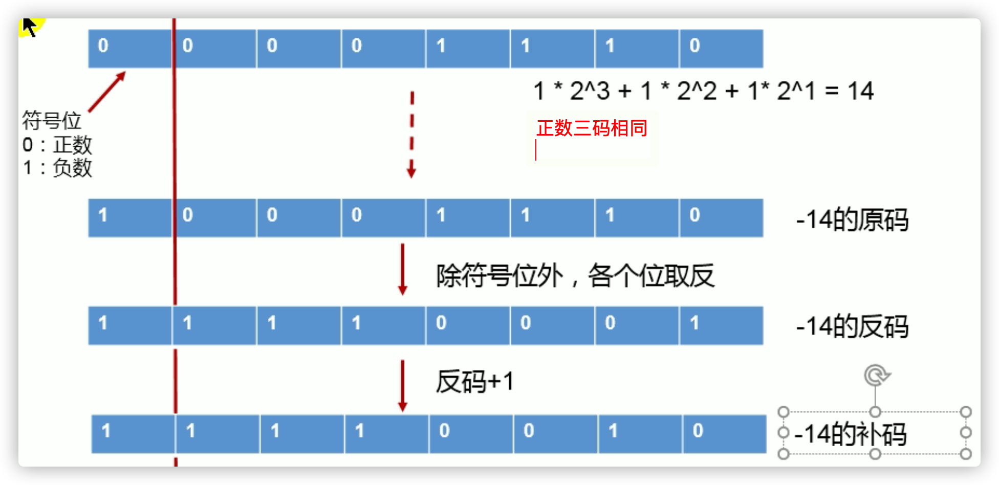
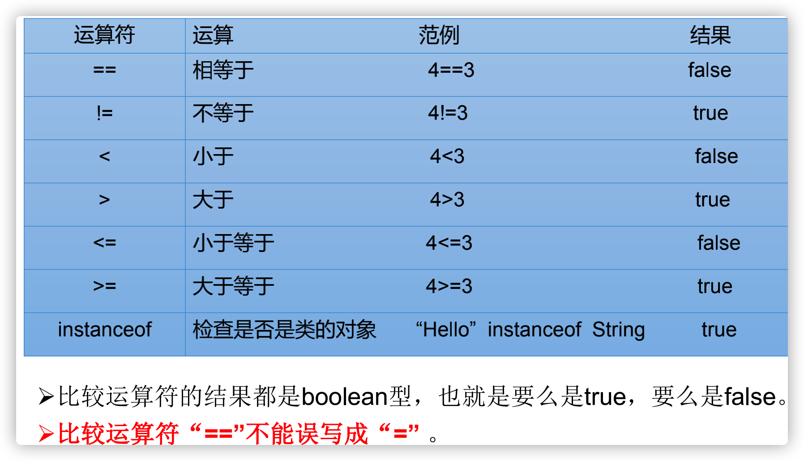
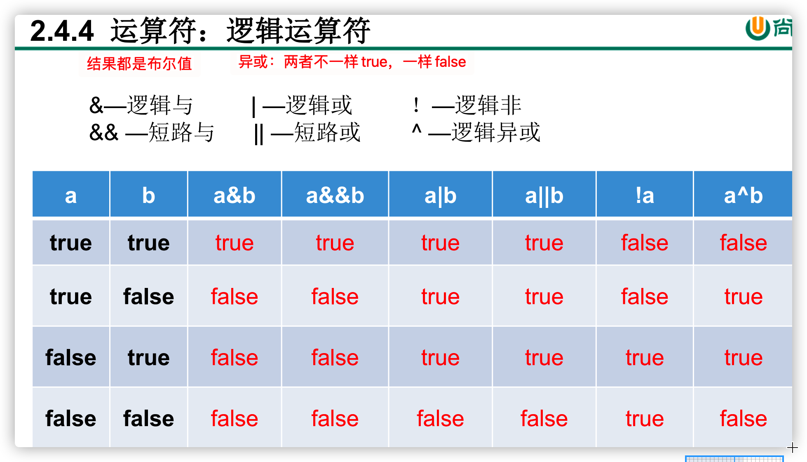
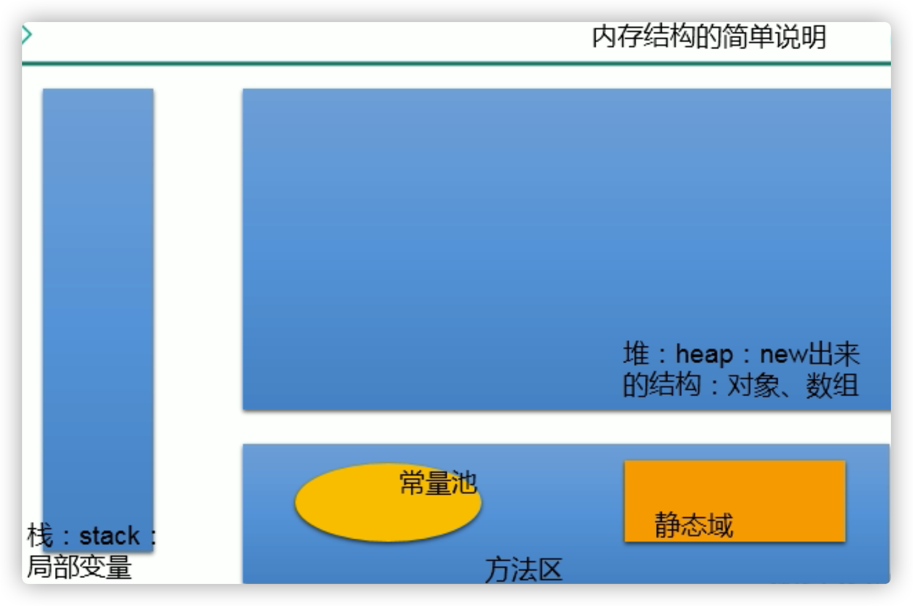
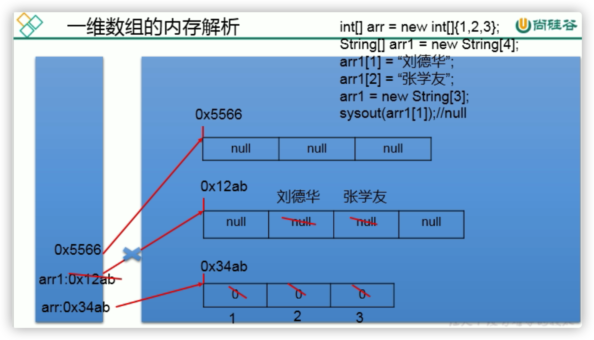

# 文件与编译

- Java 源文件名与public类名一致（只有一个类用public）
- 3 Java源文件编译可能产生不止一个二进制文件（取决于源文件类的个数）

# 文档注释

格式：

/\**

**@author** **指定**java程序的作者

**@version** **指定源文件的版本**

*/

# 打印

- System.out.printlIn();
- 先输出数据，然后换行

```java
int myAge = 12;
//没有占位符
System.out.println(myAge);
```

```java
int m1 = 12;
int n1 = 5;
System.out.println("m1 % n1 = " + m1 % n1);

int a1 = 10;
int b1 = ++a1;
System.out.println("a1 = " + a1 + ",b1 = " + b1);
```

# 标识符(Identifier)

凡是自己可以起名字的地方都叫标识符

## 定义合法标识符规则：

- 由26个英文字母大小写，0-9，_或 $组成
- 数字不可以开头。
- 不可以使用关键字和保留字，但能包含关键字和保留字。
- Java中严格区分大小写，长度无限制。
- 标识符不能包含空格。

# 名称命名规范

- 包名：多单词组成时所有字母都小写：xxxyyyzzz
- 类名、接口名：多单词组成时，所有单词的首字母大写：XxxYyyZzz
- 变量名、方法名：多单词组成时，第一个单词首字母小写，第二个单词开始每个
- 单词首字母大写：xxxYyyZzz
- 常量名：所有字母都大写。多单词时每个单词用下划线连接：XXX_YYY_ZZZ

# Java强类型语言

- Java中每个变量必须先声明，后使用

  声明但没有赋值就会编译错误

- 变量的作用域：其定义所在的一对{ }内

- 同一个作用域内，不能定义重名的变量


# 基本数据类型

## 整形

- byte 1字节=8bit位  -128 ~ 127
- short 2字节
- int 4字节 
- long 8字节

- **声明long型变量，必须以"l"或"L"结尾**

```java
long l1 = 3414234324L;
//没加l，就是int，这么干就是自动类型提升
long l1 = 341;
```

## 浮点型

- 单精度float 4字节
- 双精度double 8字节 

**声明float型常量，须后加f或F**

```java
float f1 = 12.3F;
//不加f，默认double，自动类型提升失败，编译报错
float f1 = 12.3;
```

## 字符型

- 2个字节

- 字符常量是用单引号(‘ ’)括起来的单个字符

- ```java
  char c3 = ‘\n’; // '\n'表示换行符
  ```

- Unicode OK，char可用中文，UTF-8是一种常用的Unicode编码
- a 97,A 65

## bool

- boolean类型数据只允许取值true和false
- 不可以使用0或非 0 的整数替代false和true，这点和C语言不同。

## 数据类型转换

- 自动类型提升：
  byte,char,short < int < long < float < double

```java
short s1 = 123;
double d1 = s1;
```

byte,char,short 互相做运算/相同类型运算，结果都是int

当容量小的数据类型的变量与容量大的数据类型的变量做运算时，结果自动提升为容量大的数据类型。

说明：此时的容量大小指的是，表示数的范围的大和小。比如：float容量要大于long的容量

- 强制类型转换：自动类型提升运算的**逆运算**。

​	可能精读损失

```java
int i2 = 128;
byte b = (byte)i2;
```

# 常量

- 整型常量，默认类型为int型 
- 浮点型常量，默认类型为double型

# String变量

- String属于引用数据类型

```java
String s1 = "Hello World!";
//ok
String s1 = "";
//char c1 = ''; ❌
```

- String可以和8种基本数据类型变量做运算，且运算只能是连接运算：+

  运算的结果仍然是String类型

```java
String info = "号码:";
boolean b1 = true;
// + 连接运算
String info1 = info + b1;
System.out.println(info1);
//号码：true
```

# 进制

对于整数，有四种表示方式：

- 二进制 0,1 满2进1.以0b或0B开头。
- 十进制 0-9 ，满10进1。 
- 八进制 0-7 ，满8进1. 以数字0开头表示。
- 十六进制 0-9及A-F，满16进1. 以0x或0X开头表示。此处的A-F不区分大小写。



**计算机底层都以补码的方式来存储数据**

# 运算符

## 算数运算符

- %:取余运算
  结果的符号与被模数的符号相同

  开发中，经常使用%来判断能否被除尽的情况。

- (前)++：先自增1，后运算 

  (后)+：先运算，后自增1

  **自增1不会改变本身变量的数据类型**

## 赋值运算符

- 连续赋值

- ```java
  int i2,j2;
  i2 = j2 = 10;
  
  int i3 = 10,j3 = 20;
  ```

- 扩展赋值运算符： +=, -=, *=, /=, %=

**扩展赋值运算符不会改变原有数据类型**

## 比较运算符



## 逻辑运算符



- **逻辑运算符操作的都是boolean类型的变量**
- 区分&与&
  相间点1：&与&&的运算结果相同
  相同点2：当符号左边是true时，二者都会执行符号右边的运算
  不同点：当符号左边是false时，&继续执行符号右边的运算。&&**不再**执行符号右边的运算。
- 区分：与川
  相同点1：与的运算结果相同
  相同点2： 当符号左边是fale时，二者都会执行符号右边的运算
  不同点3：当符号左边是tue时，|继续执行符号右边的运算，而||不再执行符号右边的运算
- **开发推荐使用短路**

## 位运算符


结论：

- 位运算符操作的都是整型的数据

- <<：在一定范围内，每向左移1位，相当于*2

  \>>:在一定范围内，每向右移1位，相当于/2


## 三元运算符


如果程序既可以使用三元运算符，又可以使用if-els结构，那么优先选择三元运算符。原因：简洁、执行效率高。

# Scanner类

```java
/*
如何从键盘获取不同类型的变量：需要使用Scanner类

具体实现步骤：
1.导包：import java.util.Scanner;
2.Scanner的实例化:Scanner scan = new Scanner(System.in);
3.调用Scanner类的相关方法（next() / nextXxx()），来获取指定类型的变量

注意：
需要根据相应的方法，来输入指定类型的值。如果输入的数据类型与要求的类型不匹配时，会报异常：InputMisMatchException
导致程序终止。
*/
//1.导包：import java.util.Scanner;
import java.util.Scanner;

class ScannerTest{
	
	public static void main(String[] args){
		//2.Scanner的实例化
		Scanner scan = new Scanner(System.in);
		
		//3.调用Scanner类的相关方法
		System.out.println("请输入你的姓名：");
		String name = scan.next();
		System.out.println(name);

		int age = scan.nextInt();
		double weight = scan.nextDouble();
		boolean isLove = scan.nextBoolean();

		//对于char型的获取，Scanner没有提供相关的方法。只能获取一个字符串
		System.out.println("请输入你的性别：(男/女)");
		String gender = scan.next();//"男"
		char genderChar = gender.charAt(0);//获取索引为0位置上的字符
		System.out.println(genderChar);
	}e
}
```

# 流程控制

- **顺序结构**
  - 程序从上到下逐行地执行，中间没有任何判断和跳转。

- **分支结构**
  - 根据条件，选择性地执行某段代码。
  - 有if…else和switch-case两种分支语句。

- **循环结构**
  - 根据循环条件，重复性的执行某段代码。
  - 有while、do…while、for三种循环语句。
  - 注：JDK1.5提供了foreach循环，方便的遍历集合、数组元素。

## 分支结构

### If

- 不写花括号，只管一句
- 就近原则

```java
if (x > 2) 
   if (y > 2) 
              System.out.println(x + y);
      //System.out.println("atguigu");
   else //就近原则
      System.out.println("x is " + x);
```

### switch-case

```java
switch(表达式){
case 常量1:
语句1;
// break;
case 常量2:
语句2;
// break; … …
case 常量N:
语句N;
// break;
default:
语句;
// break;
}
```

- switch结构中的表达式，只能是如下的6种数据类型之一：
     byte 、short、char、int、枚举类型(JDK5.0新增)、String类型(JDK7.0新增)

**除了浮点数，布尔**

- case 之后只能声明常量。不能声明范围。
- default位置灵活，如果case没有匹配，进入default，default不在最后的时候，最好加break
- 省略

```java
int score = 78;
		switch(score / 10){
		case 0:
		case 1:
		case 2:
		case 3:
		case 4:
		case 5:
			System.out.println("������");
			break;
		case 6:
		case 7:
		case 8:
		case 9:
		case 10:
			System.out.println("����");
			break;
		}
```

## 循环结构

-m不在循环条件部分限制次数的结构：for(;;) 或 while(true)

- 结束循环有几种方式？
  - 方式一：循环条件部分返回false
  - 方式二：在循环体中，执行break

### for

>循环结构的4个要素
>① 初始化条件
>② 循环条件  --->**是boolean类型**
>③ 循环体
>④ 迭代条件

```java
for(int i = 1;i <= 5;i++){//i:1,2,3,4,5
			System.out.println("Hello World!");
		}
		//i:在for循环内有效。出了for循环就失效了。
```

```java
for(int i = min;i >= 1 ;i--){
			if(m % i == 0 && n % i == 0){
				System.out.println("最大公约数为：" + i);
				break;//一旦在循环中执行到break，就跳出循环(不再进入）
			}
		}
```

### while

- for循环和while循环是可以相互转换的！ 
    区别：for循环和while循环的初始化条件部分的作用范围不同。

```java
//遍历100以内的所有偶数
		int i = 1;
		while(i <= 100){
			
			if(i % 2 == 0){
				System.out.println(i);
			}
			
			i++;
		}
```

### do-while

```java
		int num = 1;
		int sum = 0;//记录总和
		int count = 0;//记录个数
		do{
			
			if(num % 2 == 0){
				System.out.println(num);
				sum += num;
				count++;
			}

			num++;

		}while(num <= 100);
```

### break和continue关键字


```java
label:for(int i = 1;i <= 4;i++){
		
			for(int j = 1;j <= 10;j++){
				
				if(j % 4 == 0){
					//break;//默认跳出包裹此关键字最近的一层循环。
					//continue;

					//break label;//结束指定标识的一层循环结构
					continue label;//结束指定标识的一层循环结构当次循环
				}
				
				System.out.print(j);
			}
			
			System.out.println();
		}
```


# 随机数

```java
//课后练习4：如何获取一个随机数：10 - 99
		int value = (int)(Math.random() * 90 + 10);// [0.0,1.0) --> [0.0,90.0) --->[10.0, 100.0) -->[10,99]

//公式：[a,b]  :  (int)(Math.random() * (b - a + 1) )+ a
```

# 引用数据类型

## 数组

* 数组的理解：数组(Array)，是多个**相同类型数据**按**一定顺序**排列的集合，并使用一个名字命名，

* 数组的特点：

  * 1）数组是**有序**排列的

  * 2）数组属于**引用数据类型**的变量。数组的元素，既可以是基本数据类型，也可以是引用数据类型

  * 3）创建数组对象会在内存中开辟一整块**连续**的空间

  * 4）数组的**长度一旦确定**，就不能修改。

* 数组的分类：

  * ① 按照维数：一维数组、二维数组、。。。

  * ② 按照数组元素的类型：基本数据类型元素的数组、引用数据类型元素的数组

### 一维数组

一维数组的使用:

* ① 一维数组的声明和初始化

```java
int[] ids;//声明
//1.1 静态初始化:数组的初始化和数组元素的赋值操作同时进行
ids = new int[]{1001,1002,1003,1004};
//1.2动态初始化:数组的初始化和数组元素的赋值操作分开进行
String[] names = new String[5];

int[] arr4 = {1,2,3,4,5};//类型推断，声明赋值在一行可以
```

* ② 如何调用数组的指定位置的元素

```java
//2.如何调用数组的指定位置的元素:通过角标的方式调用。
//数组的角标（或索引）从0开始的，到数组的长度-1结束。
names[0] = "王铭";
names[1] = "王赫";
```

* ③ 如何获取数组的长度

```java
//属性:length
System.out.println(names.length);
```

* ④ 如何遍历数组

```java
for(int i = 0;i < names.length;i++){
   System.out.println(names[i]);
}
```

* ⑤ 数组元素的默认初始化值

```xml
数组元素是整型：0
数组元素是浮点型：0.0
数组元素是char型：0或'\u0000'，而非'0'
数组元素是boolean型：false
数组元素是引用数据类型：null
```

* ⑥ 数组的内存解析 




