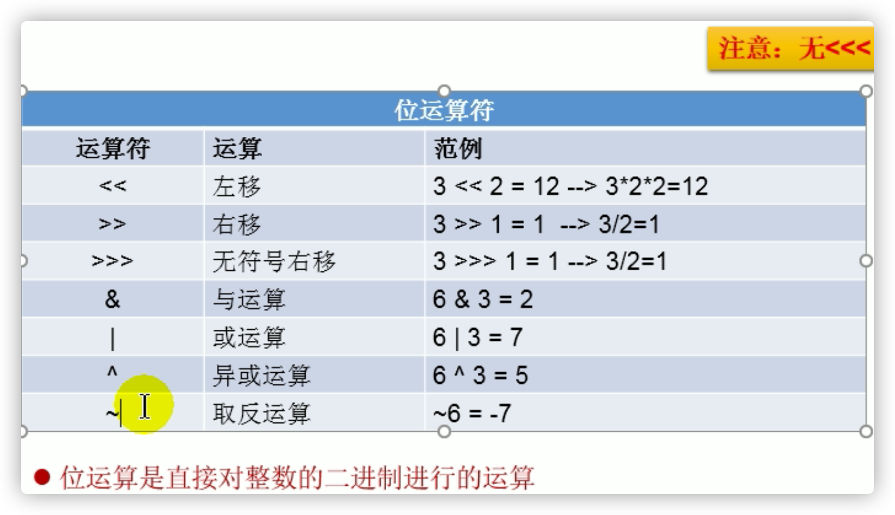
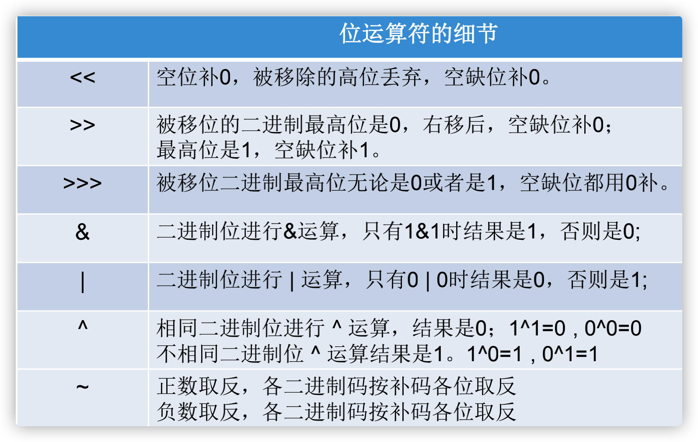
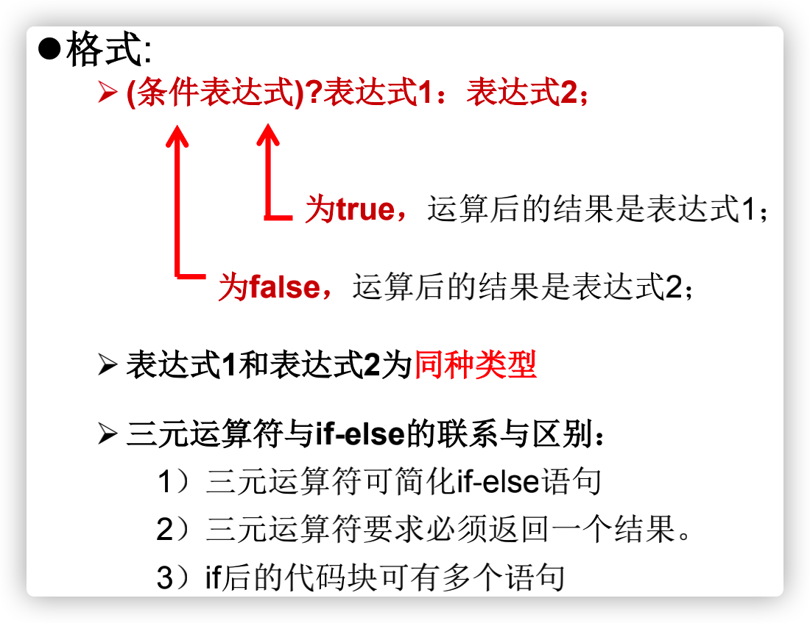

# 文件与编译

- Java 源文件名与public类名一致（只有一个类用public）
- 3 Java源文件编译可能产生不止一个二进制文件（取决于源文件类的个数）

# 文档注释

格式：

/\**

**@author** **指定**java程序的作者

**@version** **指定源文件的版本**

*/

# 打印

- System.out.printlIn();
- 先输出数据，然后换行

```java
int myAge = 12;
//没有占位符
System.out.println(myAge);
```

```java
int m1 = 12;
int n1 = 5;
System.out.println("m1 % n1 = " + m1 % n1);

int a1 = 10;
int b1 = ++a1;
System.out.println("a1 = " + a1 + ",b1 = " + b1);
```

# 标识符(Identifier)

凡是自己可以起名字的地方都叫标识符

## 定义合法标识符规则：

- 由26个英文字母大小写，0-9，_或 $组成
- 数字不可以开头。
- 不可以使用关键字和保留字，但能包含关键字和保留字。
- Java中严格区分大小写，长度无限制。
- 标识符不能包含空格。

# 名称命名规范

- 包名：多单词组成时所有字母都小写：xxxyyyzzz
- 类名、接口名：多单词组成时，所有单词的首字母大写：XxxYyyZzz
- 变量名、方法名：多单词组成时，第一个单词首字母小写，第二个单词开始每个
- 单词首字母大写：xxxYyyZzz
- 常量名：所有字母都大写。多单词时每个单词用下划线连接：XXX_YYY_ZZZ

# Java强类型语言

- Java中每个变量必须先声明，后使用

  声明但没有赋值就会编译错误

- 变量的作用域：其定义所在的一对{ }内

- 同一个作用域内，不能定义重名的变量

# 基本数据类型


## 整形

- byte 1字节=8bit位  -128 ~ 127
- short 2字节
- int 4字节 
- long 8字节

- **声明long型变量，必须以"l"或"L"结尾**

```java
long l1 = 3414234324L;
//没加l，就是int，这么干就是自动类型提升
long l1 = 341;
```

## 浮点型

- 单精度float 4字节
- 双精度double 8字节 

**声明float型常量，须后加f或F**

```java
float f1 = 12.3F;
//不加f，默认double，自动类型提升失败，编译报错
float f1 = 12.3;
```

## 字符型

- 2个字节

- 字符常量是用单引号(‘ ’)括起来的单个字符

- ```java
  char c3 = ‘\n’; // '\n'表示换行符
  ```

- Unicode OK，char可用中文，UTF-8是一种常用的Unicode编码
- a 97,A 65

## bool

- boolean类型数据只允许取值true和false
- 不可以使用0或非 0 的整数替代false和true，这点和C语言不同。

## 数据类型转换

- 自动类型提升：
  byte,char,short < int < long < float < double

```java
short s1 = 123;
double d1 = s1;
```

byte,char,short 互相做运算/相同类型运算，结果都是int

当容量小的数据类型的变量与容量大的数据类型的变量做运算时，结果自动提升为容量大的数据类型。

说明：此时的容量大小指的是，表示数的范围的大和小。比如：float容量要大于long的容量

- 强制类型转换：自动类型提升运算的**逆运算**。

​	可能精读损失

```java
int i2 = 128;
byte b = (byte)i2;
```

# 常量

- 整型常量，默认类型为int型 
- 浮点型常量，默认类型为double型

# String变量

- String属于引用数据类型

```java
String s1 = "Hello World!";
//ok
String s1 = "";
//char c1 = ''; ❌
```

- String可以和8种基本数据类型变量做运算，且运算只能是连接运算：+

  运算的结果仍然是String类型

```java
String info = "号码:";
boolean b1 = true;
// + 连接运算
String info1 = info + b1;
System.out.println(info1);
//号码：true
```

# 进制

对于整数，有四种表示方式：

- 二进制 0,1 满2进1.以0b或0B开头。
- 十进制 0-9 ，满10进1。 
- 八进制 0-7 ，满8进1. 以数字0开头表示。
- 十六进制 0-9及A-F，满16进1. 以0x或0X开头表示。此处的A-F不区分大小写。


**计算机底层都以补码的方式来存储数据**

# 运算符

## 算数运算符

- %:取余运算
  结果的符号与被模数的符号相同

  开发中，经常使用%来判断能否被除尽的情况。

- (前)++：先自增1，后运算 

  (后)+：先运算，后自增1

  **自增1不会改变本身变量的数据类型**

## 赋值运算符

- 连续赋值

- ```java
  int i2,j2;
  i2 = j2 = 10;
  
  int i3 = 10,j3 = 20;
  ```

- 扩展赋值运算符： +=, -=, *=, /=, %=

**扩展赋值运算符不会改变原有数据类型**

## 比较运算符


## 逻辑运算符


- 逻辑运算符操作的都是boolean类型的变量
- 区分&与&
  相间点1：&与&&的运算结果相同
  相同点2：当符号左边是true时，二者都会执行符号右边的运算
  不同点：当符号左边是false时，&继续执行符号右边的运算。&&**不再**执行符号右边的运算。
- 区分：与川
  相同点1：与的运算结果相同
  相同点2： 当符号左边是fale时，二者都会执行符号右边的运算
  不同点3：当符号左边是tue时，|继续执行符号右边的运算，而||不再执行符号右边的运算
- **开发推荐使用短路**

## 位运算符



结论：

- 位运算符操作的都是整型的数据

- <<：在一定范围内，每向左移1位，相当于*2

  \>>:在一定范围内，每向右移1位，相当于/2



## 三元运算符



如果程序既可以使用三元运算符，又可以使用if-els结构，那么优先选择三元运算符。原因：简洁、执行效率高。