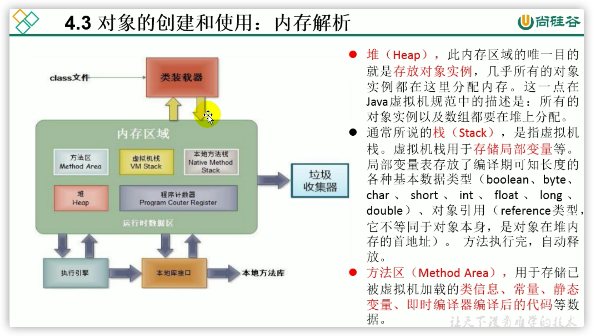
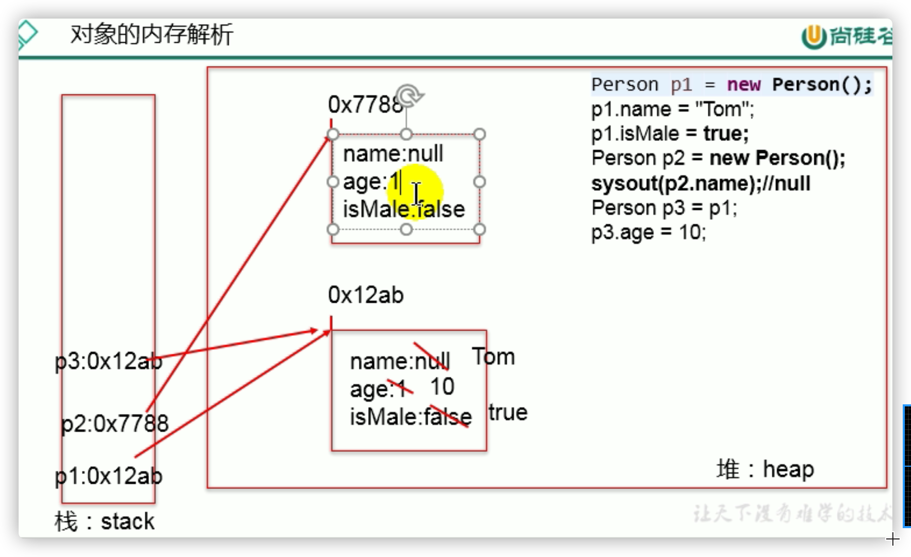
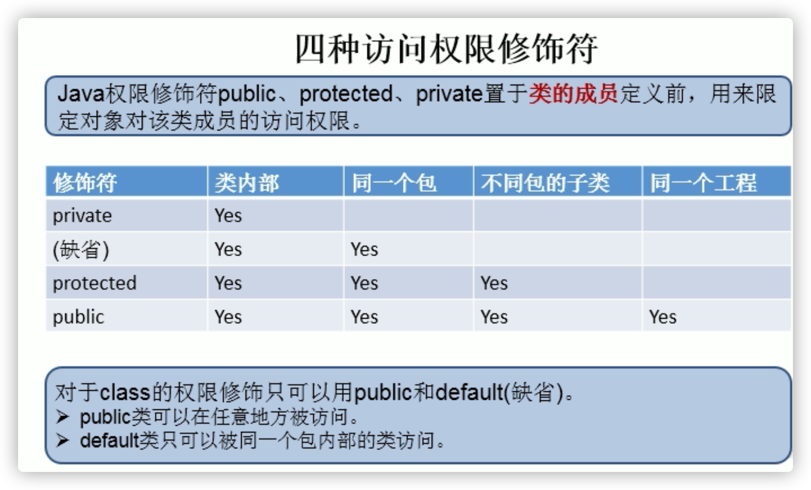
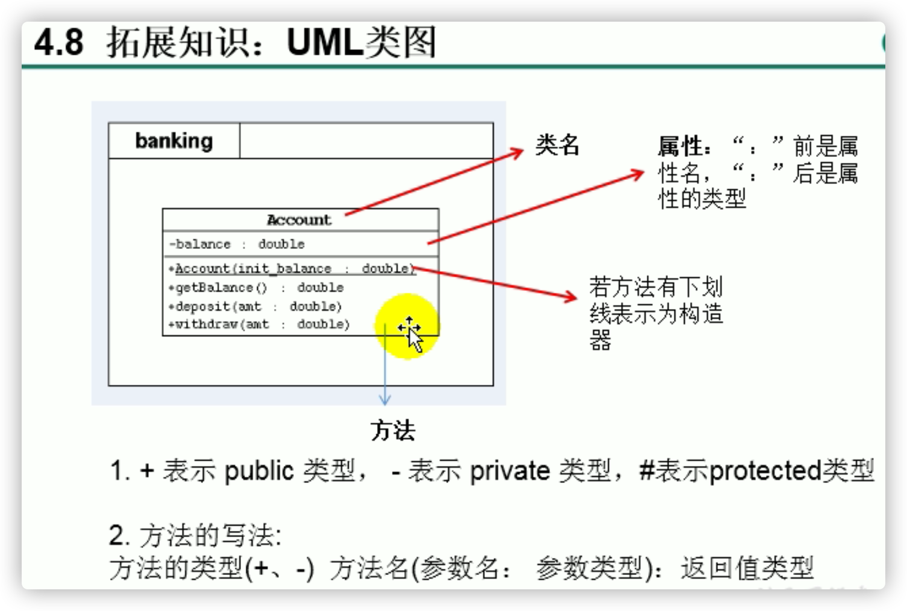
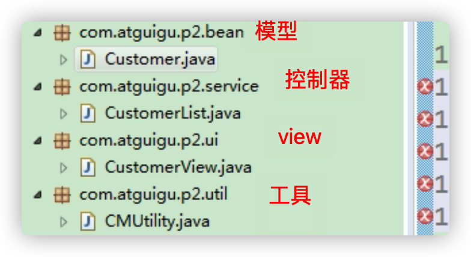
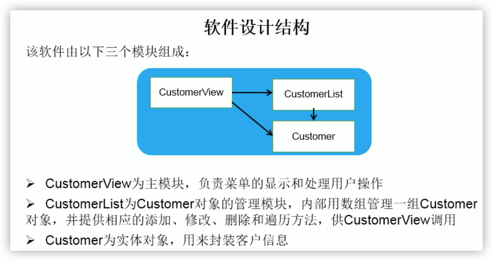
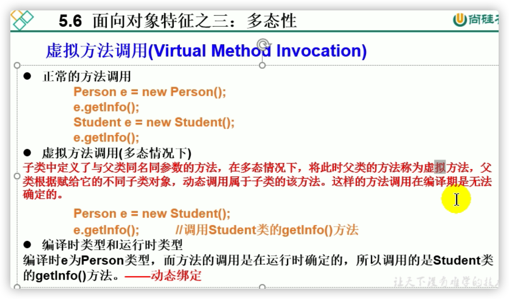

```xml
*  一、Java面向对象学习的三条主线：（第4-6章）
* 1.Java类及类的成员：属性、方法、构造器；代码块、内部类
* 
* 2.面向对象的三大特征：封装性、继承性、多态性、(抽象性)
* 
* 3.其它关键字：this、super、static、final、abstract、interface、package、import等
```

# 面向过程(POP)与面向对象(OOP)

- 二者都是一种思想，面向对象是相对于面向过程而言的。
- 面向过程，强调的是功能行为，以**函数为最小单位**，考虑怎么做。面向对象，将功能封装进对象，强调具备了功能的对象，以**类/对象为最小单位**，考虑谁来做。
- 面向对象的三大特征
  - 封装 (Encapsulation)
  - 继承 (Inheritance)
  - 多态 (Polymorphism)


- 属性 = 成员变量 = field = 域、字段
  方法 = 成员方法 = 函数 = method
- 通过“对象.属性”或“对象.方法”调用对象的结构

# 对象的内存解析

我们使用JVM中的类的加载器和解释器对生成的字节码文件进行解释运行。意味着，需要将字节码文件对应的类加载到内存中，涉及到内存解析。




- 栈：先进后出
- 引用类型的变量，只可能存储两类值：u11或地址值（含变量的类型）
- 理解“万事万物皆对象”
  1.在Java语言范畴中，我们都将功能、结构等封装到类中，通过类的实例化，来调用具体的功能结构
       >Scanner,String等
       >文件：File
       >网络资源：URL
   2.涉及到Java语言与前端Html、后端的数据库交互时，前后端的结构在Java层面交互时，都体现为类、对象。



# 属性（成员变量）vs局部变量

```java
/*
 * 类中属性的使用
 * 
 * 属性（成员变量）   vs  局部变量
 * 1.相同点：
 *        1.1  定义变量的格式：数据类型  变量名 = 变量值
 *        1.2 先声明，后使用
 *        1.3 变量都有其对应的作用域 
 * 
 * 
 * 2.不同点：
 *        2.1 在类中声明的位置的不同
 *        属性：直接定义在类的一对{}内
 *        局部变量：声明在方法内、方法形参、代码块内、构造器形参、构造器内部的变量
 *        
 *        2.2 关于权限修饰符的不同
 *        属性：可以在声明属性时，指明其权限，使用权限修饰符。
 *           常用的权限修饰符：private、public、缺省、protected  --->封装性
 *        目前，大家声明属性时，都使用缺省就可以了。
 *        局部变量：不可以使用权限修饰符。
 * 
 *        2.3 默认初始化值的情况：
 *        属性：类的属性，根据其类型，都有默认初始化值。
 *           整型（byte、short、int、long）：0
 *           浮点型（float、double）：0.0
 *           字符型（char）：0  （或'\u0000'）
 *           布尔型（boolean）：false
 * 
 *           引用数据类型（类、数组、接口）：null
 * 
 *        局部变量：没有默认初始化值。
 *        意味着，我们在调用局部变量之前，一定要显式赋值。
 *           特别地：形参在调用时，我们赋值即可。
 * 
 *        2.4 在内存中加载的位置：
 *        属性：加载到堆空间中   （非static）
 *        局部变量：加载到栈空间
 * 
 */

class User{
	//属性（或成员变量）
	String name;
	public int age = 1;
	boolean isMale;
	}

public static void main(String[] args) {
		User u1 = new User();
		System.out.println(u1.name);
	}
```

# 类中方法的声明和使用

```java
/*
 * 类中方法的声明和使用
 * 
 * 方法：描述类应该具有的功能。
 * 
 * 1.举例：
 * public void eat(){}		cust1.eat();
 * public void sleep(int hour){}		cust1.sleep(8);
 * public String getName(){}
 * public String getNation(String nation){}
 * 
 * 2. 方法的声明：权限修饰符  返回值类型  方法名(形参列表){
 *                 方法体
 *             }
 *   注意：static、final、abstract 来修饰的方法，后面再讲。
 *   
 * 3. 说明：
 *        3.1 关于权限修饰符：默认方法的权限修饰符先都使用public
 *           Java规定的4种权限修饰符：private、public、缺省、protected  -->封装性再细说
 * 
 *        3.2 返回值类型： 有返回值  vs 没有返回值
 *           3.2.1  如果方法有返回值，则必须在方法声明时，指定返回值的类型。同时，方法中，需要使用
 *                return关键字来返回指定类型的变量或常量：“return 数据”。
 *                如果方法没有返回值，则方法声明时，使用void来表示。通常，没有返回值的方法中，就不需要
 *               使用return.但是，如果使用的话，只能“return;”表示结束此方法的意思。
 * 
 *           3.2.2 我们定义方法该不该有返回值？
 *              ① 题目要求
 *              ② 凭经验：具体问题具体分析
 * 
 *      3.3 方法名：属于标识符，遵循标识符的规则和规范，“见名知意”
 *      
 *      3.4 形参列表： 方法可以声明0个，1个，或多个形参。
 *         3.4.1 格式：数据类型1 形参1,数据类型2 形参2,...
 *         
 *         3.4.2 我们定义方法时，该不该定义形参？
 *                ① 题目要求
 *                ② 凭经验：具体问题具体分析
 *      
 *      3.5 方法体：方法功能的体现。      
 * 
 *  4.return关键字的使用：
 *     1.使用范围：使用在方法体中
 *     2.作用：① 结束方法
 *            ② 针对于有返回值类型的方法，使用"return 数据"方法返回所要的数据。
 *      3.注意点：return关键字后面不可以声明执行语句。
 *      
 *  5. 方法的使用中，可以调用当前类的属性或方法
 *        特殊的：方法A中又调用了方法A:递归方法。
 *     方法中，不可以定义方法。
 */

class Circle{
	
	//属性,方法中可直接用
	double radius;
	
	//方式二：
	public void findArea(){
		double area = Math.PI * radius * radius;
		System.out.println("面积为：" + area);
	}
}
```

# 方法的重载（overload）

```java
/*
* 1.定义：在同一个类中，允许存在一个以上的同名方法，只要它们的参数个数或者参数类型不同即可。
*  
* 2. "两同一不同":同一个类、相同方法名
*            参数列表不同：参数个数不同，参数类型不同(参数顺序不同，参数类型一样也算重载）
* 
* 3.判断是否是重载：
*    跟方法的权限修饰符、返回值类型、形参变量名、方法体都没有关系！
*    
* 4. 在通过对象调用方法时，如何确定某一个指定的方法：
*      方法名 ---> 参数列表
*/
//下面两个方法构成重载关系
	public void show(String s){
		System.out.println("show(String)");
	}
	
	public void show(String ... strs){
		System.out.println("show(String ... strs)");
		for(int i = 0;i < strs.length;i++){
			System.out.println(strs[i]);
		}
	}
```

# 可变个数形参

```Java
具体使用：
2.1 可变个数形参的格式：数据类型 ... 变量名
2.2 当调用可变个数形参的方法时，传入的参数个数可以是：0个，1个,2个，。。。
2.3 可变个数形参的方法与本类中方法名相同，形参不同的方法之间构成重载
2.4 可变个数形参的方法与本类中方法名相同，形参类型也相同的数组之间不构成重载。换句话说，二者不能共存。
2.5 可变个数形参在方法的形参中，必须声明在末尾
2.6  可变个数形参在方法的形参中,最多只能声明一个可变形参。
  
  //下面两种调用都可以
  test.show("aa","bb","cc");
	test.show(new String {"aa","bb","cc"});

  public void show(String ... strs){
		System.out.println("show(String ... strs)");
		
		for(int i = 0;i < strs.length;i++){
			System.out.println(strs[i]);
		}
	}
	//不能与上一个方法同时存在
//	public void show(String[] strs){
//
//	}
```

# 变量的赋值

- 如果变量是基本数据类型，此时赋值的是变量所保存的数据值。
- 如果变量是引用数据类型，此时赋值的是变量所保存的数据的地址值。

```java
Order o2 = o1;//赋值以后，o1和o2的地址值相同，都指向了堆空间中同一个对象实体。
```

- 方法的形参的传递机制：**值传递**

 	1.形参：方法定义时，声明的小括号内的参数
 	实参：方法调用时，实际传递给形参的数据
 	
 	2.值传递机制：（普通赋值&&参数传递 都一样）
 	 如果参数是**基本数据类型**，此时实参赋给形参的是实参**真实存储的数据值**。
 	如果参数是**引用数据类型**，此时实参赋给形参的是实参存储数据的**地址值**。

# 递归

- 递归方法：一个方法体内调用它自身。
- 方法递归包含了一种隐式的循环，它会重复执行某段代码，但这种重复执行无须循环控制。
  递归一定要向已知方向递归，否则这种递归就变成了无穷递归，类似于死循环。

```java
// 例1：计算1-n之间所有自然数的和
public int getSum(int n) {// 3
   if (n == 1) {
      return 1;//拐点
   } else {
      return n + getSum(n - 1);//一定比N小
   }
}
```

```java
//例3：已知有一个数列：f(0) = 1,f(1) = 4,f(n+2)=2*f(n+1) + f(n),
   //其中n是大于0的整数，求f(10)的值。
   public int f(int n){
      if(n == 0){
         return 1;
      }else if(n == 1){
         return 4;
      }else{
         return 2*f(n - 1) + f(n - 2);
      }
   }
```

# 面向对象特征之一：封装和隐藏

- 我们程序设计追求“高内聚，低耦合”。
  - 高内聚 ：类的内部数据操作细节自己完成，不允许外部干涉；（自己的事自己干）
  - 低耦合 ：仅对外暴露少量的方法用于使用。 
- 隐藏对象内部的复杂性，只对外公开简单的接口。便于外界调用，从而提高系统的可扩展性、可维护性。通俗的说，把该隐藏的隐藏起来，该暴露的暴露出来。这就是封装性的设计思想。

```java
/*
 * 面向对象的特征一：封装与隐藏     3W:what? why? how?
 * 一、问题的引入：
 *  当我们创建一个类的对象以后，我们可以通过"对象.属性"的方式，对对象的属性进行赋值。这里，赋值操作要受到
 *  属性的数据类型和存储范围的制约。除此之外，没有其他制约条件。但是，在实际问题中，我们往往需要给属性赋值
 *  加入额外的限制条件。这个条件就不能在属性声明时体现，我们只能通过方法进行限制条件的添加。（比如：setLegs()）
 *  同时，我们需要避免用户再使用"对象.属性"的方式对属性进行赋值。则需要将属性声明为私有的(private).
 *  -->此时，针对于属性就体现了封装性。
 getter setter
 * 
 * 二、封装性的体现：
 * 我们将类的属性xxx私有化(private),同时，提供公共的(public)方法来获取(getXxx)和设置(setXxx)此属性的值
 * 
 *  拓展：封装性的体现：① 如上  ② 不对外暴露的私有的方法  ③ 单例模式   ...
 *  
```

## getter&setter

```java
public class AnimalTest {
   public static void main(String[] args) {
      
      Animal a = new Animal();
//    a.legs = 4;//The field Animal.legs is not visible   
     //被private修饰的属性不能点出来（读写）
      a.setLegs(-6);
   }
}

class Animal{
   private int legs;//腿的个数
   
   //对属性的设置
   public void setLegs(int l){
      if(l >= 0 && l % 2 == 0){
         legs = l;
      }else{
         legs = 0;
//       抛出一个异常（暂时没有讲）
      }
   }
   
   //对属性的获取
   public int getLegs(){
      return legs;
   }
}
```

## 四种访问权限修饰符（可见性）



- 封装性的体现，需要权限修饰符来配合。
   * 1.Java规定的4种权限（从小到大排列）：private、缺省、protected 、public 
   * 2.4种权限可以用来修饰类及类的内部结构：属性、方法、构造器、内部类
   * 3.**具体的，4种权限都可以用来修饰类的内部结构：属性、方法、构造器、内部类**
   *        **修饰类的话，只能使用：缺省、public**
   * 总结封装性：Java提供了4种权限修饰符来修饰类及类的内部结构，体现类及类的内部结构在被调用时的可见性的大小。
   * 体现（涉及权限修饰符的都是封装的体现）
     * 属性私有，外界用getter，setter
     * 私有方法
     * 单例（构造器私有化）
     * 如果不希望类在包外被调用，可以将类设置为缺省的。
- **补充**⚠️：
   - 同一个包的子类和普通类，private不能用
   - 不同包下的普通类（非子类）只有public能用
- 权限修饰符在最前面

# 构造器

```java
*类的结构之三：构造器（或构造方法、constructor）的使用 
* 一、构造器的作用：
* 1.创建对象
* 2.初始化对象的信息
* 
* 二、说明：
* 1.如果没有显式的定义类的构造器的话，则系统默认提供一个空参的构造器（权限和类的权限一样）
* 2.定义构造器的格式：权限修饰符  类名(形参列表){}
* 3.一个类中定义的多个构造器，彼此构成重载
* 4.一旦我们显式的定义了类的构造器（无论有没有参数）之后，系统就不再提供默认的空参构造器
* 5.一个类中，至少会有一个构造器。
```

```java
public class PersonTest {
   public static void main(String[] args) {
      //创建类的对象:new + 构造器
      Person p = new Person();
      Person p1 = new Person("Tom");
   }
}

class Person{
   //属性
   String name;
   int age;
   
   //构造器，一个类的构造器构成重载关系
   public Person(){
      System.out.println("Person().....");
   }
   
   public Person(String n){
      name = n;
   }

   public Person(String n,int a){
      name = n;
      age = a;
   }
}
```

- 构造器和方法是两个（构造器是特殊的方法❌）--->官方文档是并列的结构


# 属性赋值的先后顺序

```java
* ① 默认初始化
* ② 显式初始化
* ③ 构造器中初始化
* ④ 通过"对象.方法" 或 "对象.属性"的方式，赋值
* 
* 以上操作的先后顺序：① - ② - ③ - ④  
```

# JavaBean

JavaBean是一种Java语言写成的可重用组件。  经常用

所谓JavaBean，是指符合如下标准的Java类：
   >类是公共的
   >有一个无参的公共的构造器
   >有属性，且有对应的get、set方法

```java
public class Customer {
   
   private int id;
   private String name;
   public Customer(){
   }
   
   public void setId(int i){
      id = i;
   }
   public int getId(){
      return id;
   }
   public void setName(String n){
      name = n;
   }
   public String getName(){
      return name;
   }
   
}
```

# UML类图



- Banking：包名

# 关键字：this的使用

```java
this关键字的使用：
* 1.this可以用来修饰、调用：属性、方法、构造器
* 
* 2.this修饰属性和方法：
*   this理解为：当前对象  或 当前正在创建的对象
* 
*  2.1  在类的方法中，我们可以使用"this.属性"或"this.方法"的方式，调用当前对象属性或方法。但是，
*   通常情况下，我们都选择省略"this."。特殊情况下，如果方法的形参和类的属性同名时，我们必须显式
*   的使用"this.变量"的方式，表明此变量是属性，而非形参。
* 
*  2.2 在类的构造器中，我们可以使用"this.属性"或"this.方法"的方式，调用当前正在创建的对象属性或方法。
*  但是，通常情况下，我们都选择省略"this."。特殊情况下，如果构造器的形参和类的属性同名时，我们必须显式
*   的使用"this.变量"的方式，表明此变量是属性，而非形参。
* 
* 3. this调用构造器
*    ① 我们在类的构造器中，可以显式的使用"this(形参列表)"方式，调用本类中指定的其他构造器
*    ② 构造器中不能通过"this(形参列表)"方式调用自己 否则就无限了
*    ③ 如果一个类中有n个构造器，则最多有 n - 1构造器中使用了"this(形参列表)"
*    ④ 规定："this(形参列表)"必须声明在当前构造器的首行
*    ⑤ 构造器内部，最多只能声明一个"this(形参列表)"，用来调用其他的构造器 依据第四条
```

```java
public class PersonTest {
   public static void main(String[] args) {
      Person p2 = new Person("Jerry",20);
   }
}

class Person{
   private String name;
   private int age;
   
   public Person(){
   }
   
   public Person(int age){
     //调用上面的构造器 
     this();
      //这里this必须
      this.age = age;
   }

   public Person(String name, int age){
      this(age);
      //这里this必须
      this.name = name;
   }

   public void eat(){
      System.out.println("人吃饭");
      this.study();
      //省去this study(); 也行，原来的写法
   }
   public void study(){
      System.out.println("人学习");
   }

   public String getName() {
      return name;
   }

   public void setName(String name) {
      //这里this必须
      this.name = name;
   }

   public int getAge() {
      return age;
   }

   public void setAge(int age) {
      //这里this必须
      this.age = age;
   }
}
```

# package关键字

```java
* 1.为了更好的实现项目中类的管理，提供包的概念
* 2.使用package声明类或接口所属的包，声明在源文件的首行
* 3.包，属于标识符，遵循标识符的命名规则、规范(xxxyyyzzz)、“见名知意”
* 4.每"."一次，就代表一层文件目录。
* 
* 补充：同一个包下，不能命名同名的接口、类。
*     不同的包下，可以命名同名的接口、类。
```

```java
package com.atguigu.java2;
```

# import关键字

```java
* import:导入
* 1. 在源文件中显式的使用import结构导入指定包下的类、接口
* 2. 声明在包的声明和类的声明之间
* 3. 如果需要导入多个结构，则并列写出即可
* 4. 可以使用"xxx.*"的方式，表示可以导入xxx包下的所有结构
  	import java.util.*;
* 5. 如果使用的类或接口是java.lang包下定义的，则可以省略import结构(其子包也可以省略）
* 6. 如果使用的类或接口是本包下定义的，则可以省略import结构
* 7. 如果在源文件中，使用了不同包下的同名的类，则必须至少有一个类需要以全类名的方式显示。
  	com.atguigu.exer3.Account acct1 = new com.atguigu.exer3.Account(1000,2000,0.0123);
* 8. 使用"xxx.*"方式表明可以调用xxx包下的所有结构。但是如果使用的是xxx子包下的结构，则仍需要显式导入
	  import java.lang.reflect.Field;
* 9. import static:导入指定类或接口中的静态结构:属性或方法。 
    import static java.lang.System.*;

package com.atguigu.java2;

import java.util.*;
import com.atguigu.exer.Person;
import com.atguigu.java2.java3.Dog;
```

# MVC介绍


# 客户信息管理项目



- 构造器之中初始化作为属性的数组



# 面向对象特征之二：继承性

```java
 * 面向对象的特征之二：继承性    why?
 * 
 * 一、继承性的好处：
 * ① 减少了代码的冗余，提高了代码的复用性
 * ② 便于功能的扩展
 * ③ 为之后多态性的使用，提供了前提
 * 
 * 
 * 二、继承性的格式： 
 *    class A extends B{}
 *    A:子类、派生类、subclass
 *    B:父类、超类、基类、superclass
 *    
 *    2.1体现：一旦子类A继承父类B以后，子类A中就获取了父类B中声明的所有的属性和方法（不包括构造器）（父类子类同名属性不会被覆盖，同时存在）。
 *     特别的，父类中声明为private的属性或方法，子类继承父类以后，仍然认为获取了父类中私有的结构。
 *    只有因为封装性（可见性）的影响，使得子类不能直接调用父类的结构而已。
 *    2.2 子类继承父类以后，还可以声明自己特有的属性或方法：实现功能的拓展。
 *    子类和父类的关系，不同于子集和集合的关系。
 *    extends：延展、扩展
 * 
 * 三、Java中关于继承性的规定：
 *    1.一个类可以被多个子类继承。
 *    2.Java中类的单继承性：一个类只能有一个父类
 *    3.子父类是相对的概念。
 *    4.子类直接继承的父类，称为：直接父类。间接继承的父类称为：间接父类
 *    5.子类继承父类以后，就获取了直接父类以及所有间接父类中声明的属性和方法
 *    
 *  
 * 四、 1. 如果我们没有显式的声明一个类的父类的话，则此类继承于java.lang.Object类
 *    2. 所有的java类（除java.lang.Object类之外）都直接或间接的继承于java.lang.Object类
 *    3. 意味着，所有的java类具有java.lang.Object类声明的功能。
 */
```

# 方法的重写(override)

```java
* 1.重写：子类继承父类以后，可以对父类中同名同参数的方法，进行覆盖操作
* 
* 2.应用：重写以后，当创建子类对象以后，通过子类对象调用子父类中的同名同参数的方法时，实际执行的是子类重写父类的方法。
* 
* 3. 重写的规定：
*        方法的声明： 权限修饰符  返回值类型  方法名(形参列表) throws 异常的类型{
*                 //方法体
*              }
*        约定俗称：子类中的叫重写的方法，父类中的叫被重写的方法
*      ① 子类重写的方法的方法名和形参列表与父类被重写的方法的方法名和形参列表相同
*      ② 子类重写的方法的权限修饰符不小于父类被重写的方法的权限修饰符（摊煎饼一样，要覆盖掉父类方法）
*          >特殊情况：子类不能重写父类中声明为private权限的方法
*      ③ 返回值类型：
*          >父类被重写的方法的返回值类型是void，则子类重写的方法的返回值类型只能是void
*          >父类被重写的方法的返回值类型是A类型，则子类重写的方法的返回值类型可以是A类或A类的子类
*          >父类被重写的方法的返回值类型是基本数据类型(比如：double)，则子类重写的方法的返回值类型必须是相同的基本数据类型(必须也是double)
*      ④ 子类重写的方法抛出的异常类型不大于父类被重写的方法抛出的异常类型（具体放到异常处理时候讲）
*  **********************************************************************
*     子类和父类中的同名同参数的方法要么都声明为非static的（考虑重写），要么都声明为static的（不是重写）。   
*
* 面试题：区分方法的重载与重写
```


# super关键字

```java
super关键字的使用
* 1.super理解为：父类的
* 2.super可以用来调用：属性、方法、构造器
* 
* 3.super的使用：调用属性和方法
* 
*   3.1 我们可以在子类的方法或构造器中。通过使用"super.属性"或"super.方法"的方式，显式的调用
*   父类中声明的属性或方法。但是，通常情况下，我们习惯省略"super."
*   3.2 特殊情况：当子类和父类中定义了同名的属性时，我们要想在子类中调用父类中声明的属性，则必须显式的
*   使用"super.属性"的方式，表明调用的是父类中声明的属性。
*   3.3 特殊情况：当子类重写了父类中的方法以后，我们想在子类的方法中调用父类中被重写的方法时，则必须显式的
*   使用"super.方法"的方式，表明调用的是父类中被重写的方法。
* 
* 4.super调用构造器
*   4.1  我们可以在子类的构造器中显式的使用"super(形参列表)"的方式，调用父类中声明的指定的构造器
  public Student(String name,int age,String major){
		super(name,age);
		this.major = major;
	}
*   4.2 "super(形参列表)"的使用，必须声明在子类构造器的首行！
*   4.3 我们在类的构造器中，针对于"this(形参列表)"或"super(形参列表)"只能二选一，不能同时出现
*   4.4 在构造器的首行，没有显式的声明"this(形参列表)"或"super(形参列表)"，则默认调用的是父类中空参的构造器：super()
*   4.5 在类的多个构造器中，至少有一个类的构造器中使用了"super(形参列表)"，调用父类中的构造器
```

隐性在子类调用super无参数构造器（父类有带参数的构造器），如果父类没有显性写无参数构造器，会报错（一旦自己写构造器无论有参数与否，都不会自动生成构造器了）

# 子类对象实例化的全过程

```java
* 1. 从结果上来看：（继承性）
*     子类继承父类以后，就获取了父类中声明的属性或方法。
*      创建子类的对象，在堆空间中，就会加载所有父类中声明的属性。
* 
* 2. 从过程上来看：
*     当我们通过子类的构造器创建子类对象时，我们一定会直接或间接的调用其父类的构造器，进而调用父类的父类的构造器，...
*    直到调用了java.lang.Object类中空参的构造器为止。正因为加载过所有的父类的结构，所以才可以看到内存中有
*    父类中的结构，子类对象才可以考虑进行调用。
*  
* 明确：虽然创建子类对象时，调用了父类的构造器，但是自始至终就创建过一个对象，即为new的子类对象。
```

# 面向对象特征之三：多态性

```java
* 1.理解多态性：可以理解为一个事物的多种形态。
* 2.何为多态性：
*   对象的多态性：父类的引用指向子类的对象（或子类的对象赋给父类的引用）
*   
* 3. 多态的使用：虚拟方法调用
*   有了对象的多态性以后，我们在编译期，只能调用父类中声明的方法，但在运行期，我们实际执行的是子类重写父类的方法。
*   总结：编译，看左边；运行，看右边。
*   
* 4.多态性的使用前提：  ① 类的继承关系  ② 方法的重写
* 
* 5.对象的多态性，只适用于方法，不适用于属性（编译和运行都看左边）
```



 


# 