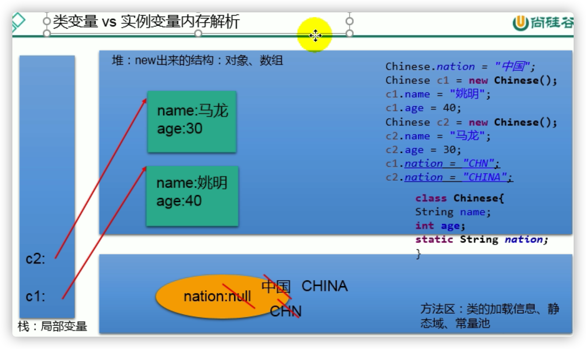

# 关键字：static

```java
* static关键字的使用
* 
* 1.static:静态的
* 2.static可以用来修饰：属性、方法、代码块、内部类
* 
* 3.使用static修饰属性：静态变量（或类变量）
*     3.1 属性，按是否使用static修饰，又分为：静态属性  vs 非静态属性(实例变量)
*       实例变量：我们创建了类的多个对象，每个对象都独立的拥有一套类中的非静态属性。当修改其中一个对象中的
*              非静态属性时，不会导致其他对象中同样的属性值的修改。
*       静态变量：我们创建了类的多个对象，多个对象共享同一个静态变量。当通过某一个对象修改静态变量时，会导致
*              其他对象调用此静态变量时，是修改过了的。
  							静态变量的getter setter用static修饰
*     3.2 static修饰属性的其他说明：
*          ① 静态变量随着类的加载而加载。可以通过"类.静态变量"/也可以"对象.静态变量"的方式进行调用（省略 类.静态变量 一般省略类）
*          ② 静态变量的加载要早于对象的创建。
*          ③ 由于类只会加载一次，则静态变量在内存中也只会存在一份：存在方法区的静态域中。
*          
*          ④      类变量    实例变量
*          类      yes       no
*          对象     yes       yes
*          
*      3.3 静态属性举例：System.out; Math.PI;
* 
* 4.使用static修饰方法：静态方法
*     ① 随着类的加载而加载，可以通过"类.静态方法"的方式进行调用
*     ②        静态方法   非静态方法
*          类      yes       no
*          对象     yes       yes
*     ③ 静态方法中，只能调用静态的方法或属性
*        非静态方法中，既可以调用非静态的方法或属性，也可以调用静态的方法或属性
* 
* 5. static注意点：
*    5.1 在静态的方法内，不能使用this关键字、super关键字
*    5.2 关于静态属性和静态方法的使用，大家都从生命周期的角度去理解。
*    
* 6. 开发中，如何确定一个属性是否要声明为static的？
*     > 属性是可以被多个对象所共享的，不会随着对象的不同而不同的。
*     > 类中的常量也常常声明为static
* 
*    开发中，如何确定一个方法是否要声明为static的？
*      > 操作静态属性的方法，通常设置为static的
*      > "工具类"中的方法，习惯上声明为static的。 比如：Math、Arrays、Collections
  
  class Circle{
	
	private double radius;
	private int id;//自动赋值
	
	public Circle(){
		id = init++;
		total++;
	}
	
	private static int total;//记录创建的圆的个数
	private static int init = 1001;//static声明的属性被所有对象所共享
  }
```

- 

## 单例（设计模式）

- 所有的设计模式


```java
//饿汉式
class Bank{
   //1.私有化类的构造器
   private Bank(){
   }
   
   //2.内部创建类的对象
   //4.要求此对象也必须声明为静态的
   private static Bank instance = new Bank();
   
   //3.提供公共的静态的方法，返回类的对象
   public static Bank getInstance(){
      return instance;
   }
}
```

- 1. 所谓类的单例设计模式，就是采取一定的方法保证在整个的软件系统中，对某个类只能存在一个对象实例。
  2. 减小了性能消耗 

# Main方法

```java
* main()方法的使用说明：
* 1. main()方法作为程序的入口
* 2. main()方法也是一个普通的静态方法
* 3. main()方法可以作为我们与控制台交互的方式。（之前：使用Scanner）
```