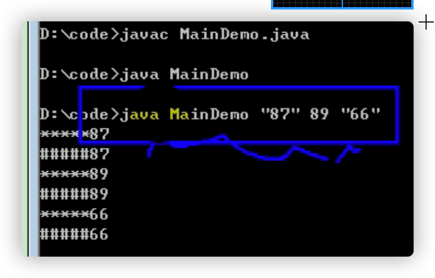
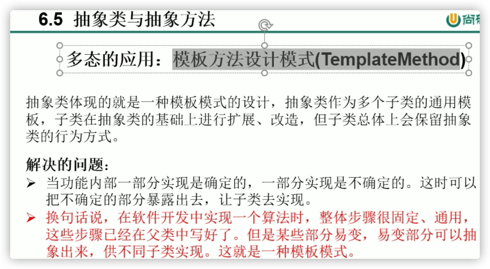
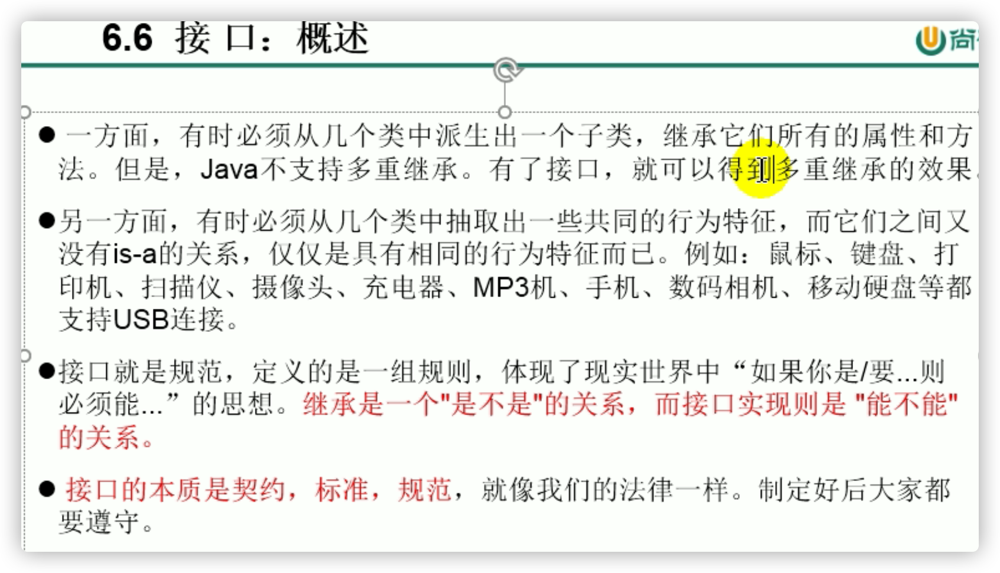
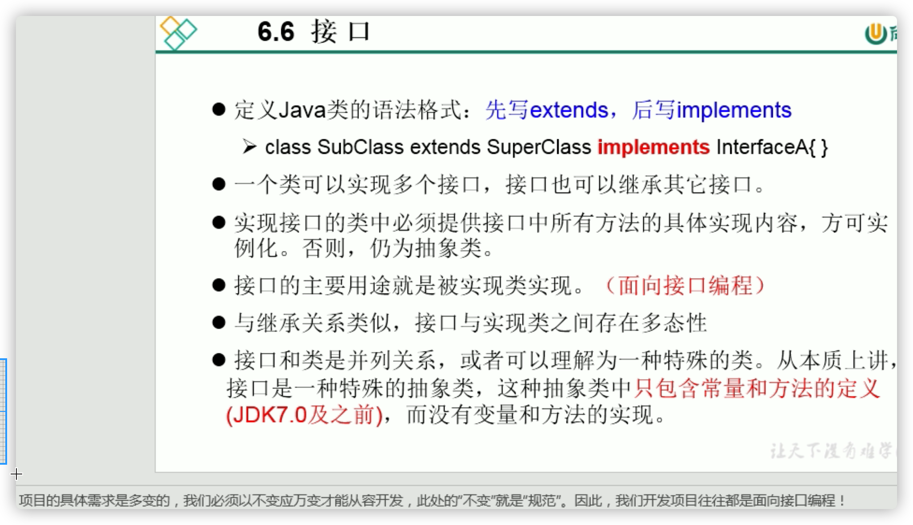
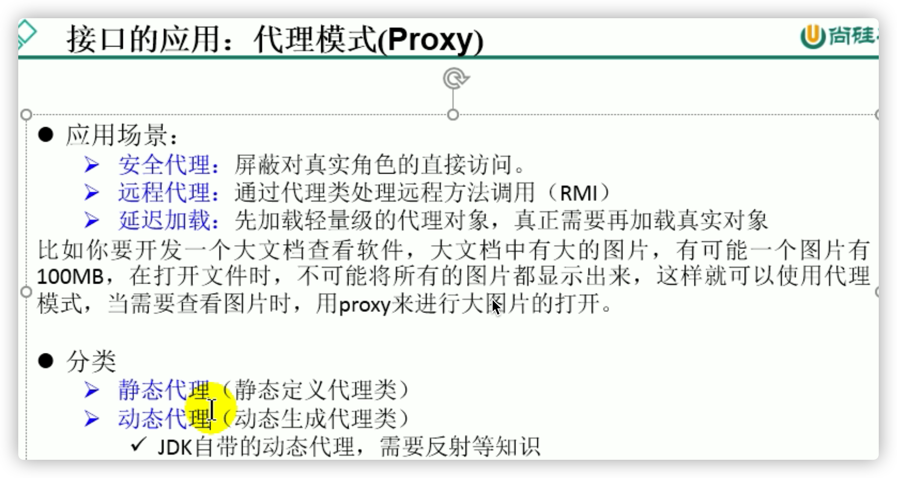
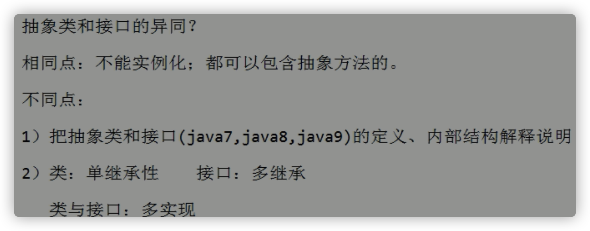
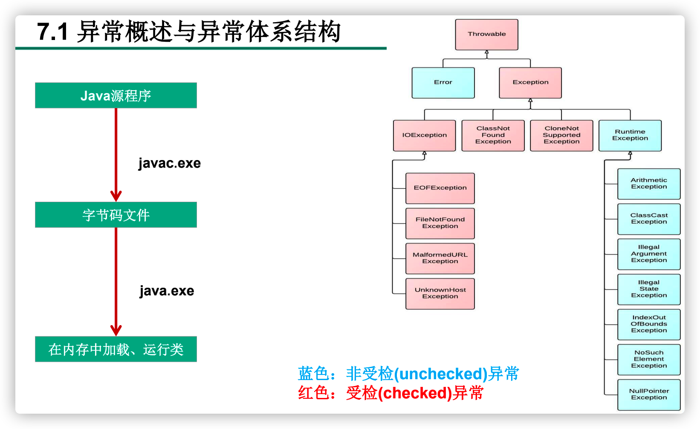

# 关键字：static

```java
* static关键字的使用
* 
* 1.static:静态的
* 2.static可以用来修饰（类的内部结构）：属性、方法、代码块、内部类
* 
* 3.使用static修饰属性：静态变量（或类变量）
*     3.1 属性，按是否使用static修饰，又分为：静态属性  vs 非静态属性(实例变量)
*       实例变量：我们创建了类的多个对象，每个对象都独立的拥有一套类中的非静态属性。当修改其中一个对象中的
*              非静态属性时，不会导致其他对象中同样的属性值的修改。
*       静态变量：我们创建了类的多个对象，多个对象共享同一个静态变量。当通过某一个对象修改静态变量时，会导致
*              其他对象调用此静态变量时，是修改过了的。
  							静态变量的getter setter用static修饰
*     3.2 static修饰属性的其他说明：
*          ① 静态变量随着类的加载而加载。可以通过"类.静态变量"/也可以"对象.静态变量"的方式进行调用（省略 类.静态变量 一般省略类）
*          ② 静态变量的加载要早于对象的创建。
*          ③ 由于类只会加载一次，则静态变量在内存中也只会存在一份：存在方法区的静态域中。
*          
*          ④      类变量    实例变量
*          类      yes       no
*          对象     yes       yes
*          
*      3.3 静态属性举例：System.out; Math.PI;
* 
* 4.使用static修饰方法：静态方法
*     ① 随着类的加载而加载，可以通过"类.静态方法"的方式进行调用
*     ②        静态方法   非静态方法
*          类      yes       no
*          对象     yes       yes
*     ③ 静态方法中，只能调用静态的方法或属性
*        非静态方法中，既可以调用非静态的方法或属性，也可以调用静态的方法或属性
* 
* 5. static注意点：
*    5.1 在静态的方法内，不能使用this关键字、super关键字
*    5.2 关于静态属性和静态方法的使用，大家都从生命周期的角度去理解。
*    
* 6. 开发中，如何确定一个属性是否要声明为static的？
*     > 属性是可以被多个对象所共享的，不会随着对象的不同而不同的。
*     > 类中的常量也常常声明为static
* 
*    开发中，如何确定一个方法是否要声明为static的？
*      > 操作静态属性的方法，通常设置为static的
*      > "工具类"中的方法，习惯上声明为static的。 比如：Math、Arrays、Collections
  
  class Circle{
	
	private double radius;
	private int id;//自动赋值
	
	public Circle(){
		id = init++;
		total++;
	}
	
	private static int total;//记录创建的圆的个数
	private static int init = 1001;//static声明的属性被所有对象所共享
  }
```

- 

## 单例（设计模式）

- 所有的设计模式


```java
//饿汉式
class Bank{
   //1.私有化类的构造器
   private Bank(){
   }
   
   //2.内部创建类的对象
   //4.要求此对象也必须声明为静态的
   private static Bank instance = new Bank();
   
   //3.提供公共的静态的方法，返回类的对象
   public static Bank getInstance(){
      return instance;
   }
}
```

- 1. 所谓类的单例设计模式，就是采取一定的方法保证在整个的软件系统中，对某个类只能存在一个对象实例。
  2. 减小了性能消耗 

# Main方法

```java
* main()方法的使用说明：
* 1. main()方法作为程序的入口
* 2. main()方法也是一个普通的静态方法
* 3. main()方法可以作为我们与控制台交互的方式。（之前：使用Scanner）
  main()也是静态方法，执行main()之前要加载其所在类（代码块），再用类调用
  
  public class MainTest {
	public static void main(String[] args) {//入口
	}	
	public void show(){
	}
}

class Main{
	public static void main(String[] args) {
		for(int i = 0;i < args.length;i++){
			args[i] = "args_" + i;
			System.out.println(args[i]);
		}
	}
}
```



# 代码块

```java
* 类的成员之四：代码块（或初始化块）
* 
* 1. 代码块的作用：用来初始化类、对象
* 2. 代码块如果有修饰的话，只能使用static.
* 3. 分类：静态代码块  vs 非静态代码块
* 
* 4. 静态代码块
*     >内部可以有输出语句
*     >随着类的加载而执行,而且只执行一次
*     >作用：初始化类的信息
*     >如果一个类中定义了多个静态代码块，则按照声明的先后顺序执行
*     >静态代码块的执行要优先于非静态代码块的执行
*     >静态代码块内只能调用静态的属性、静态的方法，不能调用非静态的结构
* 
* 5. 非静态代码块
*     >内部可以有输出语句
*     >随着对象的创建而执行
*     >每创建一个对象，就执行一次非静态代码块
*     >作用：可以在创建对象时，对对象的属性等进行初始化
*     >如果一个类中定义了多个非静态代码块，则按照声明的先后顺序执行
*     >非静态代码块内可以调用静态的属性、静态的方法，或非静态的属性、非静态的方法
  
  //非static的代码块
	{
		System.out.println("hello, block - 2");
	}

//static的代码块
	static{
		System.out.println("hello,static block-2");
	}
```

## 赋值的顺序

```java
* 对属性可以赋值的位置：
* ①默认初始化
* ②显式初始化/⑤在代码块中赋值
* ③构造器中初始化
* ④有了对象以后，可以通过"对象.属性"或"对象.方法"的方式，进行赋值
* 
* 
* 执行的先后顺序：① - ② / ⑤ - ③ - ④
  //2 5的顺序根据写的顺序
```

# 关键字：final

```java
* final:最终的
* 
* 1. final可以用来修饰的结构：类、方法、变量
final class FinalA{
}
public final void show(){
	}
final int WIDTH = 0;
* 
* 2. final 用来修饰一个类:此类不能被其他类所继承。
*          比如：String类、System类、StringBuffer类
* 
* 3. final 用来修饰方法：表明此方法不可以被重写
*        比如：Object类中getClass();
* 
* 4. final 用来修饰变量：此时的"变量"就是一个常量
*      4.1 final修饰属性：可以考虑赋值的位置有：显式初始化、代码块中初始化、构造器中初始化
*     不能自动初始化，又要保证对象有属性，就不能单独用setter（以及点赋值）
*     4.2 final修饰局部变量：
*           尤其是使用final修饰形参时，表明此形参是一个常量。当我们调用此方法时，给常量形参赋一个实参。一旦赋值
*           以后，就只能在方法体内使用此形参，但不能进行重新赋值。（基本数据类型参数赋值值传递）
*           
*  static final 用来修饰属性：全局常量（使用类调用，多个对象公用这一个属性；是一个不会变的，常量属性）
```


# 抽象类与抽象方法

```java
* abstract关键字的使用
* 1.abstract:抽象的
* 2.abstract可以用来修饰的结构：类、方法
* 
* 3. abstract修饰类：抽象类
  abstract class Creature{} 
*      > 此类不能实例化
*      > 抽象类中一定有构造器，便于子类实例化时调用（涉及：子类对象实例化的全过程）
*      > 开发中，都会提供抽象类的子类，让子类对象实例化，完成相关的操作
       > 抽象类可以继承非抽象类（比如默认抽象类继承Object类）
* 
* 4. abstract修饰方法：抽象方法
*     > 抽象方法只有方法的声明，没有方法体
  	public abstract void breath();
*     > 包含抽象方法的类，一定是一个抽象类。反之，抽象类中可以没有抽象方法。
*     > 若子类重写了父类中的所有的抽象方法后，此子类方可实例化
*        若子类没有重写父类中的所有的抽象方法，则此子类也是一个抽象类，需要使用abstract修饰
  
 * abstract使用上的注意点：
 * 1.abstract不能用来修饰：属性、构造器等结构（构造器不能重写，只能重载）
 * 
 * 2.abstract不能用来修饰私有方法（要子类重写;private修饰方法不能被重写）、静态方法(static修饰的不算重写）
 * final的方（本来就不让重写）、final的类（不能被子类继承）
                                                     
 * 接口的使用
 * 1.接口使用上也满足多态性
 * 2.接口，实际上就是定义了一种规范
 * 3.开发中，体会面向接口编程！
```

## 抽象类的匿名子类

```java
Worker worker = new Worker();
method1(worker);//非匿名的类非匿名的对象

method1(new Worker());//非匿名的类匿名的对象

//创建了一匿名子类的对象：p
		//创建了Person匿名子类的一个对象p
		Person p = new Person(){
			@Override
			public void eat() {
				System.out.println("吃东西");
			}

			@Override
			public void breath() {
				System.out.println("好好呼吸");
			}
		};
	method1(p);

//创建匿名子类的匿名对象
		method1(new Person(){
			@Override
			public void eat() {
				System.out.println("吃好吃东西");
			}

			@Override
			public void breath() {
				System.out.println("好好呼吸新鲜空气");
			}
		});
```

## 模版方法设计模式



```java
/*
 * 抽象类的应用：模板方法的设计模式
 */
public class TemplateTest {
   public static void main(String[] args) {
      Template t = new SubTemplate();
      t.spendTime();
   }
}

abstract class Template{
   //计算某段代码执行所需要花费的时间
   public void spendTime(){
      long start = System.currentTimeMillis();
      this.code();//不确定的部分、易变的部分
      long end = System.currentTimeMillis();
      System.out.println("花费的时间为：" + (end - start));
   }
   
   public abstract void code();
}

class SubTemplate extends Template{
   @Override
   public void code() {
      for(int i = 2;i <= 1000;i++){
         boolean isFlag = true;
         for(int j = 2;j <= Math.sqrt(i);j++){
            if(i % j == 0){
               isFlag = false;
               break;
            }
         }
         if(isFlag){
            System.out.println(i);
         }
      }
   }
}
```

```java
Employee[] emps = new Employee[2];
//装对象的数组

emps[0] = new SalariedEmployee("马森", 1002,new MyDate(1992, 2, 28),10000);
emps[1] = new HourlyEmployee("潘雨生", 2001, new MyDate(1991, 1, 6),60,240);
```

# 接口



```java
* 接口的使用
* 1.接口使用interface来定义
* 2.Java中，接口和类是并列的两个结构
* 3.如何定义接口：定义接口中的成员
*     
*     3.1 JDK7及以前：只能定义全局常量和抽象方法
*        >全局常量：public static final的.但是书写时，可以省略不写
*        >抽象方法：public abstract的（不能修饰构造器）
  interface Flyable{
	//全局常量
	public static final int MAX_SPEED = 7900;//第一宇宙速度
	int MIN_SPEED = 1;//省略了public static final
	
	//抽象方法
	public abstract void fly();
	//省略了public abstract
	void stop();
}
*        
* 3.2 JDK8：除了定义全局常量和抽象方法之外，还可以定义静态方法、默认方法（略）
* 
* 4. 接口中不能定义构造器的！意味着接口不可以实例化
* 
* 5. Java开发中，接口通过让类去实现(implements)的方式来使用.
*    如果实现类覆盖了接口中的所有抽象方法，则此实现类就可以实例化
*    如果实现类没有覆盖接口中所有的抽象方法，则此实现类仍为一个抽象类（所以抽象类能实现接口）
  class Plane implements Flyable{
	@Override
	public void fly() {
		System.out.println("通过引擎起飞");
	}

	@Override
	public void stop() {
		System.out.println("驾驶员减速停止");
	}
}
//直接用（体现静态）
public static void main(String[] args) {
		System.out.println(Flyable.MAX_SPEED);
}
*    
* 6. Java类可以实现多个接口   --->弥补了Java单继承性的局限性
*   格式：class AA extends BB implements CC,DD,EE
*   
* 7. 接口与接口之间可以继承，而且可以多继承
  
  关键词修饰class顺序
  class Bullet extends Object implements Flyable,Attackable,CC{}
* 
* *******************************
* 8. 接口的具体使用，体现多态性
* 9. 接口，实际上可以看做是一种规范
* 
* 面试题：抽象类与接口有哪些异同？
```

## 面向接口编程



## 接口的匿名实现类

- 借口作为参数
- 接口的匿名实现类

```java
public class USBTest {
   public static void main(String[] args) {
      Computer com = new Computer();
      //1.创建了接口的非匿名实现类的非匿名对象
      Flash flash = new Flash();
      com.transferData(flash);
      
      //2. 创建了接口的非匿名实现类的匿名对象
      com.transferData(new Printer());
      
      //3. 创建了接口的匿名实现类的非匿名对象
      USB phone = new USB(){

         @Override
         public void start() {
            System.out.println("手机开始工作");
         }

         @Override
         public void stop() {
            System.out.println("手机结束工作");
         }
         
      };
      com.transferData(phone);
      
      //4. 创建了接口的匿名实现类的匿名对象
      com.transferData(new USB(){
         @Override
         public void start() {
            System.out.println("mp3开始工作");
         }

         @Override
         public void stop() {
            System.out.println("mp3结束工作");
         }
      });
   }
}

class Computer{
   public void transferData(USB usb){//USB usb = new Flash();
      usb.start();
      System.out.println("具体传输数据的细节");
      usb.stop();
   }
}

interface USB{
   //常量：定义了长、宽、最大最小的传输速度等
   void start();
   void stop();
}

class Flash implements USB{
   @Override
   public void start() {
      System.out.println("U盘开启工作");
   }

   @Override
   public void stop() {
      System.out.println("U盘结束工作");
   }
}

class Printer implements USB{
   @Override
   public void start() {
      System.out.println("打印机开启工作");
   }

   @Override
   public void stop() {
      System.out.println("打印机结束工作");
   }
}
```

## 代理模式



```java
/*
 * 接口的应用：代理模式
 */
public class NetWorkTest {
   public static void main(String[] args) {
      Server server = new Server();
      ProxyServer proxyServer = new ProxyServer(server);
      proxyServer.browse();
      //联网之前的检查工作
      //真实的服务器访问网络
   }
}

interface NetWork{
    void browse();
}

//被代理类
class Server implements NetWork{
   @Override
   public void browse() {
      System.out.println("真实的服务器访问网络");
   }
}
//代理类
class ProxyServer implements NetWork{
   private NetWork work;
   public ProxyServer(NetWork work){
      this.work = work;
   }
   public void check(){
      System.out.println("联网之前的检查工作");
   }
   @Override
   public void browse() {
      check();
      work.browse();
   }
}
```

## 工厂模式

- 看附带文档

## 一个面试题

```Java
interface A {
   int x = 0;
}

class B {
   int x = 1;
}

class C extends B implements A {
   public void pX() {
      //编译不通过。因为x是不明确的
      // System.out.println(x);
      System.out.println(super.x);//1
      System.out.println(A.x);//0
   }//接口和最近的父类是同一个级别

   public static void main(String[] args) {
      new C().pX();
   }
}
```

- 一个类继承两个接口，两个接口都声明重名同参数的抽象方法，该类实现该方法，实现了两个接口的方法

## Java8接口新特性


```java
/*
 * 
 * JDK8：除了定义全局常量和抽象方法之外，还可以定义静态方法、默认方法
 * 
 */
public class SubClassTest {
   
   public static void main(String[] args) {
      SubClass s = new SubClass();
      
//    s.method1();
//    SubClass.method1();
      //知识点1：接口中定义的静态方法，只能通过接口来调用。
      CompareA.method1();
      //知识点2：通过实现类的对象，可以调用接口中的默认方法。
      //如果实现类重写了接口中的默认方法，调用时，仍然调用的是重写以后的方法
      s.method2();
      //知识点3：如果子类(或实现类)继承的父类和实现的接口中声明了同名同参数的默认方法，
      //那么子类在没有重写此方法的情况下，默认调用的是父类中的同名同参数的方法。-->类优先原则
      //知识点4：如果实现类实现了多个接口，而这多个接口中定义了同名同参数的默认方法，
      //那么在实现类没有重写此方法的情况下，报错。-->接口冲突。
      //这就需要我们必须在实现类中重写此方法（重写了就调用自己重写的，就没有矛盾了）
      s.method3();
      
   }
   
}

class SubClass extends SuperClass implements CompareA,CompareB{
   
   public void method2(){
      System.out.println("SubClass：上海");
   }
   
   public void method3(){
      System.out.println("SubClass：深圳");
   }
   
   //知识点5：如何在子类(或实现类)的方法中调用父类、接口中被重写的方法
   public void myMethod(){
      method3();//调用自己定义的重写的方法
      super.method3();//调用的是父类中声明的
      //调用接口中的默认方法
      CompareA.super.method3();
      CompareB.super.method3();
   }
}

public class SuperClass {
	public void method3(){
		System.out.println("SuperClass:北京");
	}
}

public interface CompareA {
	
	//静态方法
	public static void method1(){
		System.out.println("CompareA:北京");
	}
	//默认方法
	public default void method2(){
		System.out.println("CompareA：上海");
	}
	
	default void method3(){
		System.out.println("CompareA：上海");
	}
}

public interface CompareB {
	default void method3(){
		System.out.println("CompareB：上海");
	}
}
```

# 内部类

- 笔试有
- 面试少

```java
* 类的内部成员之五：内部类
* 1. Java中允许将一个类A声明在另一个类B中，则类A就是内部类，类B称为外部类
* 
* 2.内部类的分类：成员内部类（静态、非静态）  vs 局部内部类(方法内、代码块内、构造器内)
* 
* 3.成员内部类：
*     一方面，作为外部类的成员：
*        >调用外部类的结构
*        >可以被static修饰
*        >可以被4种不同的权限修饰
* 
*     另一方面，作为一个类：
*        > 类内可以定义属性、方法、构造器等
*        > 可以被final修饰，表示此类不能被继承。言外之意，不使用final，就可以被继承
*        > 可以被abstract修饰
* 
* 
* 4.关注如下的3个问题
*   4.1 如何实例化成员内部类的对象
*   4.2 如何在成员内部类中区分调用外部类的结构
*   4.3 开发中局部内部类的使用  见《InnerClassTest1.java》
public class InnerClassTest {
	public static void main(String[] args) {
		
		//创建Dog实例(静态的成员内部类):
		Person.Dog dog = new Person.Dog();
		dog.show();
		//创建Bird实例(非静态的成员内部类):
//		Person.Bird bird = new Person.Bird();//错误的
		Person p = new Person();
		Person.Bird bird = p.new Bird();
		bird.sing();
		
		System.out.println();
		
		bird.display("黄鹂");
		
	}
}


class Person{
	
	String name = "小明";
	int age;
	public void eat(){
		System.out.println("人：吃饭");
	}

	//静态成员内部类
	static class Dog{
		String name;
		int age;
		
		public void show(){
			System.out.println("卡拉是条狗");
			//静态成员内部类不能使用外部类的静态方法
//			eat();
		}
	}

	//非静态成员内部类
	class Bird{
		String name = "杜鹃";

		public Bird(){}
		public void sing(){
			System.out.println("我是一只小小鸟");
			Person.this.eat();//调用外部类的非静态属性，可以省略成为eat();
			eat();
			System.out.println(age);
		}

		public void display(String name){
			System.out.println(name);//方法的形参
			System.out.println(this.name);//内部类的属性
			System.out.println(Person.this.name);//外部类的属性
		}
	}
	
	public void method(){
		//局部内部类
		class AA{ }
	}
	
	{
		//局部内部类
		class BB{ }
	}
	
	public Person(){
		//局部内部类
		class CC{ }
	}
}
```

```Java
public class InnerClassTest1 {
   //局部内部类的使用
   //返回一个实现了Comparable接口的类的对象
   public Comparable getComparable(){
      //创建一个实现了Comparable接口的类:局部内部类
      //方式一：没有接口子类对象名，有接口子类类名
//    class MyComparable implements Comparable{
//       @Override
//       public int compareTo(Object o) {
//          return 0;
//       }
//    }
//    return new MyComparable();
      
      //方式二：没有接口子类名，也没有对象名
      return new Comparable(){
         @Override
         public int compareTo(Object o) {
            return 0;
         }
      };
   }
}
```

- 总结：
  成员内部类和局部内部类，在编译以后，都会生成字节码文件。
  格式：成员内部类：外部类$内部类名.class
  局部内部类：外部类$数字内部类名.class

## 一个面试题



## 注意点

```Java
/*
    * 在局部内部类的方法中（比如：show）如果调用局部内部类所声明的方法(比如：method)中的局部变量(比如：num)的话,
    * 要求此局部变量声明为final的。(一个类编辑形成一个文件，考虑到变量的生命周期，需要内部类使用外部类方法内的变量副本)
    * 
    * jdk 7及之前版本：要求此局部变量显式的声明为final的
    * jdk 8及之后的版本：可以省略final的声明
    * 
    */
   public void method(){
      //局部变量
      int num = 10;
      class AA{
         public void show(){
//          num = 20;
            System.out.println(num);
         }
      }
   }
```

# 异常处理




## 常见异常

```Java
* 一、异常体系结构
* 
* java.lang.Throwable
*     |-----java.lang.Error:一般不编写针对性的代码进行处理。
*     |-----java.lang.Exception:可以进行异常的处理
*        |------编译时异常(checked)
*              |-----IOException
*                 |-----FileNotFoundException
*              |-----ClassNotFoundException
*        |------运行时异常(unchecked,RuntimeException)
*              |-----NullPointerException
*              |-----ArrayIndexOutOfBoundsException
*              |-----ClassCastException
*              |-----NumberFormatException
*              |-----InputMismatchException
*              |-----ArithmeticException
* 
* 
* 
* 面试题：常见的异常都有哪些？举例说明
  
  public class ExceptionTest {
	
	//******************以下是编译时异常***************************
	@Test
	public void test7(){
//		File file = new File("hello.txt");
//		FileInputStream fis = new FileInputStream(file);
//		
//		int data = fis.read();
//		while(data != -1){
//			System.out.print((char)data);
//			data = fis.read();
//		}
//		
//		fis.close();
		
	}
	
	//******************以下是运行时异常***************************
	//ArithmeticException 数学异常
	@Test
	public void test6(){
		int a = 10;
		int b = 0;
		System.out.println(a / b);
	}
	
	//InputMismatchException 输入格式异常
	@Test
	public void test5(){
		Scanner scanner = new Scanner(System.in);
		int score = scanner.nextInt();
		System.out.println(score);
		scanner.close();
	}
	
	//NumberFormatException 数字类型异常
	@Test
	public void test4(){
		String str = "123";
		str = "abc";
		int num = Integer.parseInt(str);
	}
	
	//ClassCastException 类型转换异常
	@Test
	public void test3(){
		Object obj = new Date();
		String str = (String)obj;
	}
	
	//IndexOutOfBoundsException 数组越界异常
	@Test
	public void test2(){
		//ArrayIndexOutOfBoundsException
//		int[] arr = new int[10];
//		System.out.println(arr[10]);
		//StringIndexOutOfBoundsException
		String str = "abc";
		System.out.println(str.charAt(3));
	}
	
	//NullPointerException 空指针异常
	@Test
	public void test1(){
//		int[] arr = null;
//		System.out.println(arr[3]);
		String str = "abc";
		str = null;
		System.out.println(str.charAt(0));
	}
}
```