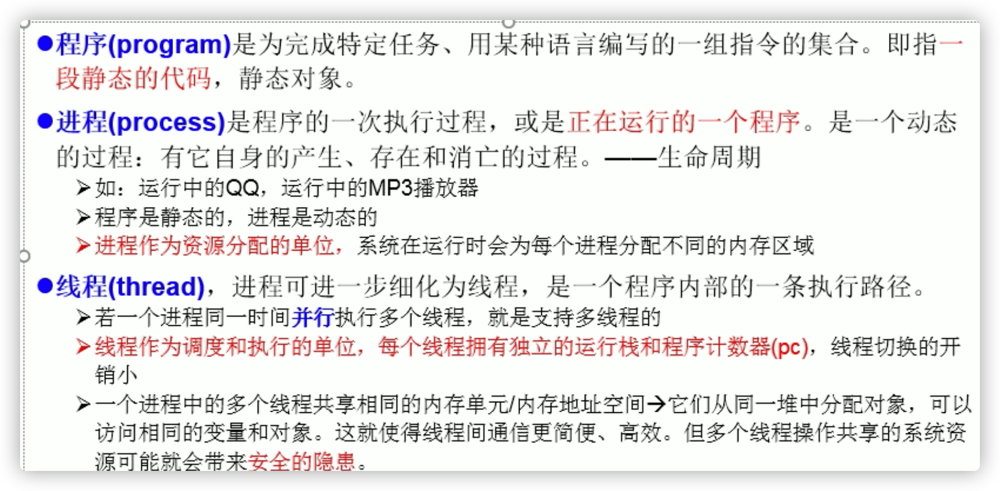
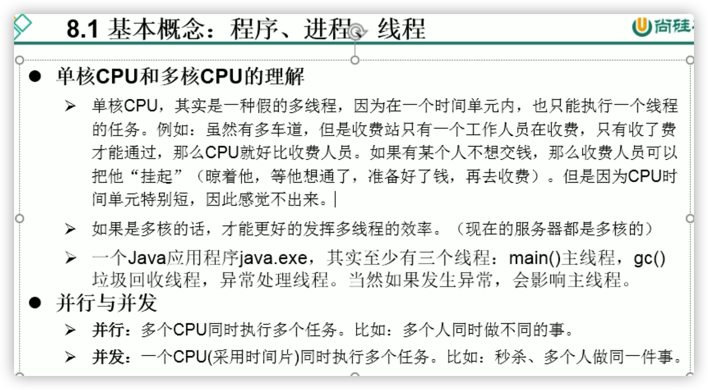
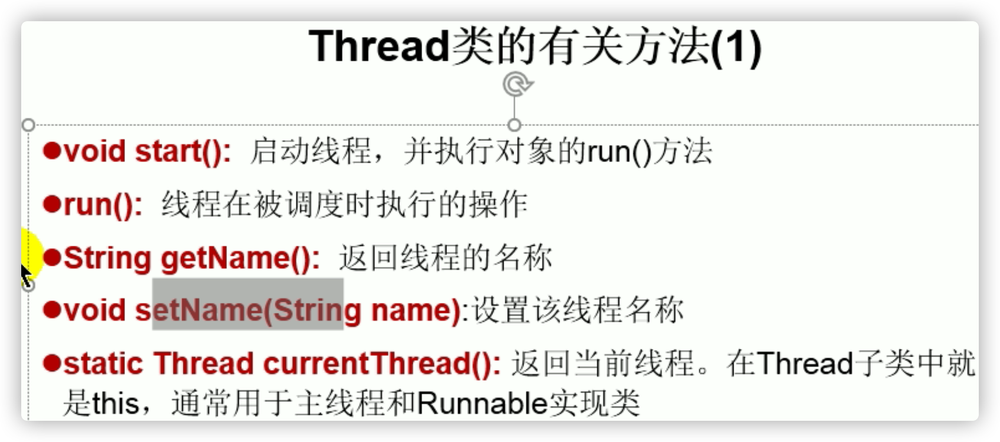

# IDEA&Eclipse

在 IntelliJ IDEA 中，没有类似于 Eclipse 工作空间（Workspace）的概念，而是提出了`Project`和`Module`这两个概念。在IntelliJ IDEA中Project是最顶级的结构单元，一个Project是由一个或者多个Module组成。一些主流大型项目结构基本上都是由多个Module的结构组成。


简单的概括如下：

IntelliJ系中的 Project 相当于Eclipse系中的 Workspace ；

IntelliJ系中的 Module 相当于Eclipse系中的 Project ；

IntelliJ中一个 Project 可以包括多个 Module ；

Eclipse中一个 Workspace 可以包括多个 Project；


# 进线程




- 一个进程的多个线程共享一个堆 和 方法区




## 创建thread(继承法)

```java
* 多线程的创建，方式一：继承于Thread类
* 1. 创建一个继承于Thread类的子类
* 2. 重写Thread类的run() --> 将此线程执行的操作声明在run()中
* 3. 创建Thread类的子类的对象
* 4. 通过此对象调用start()
* <p>
* 例子：遍历100以内的所有的偶数
  
  //1. 创建一个继承于Thread类的子类
class MyThread extends Thread {
    //2. 重写Thread类的run()
    @Override
    public void run() {
        for (int i = 0; i < 100; i++) {
            if(i % 2 == 0){
                System.out.println(Thread.currentThread().getName() + ":" + i);
            }
        }
    }
}

public class ThreadTest {
    public static void main(String[] args) {
        //3. 创建Thread类的子类的对象
        MyThread t1 = new MyThread();

        //4.通过此对象调用start():①启动当前线程 ② 调用当前线程的run()
        t1.start();
        //问题一：我们不能通过直接调用run()的方式启动线程。
//        t1.run();

        //问题二：再启动一个线程，遍历100以内的偶数。不可以还让已经start()的线程去执行。会报IllegalThreadStateException
//        t1.start();
        //我们需要重新创建一个线程的对象
        MyThread t2 = new MyThread();
        t2.start();
    }
}
```

## thread相关方法




```java
/**
 * 测试Thread中的常用方法：
 * 1. start():启动当前线程；调用当前线程的run()
 * 2. run(): 通常需要重写Thread类中的此方法，将创建的线程要执行的操作声明在此方法中
 * 3. currentThread():静态方法，返回执行当前代码的线程
 * 4. getName():获取当前线程的名字
 * 5. setName():设置当前线程的名字
 * 6. yield():释放当前cpu的执行权 看看能不能让别的线程先走
 * 7. join():在线程a中调用线程b的join(),此时线程a就进入阻塞状态，直到线程b完全执行完以后，线程a才
 *           结束阻塞状态。
 * 8. stop():已过时。当执行此方法时，强制结束当前线程。
 * 9. sleep(long millitime):让当前线程“睡眠”指定的millitime毫秒。在指定的millitime毫秒时间内，当前
 *                          线程是阻塞状态。
 * 10. isAlive():判断当前线程是否存活
 *
 *
 * 线程的优先级：
 * 1.
 * MAX_PRIORITY：10
 * MIN _PRIORITY：1
 * NORM_PRIORITY：5  -->默认优先级
 * 2.如何获取和设置当前线程的优先级：
 *   getPriority():获取线程的优先级
 *   setPriority(int p):设置线程的优先级
 *
 *   说明：高优先级的线程要抢占低优先级线程cpu的执行权。但是只是从概率上讲，高优先级的线程高概率的情况下
 *   被执行。并不意味着只有当高优先级的线程执行完以后，低优先级的线程才执行。
 */
class HelloThread extends Thread{
    @Override
    public void run() {
        for (int i = 0; i < 100; i++) {
            if(i % 2 == 0){
//                try {
//                    sleep(10);
//                } catch (InterruptedException e) {
//                    e.printStackTrace();
//                }
                System.out.println(Thread.currentThread().getName() + ":" + Thread.currentThread().getPriority() + ":" + i);
            }
//            if(i % 20 == 0){
//                yield();
//            }
        }
    }

    public HelloThread(String name){
        super(name);
    }
}

public class ThreadMethodTest {
    public static void main(String[] args) {
        HelloThread h1 = new HelloThread("Thread：1");
//        h1.setName("线程一");
        //设置分线程的优先级
        h1.setPriority(Thread.MAX_PRIORITY);
        h1.start();
        //给主线程命名
        Thread.currentThread().setName("主线程");
        Thread.currentThread().setPriority(Thread.MIN_PRIORITY);
        for (int i = 0; i < 100; i++) {
            if(i % 2 == 0){
                System.out.println(Thread.currentThread().getName() + ":" + Thread.currentThread().getPriority() + ":" + i);
            }
//            if(i == 20){
//                try {
//                    h1.join();
//                } catch (InterruptedException e) {
//                    e.printStackTrace();
//                }
//            }
        }
//        System.out.println(h1.isAlive());
    }
}
```

## 创建thread(接口法)

```java
/**
 * 创建多线程的方式二：实现Runnable接口
 * 1. 创建一个实现了Runnable接口的类
 * 2. 实现类去实现Runnable中的抽象方法：run()
 * 3. 创建实现类的对象
 * 4. 将此对象作为参数传递到Thread类的构造器中，创建Thread类的对象
 * 5. 通过Thread类的对象调用start()
 *
 *
 * 比较创建线程的两种方式。
 * 开发中：优先选择：实现Runnable接口的方式
 * 原因：1. 实现的方式没有类的单继承性的局限性
 *      2. 实现的方式更适合来处理多个线程有共享数据的情况。
 *
 * 联系：public class Thread implements Runnable
 * 相同点：两种方式都需要重写run(),将线程要执行的逻辑声明在run()中。
 */
//1. 创建一个实现了Runnable接口的类
class MThread implements Runnable{
    //2. 实现类去实现Runnable中的抽象方法：run()
    @Override
    public void run() {
        for (int i = 0; i < 100; i++) {
            if(i % 2 == 0){
                System.out.println(Thread.currentThread().getName() + ":" + i);
            }
        }
    }
}

public class ThreadTest1 {
    public static void main(String[] args) {
        //3. 创建实现类的对象
        MThread mThread = new MThread();
        //4. 将此对象作为参数传递到Thread类的构造器中，创建Thread类的对象
        Thread t1 = new Thread(mThread);
        t1.setName("线程1");
        //5. 通过Thread类的对象调用start():① 启动线程 ②调用当前线程的run()-->调用了Runnable类型的target的run()
        t1.start();
        //再启动一个线程，遍历100以内的偶数
        Thread t2 = new Thread(mThread);
        t2.setName("线程2");
        t2.start();
    }
}
```

### 售票共享数据例子

```java
/**
 * 例子：创建三个窗口卖票，总票数为100张.使用实现Runnable接口的方式
 * 存在线程的安全问题，待解决。
 */
class Window1 implements Runnable{
    //如果是继承法需要加static
    private int ticket = 100;
    @Override
    public void run() {
        while(true){
            if(ticket > 0){
                System.out.println(Thread.currentThread().getName() + ":卖票，票号为：" + ticket);
                ticket--;
            }else{
                break;
            }
        }
    }
}

public class WindowTest1 {
    public static void main(String[] args) {
        Window1 w = new Window1();
        //t1 t2 t3共享100张票
        Thread t1 = new Thread(w);
        Thread t2 = new Thread(w);
        Thread t3 = new Thread(w);

        t1.setName("窗口1");
        t2.setName("窗口2");
        t3.setName("窗口3");

        t1.start();
        t2.start();
        t3.start();
    }
}
```