# IDEA&Eclipse

在 IntelliJ IDEA 中，没有类似于 Eclipse 工作空间（Workspace）的概念，而是提出了`Project`和`Module`这两个概念。在IntelliJ IDEA中Project是最顶级的结构单元，一个Project是由一个或者多个Module组成。一些主流大型项目结构基本上都是由多个Module的结构组成。


简单的概括如下：

IntelliJ系中的 Project 相当于Eclipse系中的 Workspace ；

IntelliJ系中的 Module 相当于Eclipse系中的 Project ；

IntelliJ中一个 Project 可以包括多个 Module ；

Eclipse中一个 Workspace 可以包括多个 Project；

# 进线程


- 一个进程的多个线程共享一个堆 和 方法区


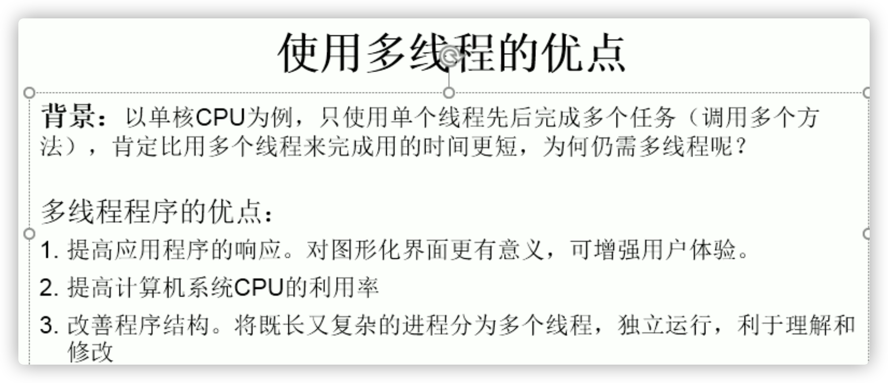


- 用户线程：主线程
- 守护线程：垃圾回收线程，异常处理线程

## 创建thread(继承法)

```java
* 多线程的创建，方式一：继承于Thread类
* 1. 创建一个继承于Thread类的子类
* 2. 重写Thread类的run() --> 将此线程执行的操作声明在run()中
* 3. 创建Thread类的子类的对象
* 4. 通过此对象调用start()
* <p>
* 例子：遍历100以内的所有的偶数
  
  //1. 创建一个继承于Thread类的子类
class MyThread extends Thread {
    //2. 重写Thread类的run()
    @Override
    public void run() {
        for (int i = 0; i < 100; i++) {
            if(i % 2 == 0){
                System.out.println(Thread.currentThread().getName() + ":" + i);
            }
        }
    }
}

public class ThreadTest {
    public static void main(String[] args) {
        //3. 创建Thread类的子类的对象
        MyThread t1 = new MyThread();

        //4.通过此对象调用start():①启动当前线程 ② 调用当前线程的run()
        t1.start();
        //问题一：我们不能通过直接调用run()的方式启动线程。
//        t1.run();

        //问题二：再启动一个线程，遍历100以内的偶数。不可以还让已经start()的线程去执行。会报IllegalThreadStateException
//        t1.start();
        //我们需要重新创建一个线程的对象
        MyThread t2 = new MyThread();
        t2.start();
    }
}
```

```java
//匿名Thread对象法
new Thread(){
            @Override
            public void run() {
                }
        }.start();
```

## thread相关方法


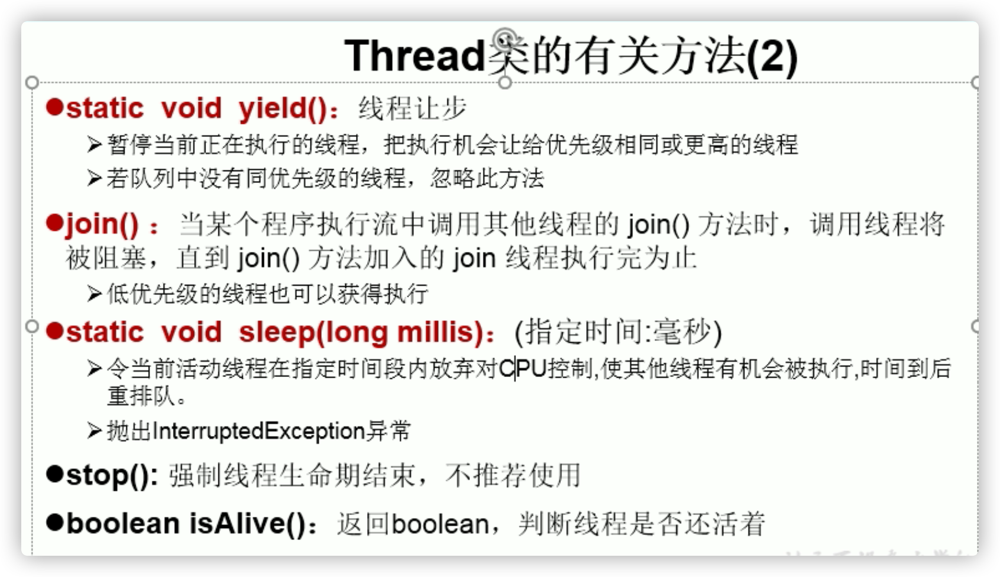


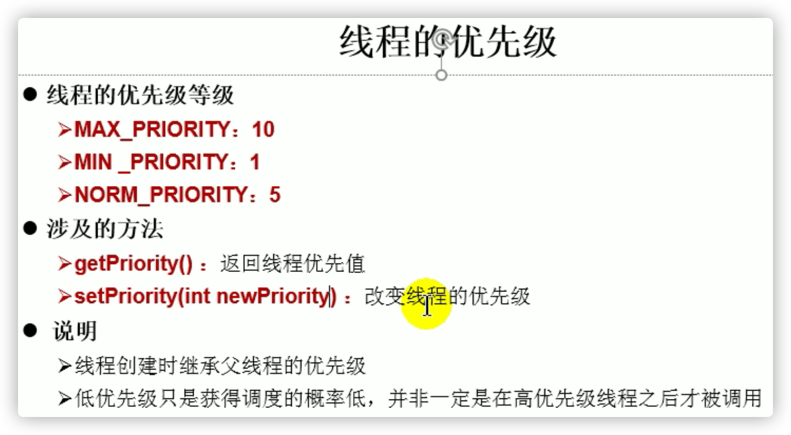

```java
/**
 * 测试Thread中的常用方法：
 * 1. start():启动当前线程；调用当前线程的run()
 * 2. run(): 通常需要重写Thread类中的此方法，将创建的线程要执行的操作声明在此方法中
 * 3. currentThread():静态方法，返回执行当前代码的线程
 * 4. getName():获取当前线程的名字
 * 5. setName():设置当前线程的名字
 * 6. yield():释放当前cpu的执行权 看看能不能让别的线程先走
 * 7. join():在线程a中调用线程b的join(),此时线程a就进入阻塞状态，直到线程b完全执行完以后，线程a才
 *           结束阻塞状态。
 * 8. stop():已过时。当执行此方法时，强制结束当前线程。
 * 9. sleep(long millitime):让当前线程“睡眠”指定的millitime毫秒。在指定的millitime毫秒时间内，当前
 *                          线程是阻塞状态。
 * 10. isAlive():判断当前线程是否存活
 *
 *
 * 线程的优先级：
 * 1.
 * MAX_PRIORITY：10
 * MIN _PRIORITY：1
 * NORM_PRIORITY：5  -->默认优先级
 * 2.如何获取和设置当前线程的优先级：
 *   getPriority():获取线程的优先级
 *   setPriority(int p):设置线程的优先级
 *
 *   说明：高优先级的线程要抢占低优先级线程cpu的执行权。但是只是从概率上讲，高优先级的线程高概率的情况下
 *   被执行。并不意味着只有当高优先级的线程执行完以后，低优先级的线程才执行。
 */
class HelloThread extends Thread{
    @Override
    public void run() {
        for (int i = 0; i < 100; i++) {
            if(i % 2 == 0){
//                try {
//                    sleep(10);
//                } catch (InterruptedException e) {
//                    e.printStackTrace();
//                }
                System.out.println(Thread.currentThread().getName() + ":" + Thread.currentThread().getPriority() + ":" + i);
            }
//            if(i % 20 == 0){
//                yield();
//            }
        }
    }

    public HelloThread(String name){
        super(name);
    }
}

public class ThreadMethodTest {
    public static void main(String[] args) {
        HelloThread h1 = new HelloThread("Thread：1");
//        h1.setName("线程一");
        //设置分线程的优先级
        h1.setPriority(Thread.MAX_PRIORITY);
        h1.start();
        //给主线程命名
        Thread.currentThread().setName("主线程");
        Thread.currentThread().setPriority(Thread.MIN_PRIORITY);
        for (int i = 0; i < 100; i++) {
            if(i % 2 == 0){
                System.out.println(Thread.currentThread().getName() + ":" + Thread.currentThread().getPriority() + ":" + i);
            }
//            if(i == 20){
//                try {
//                    h1.join();
//                } catch (InterruptedException e) {
//                    e.printStackTrace();
//                }
//            }
        }
//        System.out.println(h1.isAlive());
    }
}
```

## 创建thread(Runnable接口法)

```java
/**
 * 创建多线程的方式二：实现Runnable接口
 * 1. 创建一个实现了Runnable接口的类
 * 2. 实现类去实现Runnable中的抽象方法：run()
 * 3. 创建实现类的对象
 * 4. 将此对象作为参数传递到Thread类的构造器中，创建Thread类的对象
 * 5. 通过Thread类的对象调用start()
 *
 *
 * 比较创建线程的两种方式。
 * 开发中：优先选择：实现Runnable接口的方式
 * 原因：1. 实现的方式没有类的单继承性的局限性
 *      2. 实现的方式更适合来处理多个线程有共享数据的情况。
 *
 * 联系：public class Thread implements Runnable
 * 相同点：两种方式都需要重写run(),将线程要执行的逻辑声明在run()中。
 */
//1. 创建一个实现了Runnable接口的类
class MThread implements Runnable{
    //2. 实现类去实现Runnable中的抽象方法：run()
    @Override
    public void run() {
        for (int i = 0; i < 100; i++) {
            if(i % 2 == 0){
                System.out.println(Thread.currentThread().getName() + ":" + i);
            }
        }
    }
}

public class ThreadTest1 {
    public static void main(String[] args) {
        //3. 创建实现类的对象
        MThread mThread = new MThread();
        //4. 将此对象作为参数传递到Thread类的构造器中，创建Thread类的对象
        Thread t1 = new Thread(mThread);
        t1.setName("线程1");
        //5. 通过Thread类的对象调用start():① 启动线程 ②调用当前线程的run()-->调用了Runnable类型的target的run()
        t1.start();
        //再启动一个线程，遍历100以内的偶数
        Thread t2 = new Thread(mThread);
        t2.setName("线程2");
        t2.start();
    }
}
```

### 售票共享数据例子

```java
/**
 * 例子：创建三个窗口卖票，总票数为100张.使用实现Runnable接口的方式
 * 存在线程的安全问题，待解决。
 */
class Window1 implements Runnable{
    //如果是继承法需要加static
    private int ticket = 100;
    @Override
    public void run() {
        while(true){
            if(ticket > 0){
                System.out.println(Thread.currentThread().getName() + ":卖票，票号为：" + ticket);
                ticket--;
            }else{
                break;
            }
        }
    }
}

public class WindowTest1 {
    public static void main(String[] args) {
        Window1 w = new Window1();
        //t1 t2 t3共享100张票
        Thread t1 = new Thread(w);
        Thread t2 = new Thread(w);
        Thread t3 = new Thread(w);

        t1.setName("窗口1");
        t2.setName("窗口2");
        t3.setName("窗口3");

        t1.start();
        t2.start();
        t3.start();
    }
}
```

## 线程的生命周期

- 生命周期：状态 vs 方法
  - 状态改变，执行方法（回调方法）
  - 执行方法，状态改变

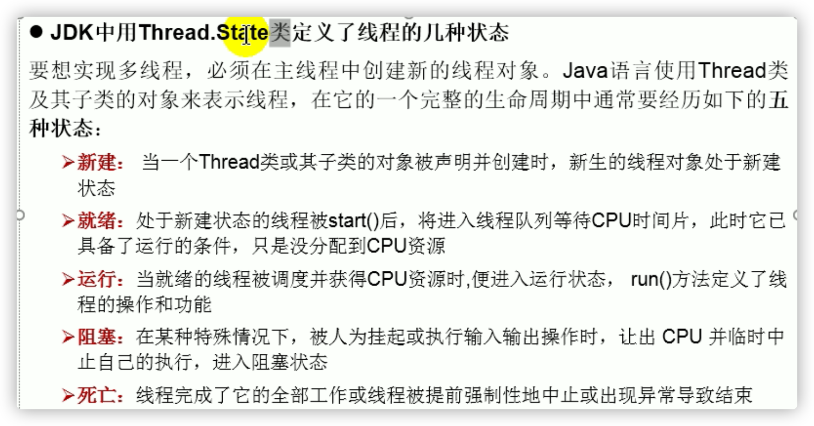

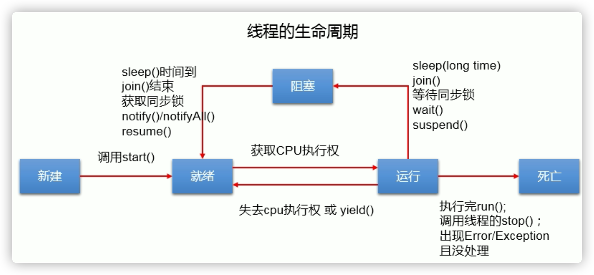

## 同步机制(同步锁)

```java
/**
 * 例子：创建三个窗口卖票，总票数为100张.使用实现Runnable接口的方式
 *
 * 1.问题：卖票过程中，出现了重票、错票 -->出现了线程的安全问题
 * 2.问题出现的原因：当某个线程操作车票的过程中，尚未操作完成时，其他线程参与进来，也操作车票。
 * 3.如何解决：当一个线程a在操作ticket的时候，其他线程不能参与进来。直到线程a操作完ticket时，其他
 *            线程才可以开始操作ticket。这种情况即使线程a出现了阻塞，也不能被改变。
 *
 *
 * 4.在Java中，我们通过同步机制，来解决线程的安全问题。
 *
 *  方式一：同步代码块
 *
 *   synchronized(同步监视器){
 *      //需要被同步的代码
 *   }
 *  说明：1.操作共享数据的代码，即为需要被同步的代码。  -->不能包含代码多了，也不能包含代码少了。
 *       2.共享数据：多个线程共同操作的变量。比如：ticket就是共享数据。(包括对共享数据的比较）
 *       3.同步监视器，俗称：锁。任何一个类的对象，都可以充当锁。
 *          要求：多个线程必须要共用同一把锁。
 *
 *       补充：在实现Runnable接口创建多线程的方式中，我们可以考虑使用this充当同步监视器。
 *  方式二：同步方法。
 *     如果操作共享数据的代码完整的声明在一个方法中，我们不妨将此方法声明同步的。
 *
 *
 *  5.同步的方式，解决了线程的安全问题。---好处
 *    操作同步代码时，只能有一个线程参与，其他线程等待。相当于是一个单线程的过程，效率低。 ---局限性
 */
```

### 同步代码块

```java
//同步代码块
//接口法

class Window1 implements Runnable{
    private int ticket = 100;
//    Object obj = new Object();
//    Dog dog = new Dog();
    @Override
    public void run() {
        //每个线程都有一把锁（❌）
//        Object obj = new Object();
        while(true){
            synchronized (this){//此时的this:唯一的Window1的对象
                // 方式二：synchronized (dog)
                if (ticket > 0) {
                    try {
                        Thread.sleep(100);
                    } catch (InterruptedException e) {
                        e.printStackTrace();
                    }

                    System.out.println(Thread.currentThread().getName() + ":卖票，票号为：" + ticket);
                    ticket--;
                } else {
                    break;
                }
            }
        }
    }
}

public class WindowTest1 {
    public static void main(String[] args) {
        Window1 w = new Window1();

        Thread t1 = new Thread(w);
        Thread t2 = new Thread(w);
        Thread t3 = new Thread(w);

        t1.setName("窗口1");
        t2.setName("窗口2");
        t3.setName("窗口3");

        t1.start();
        t2.start();
        t3.start();
    }
}

class Dog{
}
```

```java
//同步代码块
//继承法
/** 使用同步代码块解决继承Thread类的方式的线程安全问题
 *
 * 例子：创建三个窗口卖票，总票数为100张.使用继承Thread类的方式
 *
 * 说明：在继承Thread类创建多线程的方式中，慎用this充当同步监视器，考虑使用当前类充当同步监视器。
 */
  class Window2 extends Thread{
    private static int ticket = 100;
    private static Object obj = new Object();

    @Override
    public void run() {
        while(true){
            //正确的
//            synchronized (obj){
            synchronized (Window2.class){
                //Class clazz = Window2.class,Window2.class只会加载一次（类也是对象）
                //错误的方式：this代表着t1,t2,t3三个对象
//              synchronized (this){
                if(ticket > 0){
                    try {
                        Thread.sleep(100);
                    } catch (InterruptedException e) {
                        e.printStackTrace();
                    }
                    System.out.println(getName() + "：卖票，票号为：" + ticket);
                    ticket--;
                }else{
                    break;
                }
            }
        }
    }
}

public class WindowTest2 {
    public static void main(String[] args) {
        Window2 t1 = new Window2();
        Window2 t2 = new Window2();
        Window2 t3 = new Window2();

        t1.setName("窗口1");
        t2.setName("窗口2");
        t3.setName("窗口3");

        t1.start();
        t2.start();
        t3.start();
    }
}
```

### 同步方法

```java
/**
 * 使用同步方法解决实现Runnable接口的线程安全问题
 *
 *  关于同步方法的总结：
 *  1. 同步方法仍然涉及到同步监视器，只是不需要我们显式的声明。
 *  2. 非静态的同步方法，同步监视器是：this
 *     静态的同步方法，同步监视器是：当前类本身
 */
```

```java
//同步方法
//接口法
class Window3 implements Runnable {
    private int ticket = 100;
    @Override
    public void run() {
        while (true) {
            show();
        }
    }

    private synchronized void show(){//同步监视器：this
        //synchronized (this){
            if (ticket > 0) {
                try {
                    Thread.sleep(100);
                } catch (InterruptedException e) {
                    e.printStackTrace();
                }
                System.out.println(Thread.currentThread().getName() + ":卖票，票号为：" + ticket);
                ticket--;
            }
        //}
    }
}

public class WindowTest3 {
    public static void main(String[] args) {
        Window3 w = new Window3();

        Thread t1 = new Thread(w);
        Thread t2 = new Thread(w);
        Thread t3 = new Thread(w);

        t1.setName("窗口1");
        t2.setName("窗口2");
        t3.setName("窗口3");

        t1.start();
        t2.start();
        t3.start();
    }
}
```

```java
//同步方法
//继承法
class Window4 extends Thread {
    private static int ticket = 100;
    @Override
    public void run() {
        while (true) {
            show();
        }
    }

    private static synchronized void show(){//同步监视器：Window4.class
        //private synchronized void show(){ //同步监视器：t1,t2,t3。此种解决方式是错误的
        //同步方法是静态的，监视器是当前类本身（也是对象可以作为监视器）
        if (ticket > 0) {
            try {
                Thread.sleep(100);
            } catch (InterruptedException e) {
                e.printStackTrace();
            }
            System.out.println(Thread.currentThread().getName() + "：卖票，票号为：" + ticket);
            ticket--;
        }
    }
}

public class WindowTest4 {
    public static void main(String[] args) {
        Window4 t1 = new Window4();
        Window4 t2 = new Window4();
        Window4 t3 = new Window4();

        t1.setName("窗口1");
        t2.setName("窗口2");
        t3.setName("窗口3");

        t1.start();
        t2.start();
        t3.start();
    }
}
```

## 改进懒汉式单例模式

- 会手写

```java
/**
 * 使用同步机制将单例模式中的懒汉式改写为线程安全的
 * 双重if校验
 */
class Bank{
    private Bank(){}
    private static Bank instance = null;
    public static Bank getInstance(){
        if(instance == null){
            synchronized (Bank.class) {
                if(instance == null){
                    instance = new Bank();
                }
            }
        }
        return instance;
    }
}
```

## 线程的死锁

- 线程是否安全问题：取决于是否有共享数据

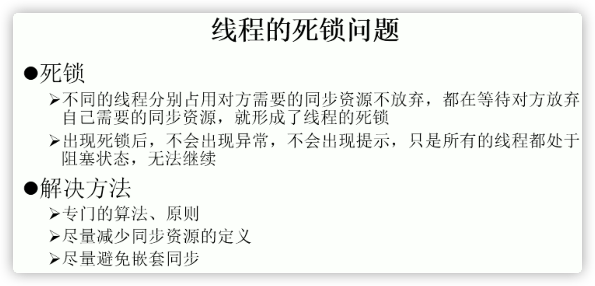


```java
/**
 * 演示线程的死锁问题
 *
 * 1.死锁的理解：不同的线程分别占用对方需要的同步资源不放弃，
 * 都在等待对方放弃自己需要的同步资源，就形成了线程的死锁
 *
 * 2.说明：
 * 1）出现死锁后，不会出现异常，不会出现提示，只是所有的线程都处于阻塞状态，无法继续
 * 2）我们使用同步时，要避免出现死锁。
 */
public class ThreadTest {
    public static void main(String[] args) {
        StringBuffer s1 = new StringBuffer();
        StringBuffer s2 = new StringBuffer();

        new Thread(){
            @Override
            public void run() {
                synchronized (s1){
                    s1.append("a");
                    s2.append("1");
                    try {
                        Thread.sleep(100);
                    } catch (InterruptedException e) {
                        e.printStackTrace();
                    }
                    synchronized (s2){
                        //等待下面对象的s2锁解开
                        s1.append("b");
                        s2.append("2");
                        System.out.println(s1);
                        System.out.println(s2);
                    }
                }
            }
        }.start();

        new Thread(new Runnable() {
            @Override
            public void run() {
                synchronized (s2){
                    s1.append("c");
                    s2.append("3");
                    try {
                        Thread.sleep(100);
                    } catch (InterruptedException e) {
                        e.printStackTrace();
                    }
                    synchronized (s1){
                        //等待上面对象的s1锁解开
                        s1.append("d");
                        s2.append("4");
                        System.out.println(s1);
                        System.out.println(s2);
                    }
                }
            }
        }).start();
    }
}
```

## Lock

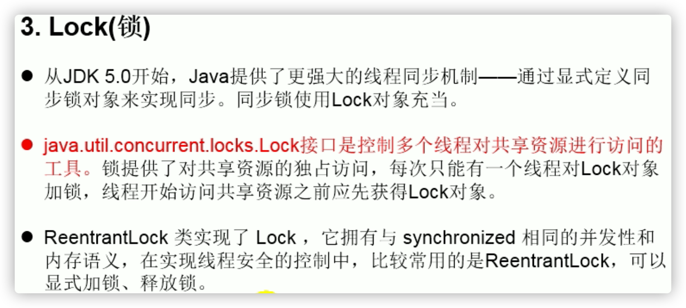


```java
/**
 * 解决线程安全问题的方式三：Lock锁  --- JDK5.0新增
 *
 * 1. 面试题：synchronized 与 Lock的异同？
 *   相同：二者都可以解决线程安全问题
 *   不同：synchronized机制在执行完相应的同步代码以后，自动的释放同步监视器
 *        Lock需要手动的启动同步（lock()），同时结束同步也需要手动的实现（unlock()）
 *
 * 2.优先使用顺序：
 * Lock > 同步代码块（已经进入了方法体，分配了相应资源） > 同步方法（在方法体之外）
 *
 *
 *  面试题：如何解决线程安全问题？有几种方式
 */
class Window implements Runnable{
    private int ticket = 100;
    //1.实例化ReentrantLock
    //如果是继承 private static ReentrantLock lock
    private ReentrantLock lock = new ReentrantLock();
    //带参数的构造器：参数如果是true：锁解开一次后，按照顺序进入；
    // false，之前进入的线程可以再抢进去
    //private ReentrantLock lock1 = new ReentrantLock(true);
    
    @Override
    public void run() {
        while(true){
            try{
                //2.调用锁定方法lock()
                lock.lock();
                if(ticket > 0){
                    try {
                        Thread.sleep(100);
                    } catch (InterruptedException e) {
                        e.printStackTrace();
                    }
                    System.out.println(Thread.currentThread().getName() + "：售票，票号为：" + ticket);
                    ticket--;
                }else{
                    break;
                }
            }finally {
                //3.调用解锁方法：unlock()
                lock.unlock();
            }
        }
    }
}

public class LockTest {
    public static void main(String[] args) {
        Window w = new Window();

        Thread t1 = new Thread(w);
        Thread t2 = new Thread(w);
        Thread t3 = new Thread(w);

        t1.setName("窗口1");
        t2.setName("窗口2");
        t3.setName("窗口3");

        t1.start();
        t2.start();
        t3.start();
    }
}
```

## 线程通信

```java
/**
 * 线程通信的例子：使用两个线程打印 1-100。线程1, 线程2 交替打印
 *
 * 涉及到的三个方法：
 * wait():一旦执行此方法，当前线程就进入阻塞状态，并释放同步监视器。
 * notify():一旦执行此方法，就会唤醒被wait的一个线程。如果有多个线程被wait，就唤醒优先级高的那个。
 * notifyAll():一旦执行此方法，就会唤醒所有被wait的线程。
 *
 * 说明：
 * 1.wait()，notify()，notifyAll()三个方法必须使用在同步代码块或同步方法中。
 * 2.wait()，notify()，notifyAll()三个方法的调用者必须是同步代码块或同步方法中的同步监视器。
 *    否则，会出现IllegalMonitorStateException异常
 * 3.wait()，notify()，notifyAll()三个方法是定义在java.lang.Object类中。(Object类做同步监视器）
 *
 * 面试题：sleep() 和 wait()的异同？
 * 1.相同点：一旦执行方法，都可以使得当前的线程进入阻塞状态。
 * 2.不同点：1）两个方法声明的位置不同：Thread类中声明sleep() , Object类中声明wait()
 *          2）调用的要求不同：sleep()可以在任何需要的场景下调用。 wait()必须使用在同步代码块或同步方法中
 *          3）关于是否释放同步监视器：如果两个方法都使用在同步代码块或同步方法中，sleep()不会释放锁，wait()会释放锁。
 */
class Number implements Runnable{
    private int number = 1;
    private Object obj = new Object();
    @Override
    public void run() {
        while(true){
            //3⃣️B线程进入
            synchronized (obj) {
                //1⃣️第一次A线程进入，notify没有明显作用
                //4⃣️A线程进入就绪状态，B线程没有明显作用
                obj.notify();
                if(number <= 100){
                    try {
                        Thread.sleep(10);
                    } catch (InterruptedException e) {
                        e.printStackTrace();
                    }
                    System.out.println(Thread.currentThread().getName() + ":" + number);
                    number++;
                    try {
                        //使得调用如下wait()方法的线程进入阻塞状态
                        //2⃣️A线程进入阻塞状态，并且释放obj同步监视器
                        //5⃣️B线程进入阻塞状态，并且释放obj同步监视器
                        obj.wait();
                    } catch (InterruptedException e) {
                        e.printStackTrace();
                    }
                }else{
                    break;
                }
            }
        }
    }
}

public class CommunicationTest {
    public static void main(String[] args) {
        Number number = new Number();
        Thread t1 = new Thread(number);
        Thread t2 = new Thread(number);

        t1.setName("线程1");
        t2.setName("线程2");

        t1.start();
        t2.start();
    }
}
```

## 创建thread(Callable接口)

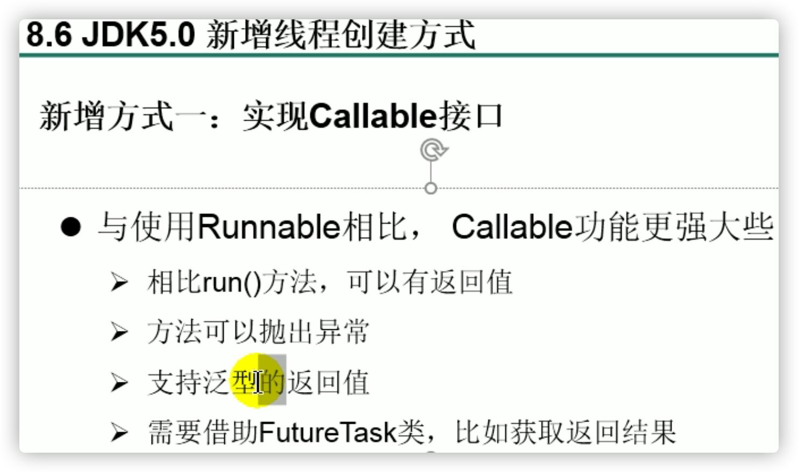

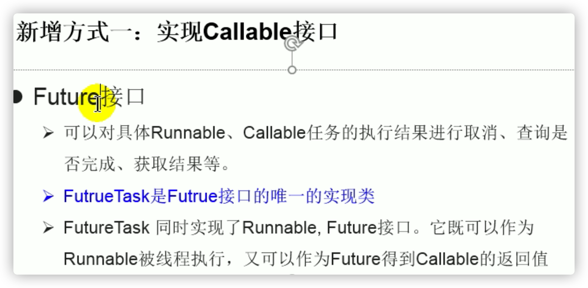

```java
/**
 * 创建线程的方式三：实现Callable接口。 --- JDK 5.0新增
 *
 * 如何理解实现Callable接口的方式创建多线程比实现Runnable接口创建多线程方式强大？
 * 1. call()可以有返回值的。
 * 2. call()可以抛出异常，被外面的操作捕获，获取异常的信息
 * 3. Callable是支持泛型的
 */
//1.创建一个实现Callable的实现类
class NumThread implements Callable{
    //2.实现call方法，将此线程需要执行的操作声明在call()中
    @Override
    public Object call() throws Exception {
        int sum = 0;
        for (int i = 1; i <= 100; i++) {
            if(i % 2 == 0){
                System.out.println(i);
                sum += i;
            }
        }
        return sum;
    }
}

public class ThreadNew {
    public static void main(String[] args) {
        //3.创建Callable接口实现类的对象
        NumThread numThread = new NumThread();
        //4.将此Callable接口实现类的对象作为参数传递到FutureTask构造器中，创建FutureTask的对象
        FutureTask futureTask = new FutureTask(numThread);
        //5.将FutureTask的对象作为参数传递到Thread类的构造器中，创建Thread对象，并调用start()
        new Thread(futureTask).start();

        try {
            //6.获取Callable中call方法的返回值
            //get()返回值即为FutureTask构造器参数Callable实现类重写的call()的返回值。
            //int --> Object --> Integer
            Object sum = futureTask.get();
            System.out.println("总和为：" + sum);
        } catch (InterruptedException e) {
            e.printStackTrace();
        } catch (ExecutionException e) {
            e.printStackTrace();
        }
    }
}
```

## 创建thread(线程池法)

- 很常用

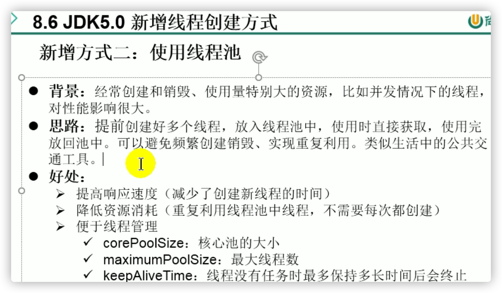 

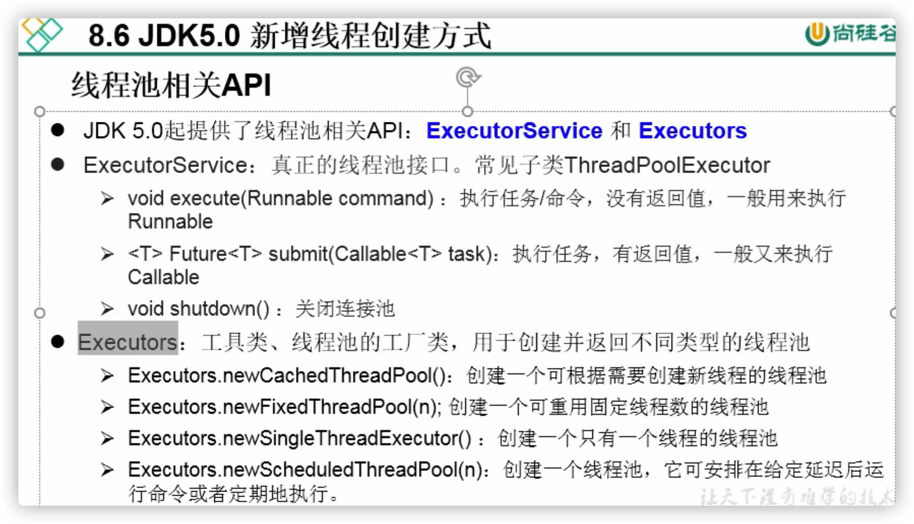

```java
/**
 * 创建线程的方式四：使用线程池
 *
 * 好处：
 * 1.提高响应速度（减少了创建新线程的时间）
 * 2.降低资源消耗（重复利用线程池中线程，不需要每次都创建）
 * 3.便于线程管理
 *      corePoolSize：核心池的大小
 *      maximumPoolSize：最大线程数
 *      keepAliveTime：线程没有任务时最多保持多长时间后会终止
 * 面试题：创建多线程有几种方式？四种！
 */
```

### Runnable使用

```java
class NumberThread implements Runnable{
    @Override
    public void run() {
        for(int i = 0;i <= 100;i++){
            if(i % 2 == 0){
                System.out.println(Thread.currentThread().getName() + ": " + i);
            }
        }
    }
}

class NumberThread1 implements Runnable{
    @Override
    public void run() {
        for(int i = 0;i <= 100;i++){
            if(i % 2 != 0){
                System.out.println(Thread.currentThread().getName() + ": " + i);
            }
        }
    }
}

public class ThreadPool {
    public static void main(String[] args) {
        //1. 提供指定线程数量的线程池
        //service 是 ExecutorService接口实现类的对象
        ExecutorService service = Executors.newFixedThreadPool(10);
        ThreadPoolExecutor service1 = (ThreadPoolExecutor) service;
        //设置线程池的属性
//        System.out.println(service.getClass());
//        service1.setCorePoolSize(15);
//        service1.setKeepAliveTime();

        //2.执行指定的线程的操作。需要提供实现Runnable接口或Callable接口实现类的对象
        service.execute(new NumberThread());//适合适用于Runnable
        service.execute(new NumberThread1());//适合适用于Runnable

//        service.submit(Callable callable);//适合使用于Callable
        //FutureTask接收返回值
        //Object sum = futureTask.get();
        //3.关闭连接池
        service.shutdown();
    }
}
```

### Callable使用

```java
//1.创建一个实现Callable的实现类
class NumThread implements Callable{
    //2.实现call方法，将此线程需要执行的操作声明在call()中
    @Override
    public Object call() throws Exception {
        int sum = 0;
        for (int i = 1; i <= 100; i++) {
            if(i % 2 == 0){
                System.out.println(i);
                sum += i;
            }
        }
        return sum;
    }
}

public class ThreadNew {
    public static void main(String[] args) {
        //3.创建Callable接口实现类的对象
        NumThread numThread = new NumThread();

        //1. 提供指定线程数量的线程池
        //service 是 ExecutorService接口实现类的对象
        ExecutorService service = Executors.newFixedThreadPool(10);

        //2.执行指定的线程的操作。需要提供实现Runnable接口或Callable接口实现类的对象
        FutureTask futureTask = (FutureTask) service.submit(numThread);//适合使用于Callable
        try {
            //6.获取Callable中call方法的返回值
            //get()返回值即为FutureTask构造器参数Callable实现类重写的call()的返回值。
            //int --> Object --> Integer
            Object sum = futureTask.get();
            System.out.println("总和为：" + sum);
        } catch (InterruptedException e) {
            e.printStackTrace();
        } catch (ExecutionException e) {
            e.printStackTrace();
        }
        //3.关闭连接池
        service.shutdown();
    }
}
```

# String

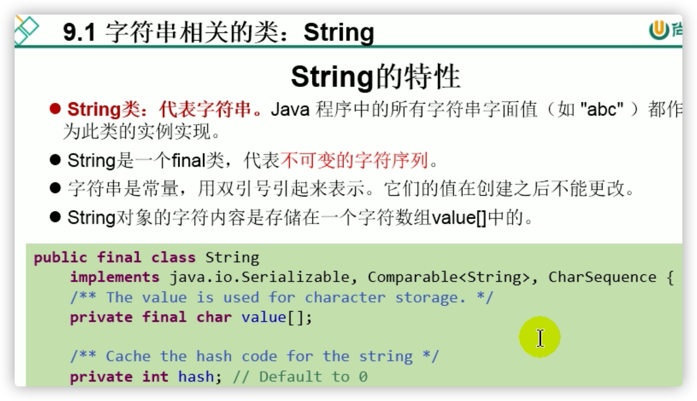

## 内存

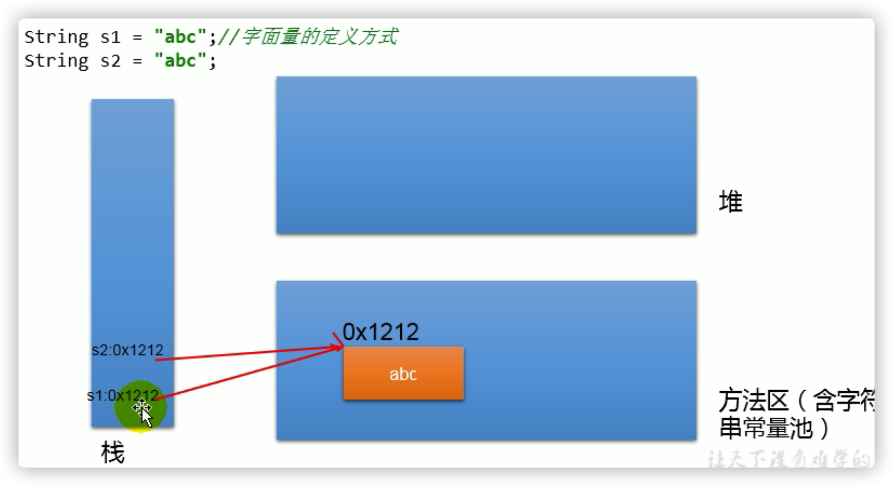

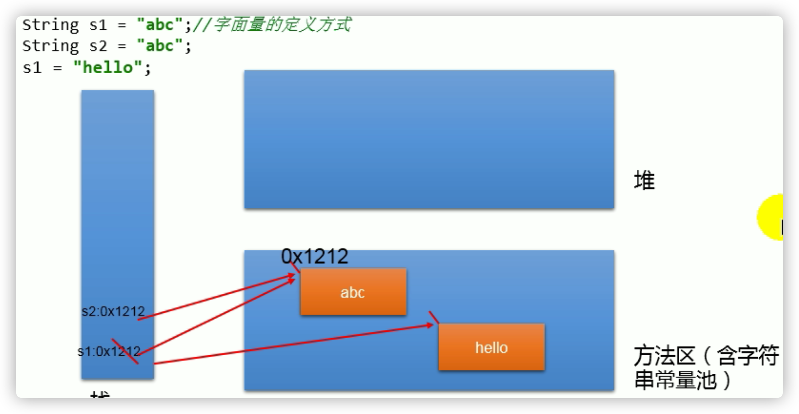

```java
/*
String:字符串，使用一对""引起来表示。
1.String声明为final的，不可被继承
2.String实现了Serializable接口：表示字符串是支持序列化的。
        实现了Comparable接口：表示String可以比较大小
3.String内部定义了final char[] value用于存储字符串数据
4.String:代表不可变的字符序列。简称：不可变性。
    体现：1.当对字符串重新赋值时，需要重写指定内存区域赋值，不能使用原有的value进行赋值。
         2. 当对现有的字符串进行连接操作时，也需要重新指定内存区域赋值，不能使用原有的value进行赋值。
         3. 当调用String的replace()方法修改指定字符或字符串时，也需要重新指定内存区域赋值，不能使用原有的value进行赋值。
5.通过字面量的方式（区别于new）给一个字符串赋值，此时的字符串值声明在字符串常量池中。
6.字符串常量池中是不会存储相同内容的字符串的。
 */
```


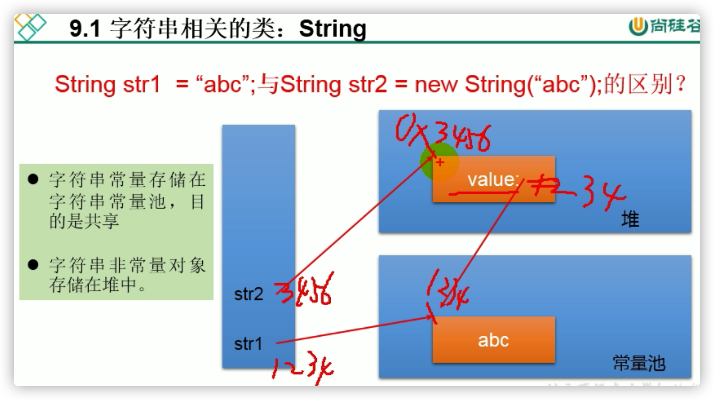

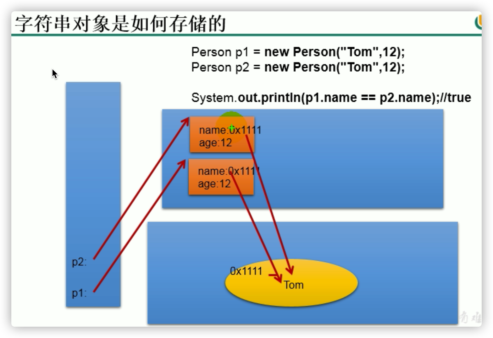

```java
/*
String的实例化方式：
方式一：通过字面量定义的方式
方式二：通过new + 构造器的方式

 面试题：String s = new String("abc");方式创建对象，在内存中创建了几个对象？
        两个:一个是堆空间中new结构，另一个是char[]对应的常量池中的数据："abc"
 */
@Test
public void test2(){
    //通过字面量定义的方式：此时的s1和s2的数据javaEE声明在方法区中的字符串常量池中。
    String s1 = "javaEE";
    String s2 = "javaEE";
    //通过new + 构造器的方式:此时的s3和s4保存的地址值，是数据在堆空间中开辟空间以后对应的地址值。
    String s3 = new String("javaEE");
    String s4 = new String("javaEE");

    System.out.println(s1 == s2);//true
    System.out.println(s1 == s3);//false
    System.out.println(s1 == s4);//false
    System.out.println(s3 == s4);//false

    System.out.println("***********************");
    Person p1 = new Person("Tom",12);
    Person p2 = new Person("Tom",12);

    System.out.println(p1.name.equals(p2.name));//true
    System.out.println(p1.name == p2.name);//true

    p1.name = "Jerry";
    System.out.println(p2.name);//Tom
}
```

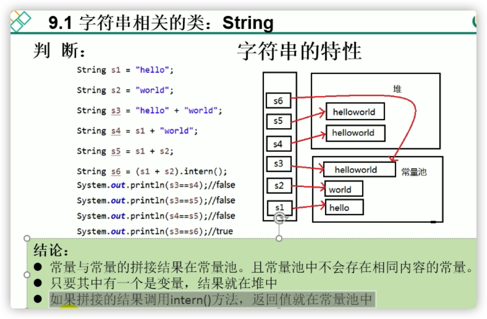

```java
 /*
    结论：
    1.常量与常量的拼接结果在常量池。且常量池中不会存在相同内容的常量。
    2.只要其中有一个是变量，结果就在堆中。
    3.如果拼接的结果调用intern()方法，返回值就在常量池中
     */
		@Test
    public void test3(){
        String s1 = "javaEE";
        String s2 = "hadoop";

        String s3 = "javaEEhadoop";
        String s4 = "javaEE" + "hadoop";
        String s5 = s1 + "hadoop";
        String s6 = "javaEE" + s2;
        String s7 = s1 + s2;
        
        System.out.println(s3 == s4);//true
        System.out.println(s3 == s5);//false
        System.out.println(s3 == s6);//false
        System.out.println(s3 == s7);//false
        System.out.println(s5 == s6);//false
        System.out.println(s5 == s7);//false
        System.out.println(s6 == s7);//false

        String s8 = s6.intern();//返回值得到的s8使用的常量值中已经存在的“javaEEhadoop”
        System.out.println(s3 == s8);//true
    }

  public void test4(){
          String s1 = "javaEEhadoop";
          String s2 = "javaEE";
          String s3 = s2 + "hadoop";
          System.out.println(s1 == s3);//false

          final String s4 = "javaEE";//s4:常量
          String s5 = s4 + "hadoop";
          System.out.println(s1 == s5);//true
      }
```

- String作为参数传递：即使参数内部改变String值，也改变不了（不可变性）

## 常用方法

```java
/*
int length()：返回字符串的长度： return value.length
char charAt(int index)： 返回某索引处的字符return value[index]
boolean isEmpty()：判断是否是空字符串：return value.length == 0
String toLowerCase()：使用默认语言环境，将 String 中的所有字符转换为小写
String toUpperCase()：使用默认语言环境，将 String 中的所有字符转换为大写
String trim()：返回字符串的副本，忽略前导空白和尾部空白
boolean equals(Object obj)：比较字符串的内容是否相同
boolean equalsIgnoreCase(String anotherString)：与equals方法类似，忽略大小写
String concat(String str)：将指定字符串连接到此字符串的结尾。 等价于用“+”
int compareTo(String anotherString)：比较两个字符串的大小
String substring(int beginIndex)：返回一个新的字符串，它是此字符串的从beginIndex开始截取到最后的一个子字符串。
String substring(int beginIndex, int endIndex) ：返回一个新字符串，它是此字符串从beginIndex开始截取到endIndex(不包含)的一个子字符串。

     */
    @Test
    public void test2() {
        String s1 = "HelloWorld";
        String s2 = "helloworld";
        System.out.println(s1.equals(s2));
        System.out.println(s1.equalsIgnoreCase(s2));

        String s3 = "abc";
        String s4 = s3.concat("def");
        System.out.println(s4);

        String s5 = "abc";
        String s6 = new String("abe");
        System.out.println(s5.compareTo(s6));//涉及到字符串排序
        //-2 s5 - s6

        String s7 = "北京尚硅谷教育";
        String s8 = s7.substring(2);
        System.out.println(s7);
        System.out.println(s8);//尚硅谷教育

        String s9 = s7.substring(2, 5);
        System.out.println(s9);//尚硅谷
    }

    @Test
    public void test1() {
        String s1 = "HelloWorld";
        System.out.println(s1.length());
        System.out.println(s1.charAt(0));
//        System.out.println(s1.charAt(10));
        //要在角标范围内
        System.out.println(s1.isEmpty());

        String s2 = s1.toLowerCase();
        System.out.println(s1);//s1不可变的，仍然为原来的字符串
        System.out.println(s2);//改成小写以后的字符串

        String s3 = "   he  llo   world   ";
        String s4 = s3.trim();
        System.out.println("-----" + s3 + "-----");
        System.out.println("-----" + s4 + "-----");
    }
}
```

```java
/*
boolean endsWith(String suffix)：测试此字符串是否以指定的后缀结束
boolean startsWith(String prefix)：测试此字符串是否以指定的前缀开始
boolean startsWith(String prefix, int toffset)：测试此字符串从指定索引开始的子字符串是否以指定前缀开始

boolean contains(CharSequence s)：当且仅当此字符串包含指定的 char 值序列时，返回 true
int indexOf(String str)：返回指定子字符串在此字符串中第一次出现处的索引
int indexOf(String str, int fromIndex)：返回指定子字符串在此字符串中第一次出现处的索引，从指定的索引开始
int lastIndexOf(String str)：返回指定子字符串在此字符串中最右边出现处的索引
int lastIndexOf(String str, int fromIndex)：返回指定子字符串在此字符串中最后一次出现处的索引，从指定的索引开始反向搜索

注：indexOf和lastIndexOf方法如果未找到都是返回-1
     */
    @Test
    public void test3(){
        String str1 = "hellowworld";
        boolean b1 = str1.endsWith("rld");
        System.out.println(b1);

        boolean b2 = str1.startsWith("He");
        System.out.println(b2);

        boolean b3 = str1.startsWith("ll",2);
        System.out.println(b3);//true

        String str2 = "wor";
        System.out.println(str1.contains(str2));

        System.out.println(str1.indexOf("lol"));//-1

        System.out.println(str1.indexOf("lo",5));//-1

        String str3 = "hellorworld";
        //从后往前找，
        System.out.println(str3.lastIndexOf("or"));//7
        System.out.println(str3.lastIndexOf("or",6));//4

        //什么情况下，indexOf(str)和lastIndexOf(str)返回值相同？
        //情况一：存在唯一的一个str。情况二：不存在str
    }
```

```java
/*
替换：
String replace(char oldChar, char newChar)：返回一个新的字符串，它是通过用 newChar 替换此字符串中出现的所有 oldChar 得到的。
String replace(CharSequence target, CharSequence replacement)：使用指定的字面值替换序列替换此字符串所有匹配字面值目标序列的子字符串。
String replaceAll(String regex, String replacement)：使用给定的 replacement 替换此字符串所有匹配给定的正则表达式的子字符串。
String replaceFirst(String regex, String replacement)：使用给定的 replacement 替换此字符串匹配给定的正则表达式的第一个子字符串。
匹配:
boolean matches(String regex)：告知此字符串是否匹配给定的正则表达式。
切片：
String[] split(String regex)：根据给定正则表达式的匹配拆分此字符串。
String[] split(String regex, int limit)：根据匹配给定的正则表达式来拆分此字符串，最多不超过limit个，如果超过了，剩下的全部都放到最后一个元素中。

     */
    @Test
    public void test4(){
        String str1 = "北京尚硅谷教育北京";
        String str2 = str1.replace('北', '东');

        System.out.println(str1);//北京尚硅谷教育北京
        System.out.println(str2);//东京尚硅谷教育东京
        
        String str3 = str1.replace("北京", "上海");
        System.out.println(str3);//上海尚硅谷教育上海

        System.out.println("*************************");
        String str = "12hello34world5java7891mysql456";
        //把字符串中的数字替换成,，如果结果中开头和结尾有，的话去掉
        String string = str.replaceAll("\\d+", ",").replaceAll("^,|,$", "");
        System.out.println(string);

        System.out.println("*************************");
        str = "12345";
        //判断str字符串中是否全部有数字组成，即有1-n个数字组成
        boolean matches = str.matches("\\d+");
        System.out.println(matches);
        String tel = "0571-4534289";
        //判断这是否是一个杭州的固定电话
        boolean result = tel.matches("0571-\\d{7,8}");
        System.out.println(result);

        System.out.println("*************************");
        str = "hello|world|java";
        String[] strs = str.split("\\|");
        for (int i = 0; i < strs.length; i++) {
            System.out.println(strs[i]);
        }
        System.out.println();
        str2 = "hello.world.java";
        String[] strs2 = str2.split("\\.");
        for (int i = 0; i < strs2.length; i++) {
            System.out.println(strs2[i]);
        }
    }
```

## 与其他结构之间的转换

### 与基本数据类型、包装类

```Java
/*
复习：
String 与基本数据类型、包装类之间的转换。

String --> 基本数据类型、包装类：调用包装类的静态方法：parseXxx(str)
基本数据类型、包装类 --> String:调用String重载的valueOf(xxx)
 */
@Test
public void test1(){
    String str1 = "123";
    int num = Integer.parseInt(str1);

    String str2 = String.valueOf(num);//"123"//常量池
    String str3 = num + "";//堆

    System.out.println(str1 == str3);
}
```

### 与char[]

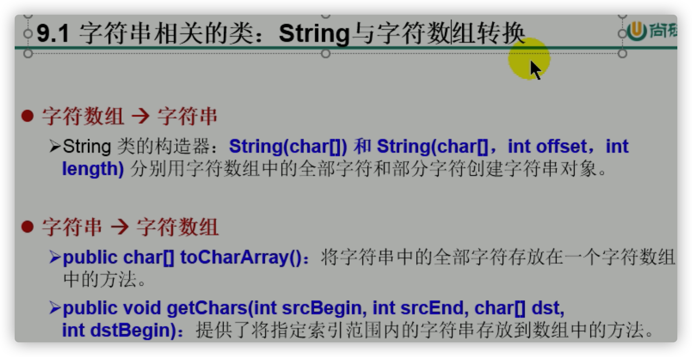

```java
/*
String 与 char[]之间的转换

String --> char[]:调用String的toCharArray()
char[] --> String:调用String的构造器
 */
@Test
public void test2(){
    String str1 = "abc123";  //题目： a21cb3

    char[] charArray = str1.toCharArray();
    for (int i = 0; i < charArray.length; i++) {
        System.out.println(charArray[i]);
    }

    char[] arr = new char[]{'h','e','l','l','o'};
    String str2 = new String(arr);
    System.out.println(str2);
}
```

### 与byte[]

```java
/*
    String 与 byte[]之间的转换
    编码：String --> byte[]:调用String的getBytes()
    解码：byte[] --> String:调用String的构造器

    编码：字符串 -->字节  (看得懂 --->看不懂的二进制数据)
    解码：编码的逆过程，字节 --> 字符串 （看不懂的二进制数据 ---> 看得懂）

    说明：解码时，要求解码使用的字符集必须与编码时使用的字符集一致，否则会出现乱码。
     */
    @Test
    public void test3() throws UnsupportedEncodingException {
        String str1 = "abc123中国";
        //UTF-8 一个汉字三个字节
        byte[] bytes = str1.getBytes();//使用默认的字符集，进行编码。
        System.out.println(Arrays.toString(bytes));
        //[97, 98, 99, 49, 50, 51, -28, -72, -83, -27, -101, -67]

        byte[] gbks = str1.getBytes("gbk");//使用gbk字符集进行编码。
        System.out.println(Arrays.toString(gbks));
//        [97, 98, 99, 49, 50, 51, -42, -48, -71, -6]

        System.out.println("******************");
        
        String str2 = new String(bytes);//使用默认的字符集，进行解码。
        System.out.println(str2);//abc123中国

        String str3 = new String(gbks);
        System.out.println(str3);//出现乱码。原因：编码集和解码集不一致！

        String str4 = new String(gbks, "gbk");
        System.out.println(str4);//没有出现乱码。原因：编码集和解码集一致！
//        abc123中国
    }
```

# String、StringBuffer、StringBuilder

## 异同&创建

```java
对比String、StringBuffer、StringBuilder三者的效率：
从高到低排列：StringBuilder > StringBuffer > String
```

```java
/*
String、StringBuffer、StringBuilder三者的异同？
String:不可变的字符序列；底层使用char[]存储
StringBuffer:可变的字符序列；线程安全的，效率低；底层使用char[]存储
StringBuilder:可变的字符序列；jdk5.0新增的，线程不安全的，效率高；底层使用char[]存储

源码分析：
String str = new String();//char[] value = new char[0];
String str1 = new String("abc");//char[] value = new char[]{'a','b','c'};

StringBuffer sb1 = new StringBuffer();//char[] value = new char[16];底层创建了一个长度是16的数组。
System.out.println(sb1.length());//0
sb1.append('a');//value[0] = 'a';
sb1.append('b');//value[1] = 'b';

StringBuffer sb2 = new StringBuffer("abc");//char[] value = new char["abc".length() + 16];

//问题1. System.out.println(sb2.length());//3
//问题2. 扩容问题:如果要添加的数据底层数组盛不下了，那就需要扩容底层的数组。
         默认情况下，扩容为原来容量的2倍 + 2，同时将原有数组中的元素复制到新的数组中。

        指导意义：开发中建议大家使用：StringBuffer(int capacity) 或 StringBuilder(int capacity)
        //确定字符数量的时候
 */
@Test
public void test1(){
    StringBuffer sb1 = new StringBuffer("abc");
    sb1.setCharAt(0,'m');
    System.out.println(sb1);

    StringBuffer sb2 = new StringBuffer();
    System.out.println(sb2.length());//0
}
```

## StringBuffer和StringBuilder的使用

String->StringBuffer、StringBuilder:调用StringBuffer、StringBuilder构造器
StringBuffer、StringBuilder-->String:调用String构造器；或 StringBuffer、StringBuilder的 tostring()

```java
/*
    StringBuffer的常用方法：
StringBuffer append(xxx)：提供了很多的append()方法，用于进行字符串拼接
StringBuffer delete(int start,int end)：删除指定位置的内容
StringBuffer replace(int start, int end, String str)：把[start,end)位置替换为str
StringBuffer insert(int offset, xxx)：在指定位置插入xxx
StringBuffer reverse() ：把当前字符序列逆转
public int indexOf(String str)
public String substring(int start,int end):返回一个从start开始到end索引结束的左闭右开区间的子字符串
public int length()
public char charAt(int n )
public void setCharAt(int n ,char ch)

        总结：
        增：append(xxx)
        删：delete(int start,int end)
        改：setCharAt(int n ,char ch) / replace(int start, int end, String str)
        查：charAt(int n )
        插：insert(int offset, xxx)
        长度：length();
        *遍历：for() + charAt() / toString()
     */
    @Test
    public void test2(){
        StringBuffer s1 = new StringBuffer("abc");
        s1.append(1);
        s1.append('1');
        System.out.println(s1);//abc11
        s1.delete(2,4);//左闭右开
//        s1.replace(2,4,"hello");
//        s1.insert(2,false);
//        s1.reverse();
        String s2 = s1.substring(1, 3);
        System.out.println(s1);//ab1
        System.out.println(s1.length());//3
        System.out.println(s2);//b1
    }
```

## String算法

### 字符串指定反转

```java
public class StringDemo {
    /*
    将一个字符串进行反转。将字符串中指定部分进行反转。比如“abcdefg”反转为”abfedcg”
    方式一：转换为char[]
     */
    public String reverse(String str,int startIndex,int endIndex){

        if(str != null){
            char[] arr = str.toCharArray();
            for(int x = startIndex,y = endIndex;x < y;x++,y--){
                char temp = arr[x];
                arr[x] = arr[y];
                arr[y] = temp;
            }

            return new String(arr);
        }
        return null;
    }

    //方式二：使用String的拼接
    public String reverse1(String str,int startIndex,int endIndex){
        if(str != null){
            //第1部分
            String reverseStr = str.substring(0,startIndex);
            //第2部分
            for(int i = endIndex;i >= startIndex;i--){
                reverseStr += str.charAt(i);
            }
            //第3部分
            reverseStr += str.substring(endIndex + 1);

            return reverseStr;
        }
        return null;
    }
    //方式三：使用StringBuffer/StringBuilder替换String
    public String reverse2(String str,int startIndex,int endIndex){
        if(str != null){
            StringBuilder builder = new StringBuilder(str.length());

            //第1部分
            builder.append(str.substring(0,startIndex));
            //第2部分
            for(int i = endIndex;i >= startIndex;i--){

                builder.append(str.charAt(i));
            }
            //第3部分
            builder.append(str.substring(endIndex + 1));

            return builder.toString();
        }
        return null;
    }

    @Test
    public void testReverse(){
        String str = "abcdefg";
        String reverse = reverse2(str, 2, 5);
        System.out.println(reverse);
    }
}
```

### 统计出现次数

```java
public class StringDemo1 {
    /*
    获取一个字符串在另一个字符串中出现的次数。
      比如：获取“ab”在 “abkkcadkabkebfkaabkskab” 中出现的次数
     */

    /**
     * 获取subStr在mainStr中出现的次数
     * @param mainStr
     * @param subStr
     * @return
     */
    public int getCount(String mainStr,String subStr){
        int mainLength = mainStr.length();
        int subLength = subStr.length();
        int count = 0;
        int index = 0;
        if(mainLength >= subLength){
            //方式一：每次都造一个mainStr
//            while((index = mainStr.indexOf(subStr)) != -1){
//                count++;
//                mainStr = mainStr.substring(index + subStr.length());
//            }
            //方式二：对方式一的改进
            while((index = mainStr.indexOf(subStr,index)) != -1){
                count++;
                index += subLength;
            }
            return count;
        }else{
            return 0;
        }
    }

    @Test
    public void testGetCount(){
        String mainStr = "abkkcadkabkebfkaabkskab";
        String subStr = "ab";
        int count = getCount(mainStr, subStr);
        System.out.println(count);
    }
}
```

### 最大相同子串

```java
public class StringDemo2 {
    /*
    获取两个字符串中最大相同子串。比如：
   str1 = "abcwerthelloyuiodefabcdef";str2 = "cvhellobnm"
   提示：将短的那个串进行长度依次递减的子串与较长的串比较。
     */
    //前提：两个字符串中只有一个最大相同子串
    public String getMaxSameString(String str1,String str2){
        if(str1 != null && str2 != null){
            String maxStr = (str1.length() >= str2.length())? str1 : str2;
            String minStr = (str1.length() < str2.length())? str1 : str2;
            int length = minStr.length();

            for(int i = 0;i < length;i++){
                for(int x = 0,y = length - i;y <= length;x++,y++){
                    String subStr = minStr.substring(x,y);//左闭右开所以需要y = length
                    if(maxStr.contains(subStr)){
                        return subStr;
                    }
                }
            }
        }
        return null;
    }

    // 如果存在多个长度相同的最大相同子串
    // 此时先返回String[]，后面可以用集合中的ArrayList替换，较方便
    public String[] getMaxSameString1(String str1, String str2) {
        if (str1 != null && str2 != null) {
            StringBuffer sBuffer = new StringBuffer();
            String maxString = (str1.length() > str2.length()) ? str1 : str2;
            String minString = (str1.length() > str2.length()) ? str2 : str1;

            int len = minString.length();
            for (int i = 0; i < len; i++) {
                for (int x = 0, y = len - i; y <= len; x++, y++) {
                    String subString = minString.substring(x, y);
                    if (maxString.contains(subString)) {
                        sBuffer.append(subString + ",");
                    }
                }
//                System.out.println(sBuffer);
                if (sBuffer.length() != 0) {
                    break;
                }
            }
            String[] split = sBuffer.toString().replaceAll(",$", "").split("\\,");
            return split;
        }
        return null;
    }

    @Test
    public void testGetMaxSameString(){
        String str1 = "abcwerthello1yuiodefabcdef";
        String str2 = "cvhello1bnmabcdef";
        String[] maxSameStrings = getMaxSameString1(str1, str2);
        System.out.println(Arrays.toString(maxSameStrings));

    }
}
```

# 日期时间

```java
/*
java.util.Date类
       |---java.sql.Date类（是上面的子类)

1.两个构造器的使用
    >构造器一：Date()：创建一个对应当前时间的Date对象
    >构造器二：创建指定毫秒数的Date对象
2.两个方法的使用
    >toString():显示当前的年、月、日、时、分、秒
    >getTime():获取当前Date对象对应的毫秒数。（时间戳）

3. java.sql.Date对应着数据库中的日期类型的变量
    >如何实例化
    >如何将java.util.Date对象转换为java.sql.Date对象
 */
```

```java
@Test
    public void test2(){
        //构造器一：Date()：创建一个对应当前时间的Date对象
        Date date1 = new Date();
        System.out.println(date1.toString());//Sat Feb 16 16:35:31 GMT+08:00 2019

        System.out.println(date1.getTime());//1550306204104

        //构造器二：创建指定毫秒数的Date对象
        Date date2 = new Date(155030620410L);
        System.out.println(date2.toString());

        //创建java.sql.Date对象
        java.sql.Date date3 = new java.sql.Date(35235325345L);
        System.out.println(date3);//1971-02-13

        //如何将java.util.Date对象转换为java.sql.Date对象
        //情况一：
//        Date date4 = new java.sql.Date(2343243242323L);
//        java.sql.Date date5 = (java.sql.Date) date4;
        //情况二：
        Date date6 = new Date();
        java.sql.Date date7 = new java.sql.Date(date6.getTime());
    }
```

```java
//1.System类中的currentTimeMillis()
@Test
public void test1(){
    long time = System.currentTimeMillis();
    //返回当前时间与1970年1月1日0时0分0秒之间以毫秒为单位的时间差。
    //称为时间戳
    System.out.println(time);
    //1651676423467
}
```

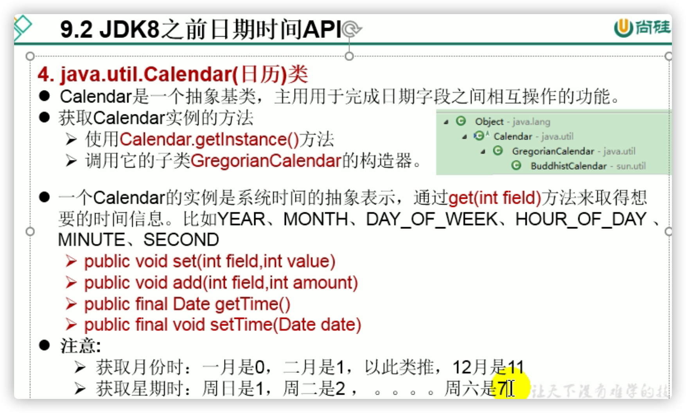


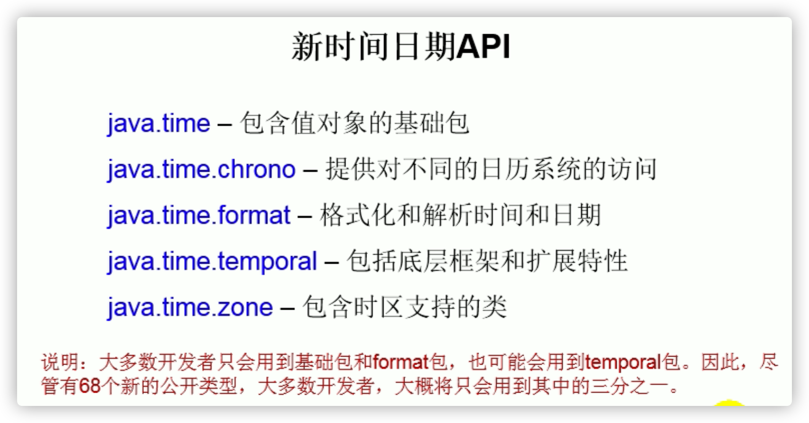

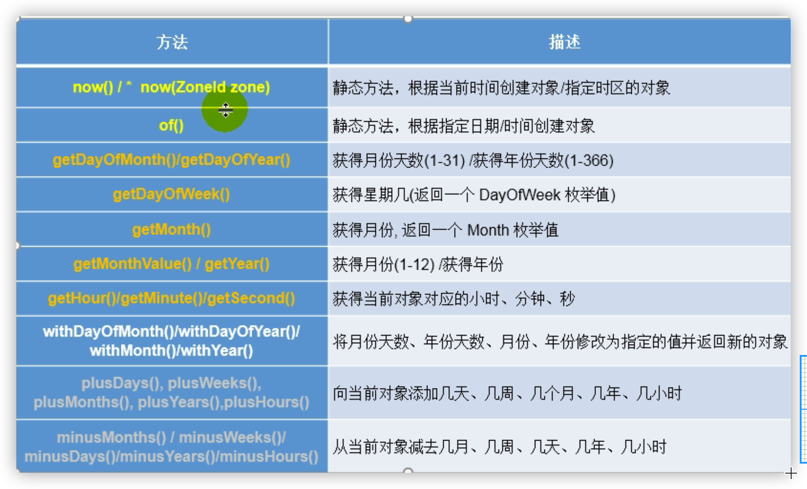


