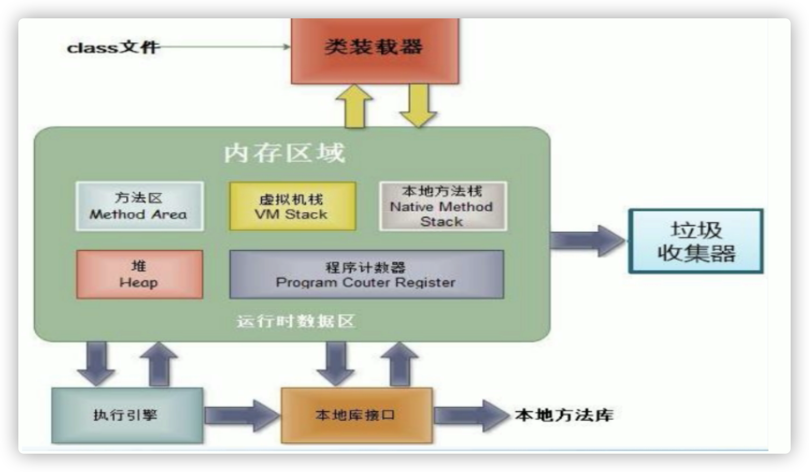
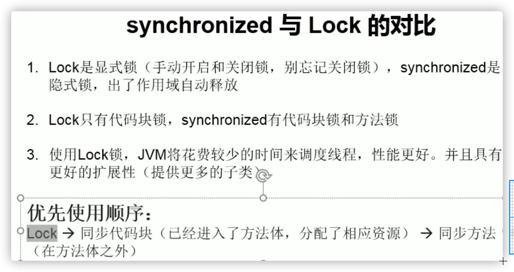

# IDEA&Eclipse

在 IntelliJ IDEA 中，没有类似于 Eclipse 工作空间（Workspace）的概念，而是提出了`Project`和`Module`这两个概念。在IntelliJ IDEA中Project是最顶级的结构单元，一个Project是由一个或者多个Module组成。一些主流大型项目结构基本上都是由多个Module的结构组成。


简单的概括如下：

IntelliJ系中的 Project 相当于Eclipse系中的 Workspace ；

IntelliJ系中的 Module 相当于Eclipse系中的 Project ；

IntelliJ中一个 Project 可以包括多个 Module ；

Eclipse中一个 Workspace 可以包括多个 Project；

# 进线程




- 一个进程的多个线程共享一个堆 和 方法区


- 用户线程：主线程
- 守护线程：垃圾回收线程，异常处理线程

## 创建thread(继承法)

```java
* 多线程的创建，方式一：继承于Thread类
* 1. 创建一个继承于Thread类的子类
* 2. 重写Thread类的run() --> 将此线程执行的操作声明在run()中
* 3. 创建Thread类的子类的对象
* 4. 通过此对象调用start()
* <p>
* 例子：遍历100以内的所有的偶数
  
  //1. 创建一个继承于Thread类的子类
class MyThread extends Thread {
    //2. 重写Thread类的run()
    @Override
    public void run() {
        for (int i = 0; i < 100; i++) {
            if(i % 2 == 0){
                System.out.println(Thread.currentThread().getName() + ":" + i);
            }
        }
    }
}

public class ThreadTest {
    public static void main(String[] args) {
        //3. 创建Thread类的子类的对象
        MyThread t1 = new MyThread();

        //4.通过此对象调用start():①启动当前线程 ② 调用当前线程的run()
        t1.start();
        //问题一：我们不能通过直接调用run()的方式启动线程。
//        t1.run();

        //问题二：再启动一个线程，遍历100以内的偶数。不可以还让已经start()的线程去执行。会报IllegalThreadStateException
//        t1.start();
        //我们需要重新创建一个线程的对象
        MyThread t2 = new MyThread();
        t2.start();
    }
}
```

```java
//匿名Thread对象法
new Thread(){
            @Override
            public void run() {
                }
        }.start();
```

## thread相关方法


```java
/**
 * 测试Thread中的常用方法：
 * 1. start():启动当前线程；调用当前线程的run()
 * 2. run(): 通常需要重写Thread类中的此方法，将创建的线程要执行的操作声明在此方法中
 * 3. currentThread():静态方法，返回执行当前代码的线程
 * 4. getName():获取当前线程的名字
 * 5. setName():设置当前线程的名字
 * 6. yield():释放当前cpu的执行权 看看能不能让别的线程先走
 * 7. join():在线程a中调用线程b的join(),此时线程a就进入阻塞状态，直到线程b完全执行完以后，线程a才
 *           结束阻塞状态。
 * 8. stop():已过时。当执行此方法时，强制结束当前线程。
 * 9. sleep(long millitime):让当前线程“睡眠”指定的millitime毫秒。在指定的millitime毫秒时间内，当前
 *                          线程是阻塞状态。
 * 10. isAlive():判断当前线程是否存活
 *
 *
 * 线程的优先级：
 * 1.
 * MAX_PRIORITY：10
 * MIN _PRIORITY：1
 * NORM_PRIORITY：5  -->默认优先级
 * 2.如何获取和设置当前线程的优先级：
 *   getPriority():获取线程的优先级
 *   setPriority(int p):设置线程的优先级
 *
 *   说明：高优先级的线程要抢占低优先级线程cpu的执行权。但是只是从概率上讲，高优先级的线程高概率的情况下
 *   被执行。并不意味着只有当高优先级的线程执行完以后，低优先级的线程才执行。
 */
class HelloThread extends Thread{
    @Override
    public void run() {
        for (int i = 0; i < 100; i++) {
            if(i % 2 == 0){
//                try {
//                    sleep(10);
//                } catch (InterruptedException e) {
//                    e.printStackTrace();
//                }
                System.out.println(Thread.currentThread().getName() + ":" + Thread.currentThread().getPriority() + ":" + i);
            }
//            if(i % 20 == 0){
//                yield();
//            }
        }
    }

    public HelloThread(String name){
        super(name);
    }
}

public class ThreadMethodTest {
    public static void main(String[] args) {
        HelloThread h1 = new HelloThread("Thread：1");
//        h1.setName("线程一");
        //设置分线程的优先级
        h1.setPriority(Thread.MAX_PRIORITY);
        h1.start();
        //给主线程命名
        Thread.currentThread().setName("主线程");
        Thread.currentThread().setPriority(Thread.MIN_PRIORITY);
        for (int i = 0; i < 100; i++) {
            if(i % 2 == 0){
                System.out.println(Thread.currentThread().getName() + ":" + Thread.currentThread().getPriority() + ":" + i);
            }
//            if(i == 20){
//                try {
//                    h1.join();
//                } catch (InterruptedException e) {
//                    e.printStackTrace();
//                }
//            }
        }
//        System.out.println(h1.isAlive());
    }
}
```

## 创建thread(接口法)

```java
/**
 * 创建多线程的方式二：实现Runnable接口
 * 1. 创建一个实现了Runnable接口的类
 * 2. 实现类去实现Runnable中的抽象方法：run()
 * 3. 创建实现类的对象
 * 4. 将此对象作为参数传递到Thread类的构造器中，创建Thread类的对象
 * 5. 通过Thread类的对象调用start()
 *
 *
 * 比较创建线程的两种方式。
 * 开发中：优先选择：实现Runnable接口的方式
 * 原因：1. 实现的方式没有类的单继承性的局限性
 *      2. 实现的方式更适合来处理多个线程有共享数据的情况。
 *
 * 联系：public class Thread implements Runnable
 * 相同点：两种方式都需要重写run(),将线程要执行的逻辑声明在run()中。
 */
//1. 创建一个实现了Runnable接口的类
class MThread implements Runnable{
    //2. 实现类去实现Runnable中的抽象方法：run()
    @Override
    public void run() {
        for (int i = 0; i < 100; i++) {
            if(i % 2 == 0){
                System.out.println(Thread.currentThread().getName() + ":" + i);
            }
        }
    }
}

public class ThreadTest1 {
    public static void main(String[] args) {
        //3. 创建实现类的对象
        MThread mThread = new MThread();
        //4. 将此对象作为参数传递到Thread类的构造器中，创建Thread类的对象
        Thread t1 = new Thread(mThread);
        t1.setName("线程1");
        //5. 通过Thread类的对象调用start():① 启动线程 ②调用当前线程的run()-->调用了Runnable类型的target的run()
        t1.start();
        //再启动一个线程，遍历100以内的偶数
        Thread t2 = new Thread(mThread);
        t2.setName("线程2");
        t2.start();
    }
}
```

### 售票共享数据例子

```java
/**
 * 例子：创建三个窗口卖票，总票数为100张.使用实现Runnable接口的方式
 * 存在线程的安全问题，待解决。
 */
class Window1 implements Runnable{
    //如果是继承法需要加static
    private int ticket = 100;
    @Override
    public void run() {
        while(true){
            if(ticket > 0){
                System.out.println(Thread.currentThread().getName() + ":卖票，票号为：" + ticket);
                ticket--;
            }else{
                break;
            }
        }
    }
}

public class WindowTest1 {
    public static void main(String[] args) {
        Window1 w = new Window1();
        //t1 t2 t3共享100张票
        Thread t1 = new Thread(w);
        Thread t2 = new Thread(w);
        Thread t3 = new Thread(w);

        t1.setName("窗口1");
        t2.setName("窗口2");
        t3.setName("窗口3");

        t1.start();
        t2.start();
        t3.start();
    }
}
```

## 线程的生命周期


## 同步机制(同步锁)

```java
/**
 * 例子：创建三个窗口卖票，总票数为100张.使用实现Runnable接口的方式
 *
 * 1.问题：卖票过程中，出现了重票、错票 -->出现了线程的安全问题
 * 2.问题出现的原因：当某个线程操作车票的过程中，尚未操作完成时，其他线程参与进来，也操作车票。
 * 3.如何解决：当一个线程a在操作ticket的时候，其他线程不能参与进来。直到线程a操作完ticket时，其他
 *            线程才可以开始操作ticket。这种情况即使线程a出现了阻塞，也不能被改变。
 *
 *
 * 4.在Java中，我们通过同步机制，来解决线程的安全问题。
 *
 *  方式一：同步代码块
 *
 *   synchronized(同步监视器){
 *      //需要被同步的代码
 *   }
 *  说明：1.操作共享数据的代码，即为需要被同步的代码。  -->不能包含代码多了，也不能包含代码少了。
 *       2.共享数据：多个线程共同操作的变量。比如：ticket就是共享数据。(包括对共享数据的比较）
 *       3.同步监视器，俗称：锁。任何一个类的对象，都可以充当锁。
 *          要求：多个线程必须要共用同一把锁。
 *
 *       补充：在实现Runnable接口创建多线程的方式中，我们可以考虑使用this充当同步监视器。
 *  方式二：同步方法。
 *     如果操作共享数据的代码完整的声明在一个方法中，我们不妨将此方法声明同步的。
 *
 *
 *  5.同步的方式，解决了线程的安全问题。---好处
 *    操作同步代码时，只能有一个线程参与，其他线程等待。相当于是一个单线程的过程，效率低。 ---局限性
 */
```

### 同步代码块

```java
//同步代码块
//接口法

class Window1 implements Runnable{
    private int ticket = 100;
//    Object obj = new Object();
//    Dog dog = new Dog();
    @Override
    public void run() {
        //每个线程都有一把锁（❌）
//        Object obj = new Object();
        while(true){
            synchronized (this){//此时的this:唯一的Window1的对象
                // 方式二：synchronized (dog)
                if (ticket > 0) {
                    try {
                        Thread.sleep(100);
                    } catch (InterruptedException e) {
                        e.printStackTrace();
                    }

                    System.out.println(Thread.currentThread().getName() + ":卖票，票号为：" + ticket);
                    ticket--;
                } else {
                    break;
                }
            }
        }
    }
}

public class WindowTest1 {
    public static void main(String[] args) {
        Window1 w = new Window1();

        Thread t1 = new Thread(w);
        Thread t2 = new Thread(w);
        Thread t3 = new Thread(w);

        t1.setName("窗口1");
        t2.setName("窗口2");
        t3.setName("窗口3");

        t1.start();
        t2.start();
        t3.start();
    }
}

class Dog{
}
```

```java
//同步代码块
//继承法
/** 使用同步代码块解决继承Thread类的方式的线程安全问题
 *
 * 例子：创建三个窗口卖票，总票数为100张.使用继承Thread类的方式
 *
 * 说明：在继承Thread类创建多线程的方式中，慎用this充当同步监视器，考虑使用当前类充当同步监视器。
 */
  class Window2 extends Thread{
    private static int ticket = 100;
    private static Object obj = new Object();

    @Override
    public void run() {
        while(true){
            //正确的
//            synchronized (obj){
            synchronized (Window2.class){
                //Class clazz = Window2.class,Window2.class只会加载一次（类也是对象）
                //错误的方式：this代表着t1,t2,t3三个对象
//              synchronized (this){
                if(ticket > 0){
                    try {
                        Thread.sleep(100);
                    } catch (InterruptedException e) {
                        e.printStackTrace();
                    }
                    System.out.println(getName() + "：卖票，票号为：" + ticket);
                    ticket--;
                }else{
                    break;
                }
            }
        }
    }
}

public class WindowTest2 {
    public static void main(String[] args) {
        Window2 t1 = new Window2();
        Window2 t2 = new Window2();
        Window2 t3 = new Window2();

        t1.setName("窗口1");
        t2.setName("窗口2");
        t3.setName("窗口3");

        t1.start();
        t2.start();
        t3.start();
    }
}
```

### 同步方法

```java
/**
 * 使用同步方法解决实现Runnable接口的线程安全问题
 *
 *  关于同步方法的总结：
 *  1. 同步方法仍然涉及到同步监视器，只是不需要我们显式的声明。
 *  2. 非静态的同步方法，同步监视器是：this
 *     静态的同步方法，同步监视器是：当前类本身
 */
```

```java
//同步方法
//接口法
class Window3 implements Runnable {
    private int ticket = 100;
    @Override
    public void run() {
        while (true) {
            show();
        }
    }

    private synchronized void show(){//同步监视器：this
        //synchronized (this){
            if (ticket > 0) {
                try {
                    Thread.sleep(100);
                } catch (InterruptedException e) {
                    e.printStackTrace();
                }
                System.out.println(Thread.currentThread().getName() + ":卖票，票号为：" + ticket);
                ticket--;
            }
        //}
    }
}

public class WindowTest3 {
    public static void main(String[] args) {
        Window3 w = new Window3();

        Thread t1 = new Thread(w);
        Thread t2 = new Thread(w);
        Thread t3 = new Thread(w);

        t1.setName("窗口1");
        t2.setName("窗口2");
        t3.setName("窗口3");

        t1.start();
        t2.start();
        t3.start();
    }
}
```

```java
//同步方法
//继承法
class Window4 extends Thread {
    private static int ticket = 100;
    @Override
    public void run() {
        while (true) {
            show();
        }
    }

    private static synchronized void show(){//同步监视器：Window4.class
        //private synchronized void show(){ //同步监视器：t1,t2,t3。此种解决方式是错误的
        //同步方法是静态的，监视器是当前类本身（也是对象可以作为监视器）
        if (ticket > 0) {
            try {
                Thread.sleep(100);
            } catch (InterruptedException e) {
                e.printStackTrace();
            }
            System.out.println(Thread.currentThread().getName() + "：卖票，票号为：" + ticket);
            ticket--;
        }
    }
}

public class WindowTest4 {
    public static void main(String[] args) {
        Window4 t1 = new Window4();
        Window4 t2 = new Window4();
        Window4 t3 = new Window4();

        t1.setName("窗口1");
        t2.setName("窗口2");
        t3.setName("窗口3");

        t1.start();
        t2.start();
        t3.start();
    }
}
```

## 改进懒汉式单例模式

```java
/**
 * 使用同步机制将单例模式中的懒汉式改写为线程安全的
 */
class Bank{
    private Bank(){}
    private static Bank instance = null;
    public static Bank getInstance(){
        if(instance == null){
            synchronized (Bank.class) {
                if(instance == null){
                    instance = new Bank();
                }
            }
        }
        return instance;
    }
}
```

## 线程的死锁

- 线程是否安全问题：取决于是否有共享数据


```java
/**
 * 演示线程的死锁问题
 *
 * 1.死锁的理解：不同的线程分别占用对方需要的同步资源不放弃，
 * 都在等待对方放弃自己需要的同步资源，就形成了线程的死锁
 *
 * 2.说明：
 * 1）出现死锁后，不会出现异常，不会出现提示，只是所有的线程都处于阻塞状态，无法继续
 * 2）我们使用同步时，要避免出现死锁。
 */
public class ThreadTest {
    public static void main(String[] args) {
        StringBuffer s1 = new StringBuffer();
        StringBuffer s2 = new StringBuffer();

        new Thread(){
            @Override
            public void run() {
                synchronized (s1){
                    s1.append("a");
                    s2.append("1");
                    try {
                        Thread.sleep(100);
                    } catch (InterruptedException e) {
                        e.printStackTrace();
                    }
                    synchronized (s2){
                        //等待下面对象的s2锁解开
                        s1.append("b");
                        s2.append("2");
                        System.out.println(s1);
                        System.out.println(s2);
                    }
                }
            }
        }.start();

        new Thread(new Runnable() {
            @Override
            public void run() {
                synchronized (s2){
                    s1.append("c");
                    s2.append("3");
                    try {
                        Thread.sleep(100);
                    } catch (InterruptedException e) {
                        e.printStackTrace();
                    }
                    synchronized (s1){
                        //等待上面对象的s1锁解开
                        s1.append("d");
                        s2.append("4");
                        System.out.println(s1);
                        System.out.println(s2);
                    }
                }
            }
        }).start();
    }
}
```

## Lock




```java
/**
 * 解决线程安全问题的方式三：Lock锁  --- JDK5.0新增
 *
 * 1. 面试题：synchronized 与 Lock的异同？
 *   相同：二者都可以解决线程安全问题
 *   不同：synchronized机制在执行完相应的同步代码以后，自动的释放同步监视器
 *        Lock需要手动的启动同步（lock()），同时结束同步也需要手动的实现（unlock()）
 *
 * 2.优先使用顺序：
 * Lock > 同步代码块（已经进入了方法体，分配了相应资源） > 同步方法（在方法体之外）
 *
 *
 *  面试题：如何解决线程安全问题？有几种方式
 */
class Window implements Runnable{
    private int ticket = 100;
    //1.实例化ReentrantLock
    //如果是继承 private static ReentrantLock lock
    private ReentrantLock lock = new ReentrantLock();
    //带参数的构造器：参数如果是true：锁解开一次后，按照顺序进入；
    // false，之前进入的线程可以再抢进去
    //private ReentrantLock lock1 = new ReentrantLock(true);
    
    @Override
    public void run() {
        while(true){
            try{
                //2.调用锁定方法lock()
                lock.lock();
                if(ticket > 0){
                    try {
                        Thread.sleep(100);
                    } catch (InterruptedException e) {
                        e.printStackTrace();
                    }
                    System.out.println(Thread.currentThread().getName() + "：售票，票号为：" + ticket);
                    ticket--;
                }else{
                    break;
                }
            }finally {
                //3.调用解锁方法：unlock()
                lock.unlock();
            }
        }
    }
}

public class LockTest {
    public static void main(String[] args) {
        Window w = new Window();

        Thread t1 = new Thread(w);
        Thread t2 = new Thread(w);
        Thread t3 = new Thread(w);

        t1.setName("窗口1");
        t2.setName("窗口2");
        t3.setName("窗口3");

        t1.start();
        t2.start();
        t3.start();
    }
}
```

# 线程通信

```java
/**
 * 线程通信的例子：使用两个线程打印 1-100。线程1, 线程2 交替打印
 *
 * 涉及到的三个方法：
 * wait():一旦执行此方法，当前线程就进入阻塞状态，并释放同步监视器。
 * notify():一旦执行此方法，就会唤醒被wait的一个线程。如果有多个线程被wait，就唤醒优先级高的那个。
 * notifyAll():一旦执行此方法，就会唤醒所有被wait的线程。
 *
 * 说明：
 * 1.wait()，notify()，notifyAll()三个方法必须使用在同步代码块或同步方法中。
 * 2.wait()，notify()，notifyAll()三个方法的调用者必须是同步代码块或同步方法中的同步监视器。
 *    否则，会出现IllegalMonitorStateException异常
 * 3.wait()，notify()，notifyAll()三个方法是定义在java.lang.Object类中。(Object类做同步监视器）
 *
 * 面试题：sleep() 和 wait()的异同？
 * 1.相同点：一旦执行方法，都可以使得当前的线程进入阻塞状态。
 * 2.不同点：1）两个方法声明的位置不同：Thread类中声明sleep() , Object类中声明wait()
 *          2）调用的要求不同：sleep()可以在任何需要的场景下调用。 wait()必须使用在同步代码块或同步方法中
 *          3）关于是否释放同步监视器：如果两个方法都使用在同步代码块或同步方法中，sleep()不会释放锁，wait()会释放锁。
 */
class Number implements Runnable{
    private int number = 1;
    private Object obj = new Object();
    @Override
    public void run() {
        while(true){
            //3⃣️B线程进入
            synchronized (obj) {
                //1⃣️第一次A线程进入，notify没有明显作用
                //4⃣️A线程进入就绪状态，B线程没有明显作用
                obj.notify();
                if(number <= 100){
                    try {
                        Thread.sleep(10);
                    } catch (InterruptedException e) {
                        e.printStackTrace();
                    }
                    System.out.println(Thread.currentThread().getName() + ":" + number);
                    number++;
                    try {
                        //使得调用如下wait()方法的线程进入阻塞状态
                        //2⃣️A线程进入阻塞状态，并且释放obj同步监视器
                        //5⃣️B线程进入阻塞状态，并且释放obj同步监视器
                        obj.wait();
                    } catch (InterruptedException e) {
                        e.printStackTrace();
                    }
                }else{
                    break;
                }
            }
        }
    }
}

public class CommunicationTest {
    public static void main(String[] args) {
        Number number = new Number();
        Thread t1 = new Thread(number);
        Thread t2 = new Thread(number);

        t1.setName("线程1");
        t2.setName("线程2");

        t1.start();
        t2.start();
    }
}
```

## 例题

