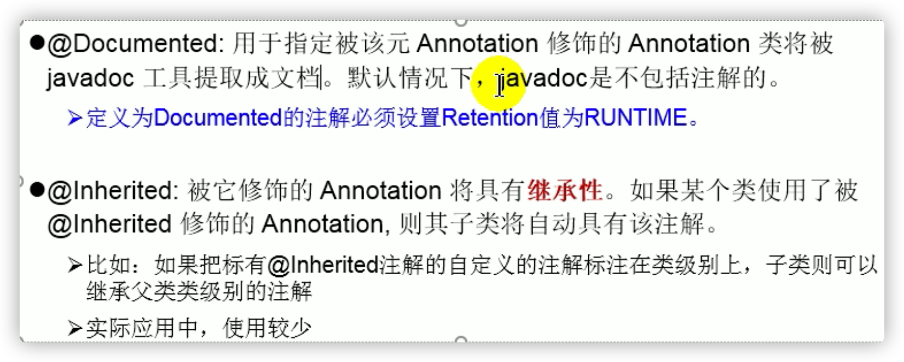
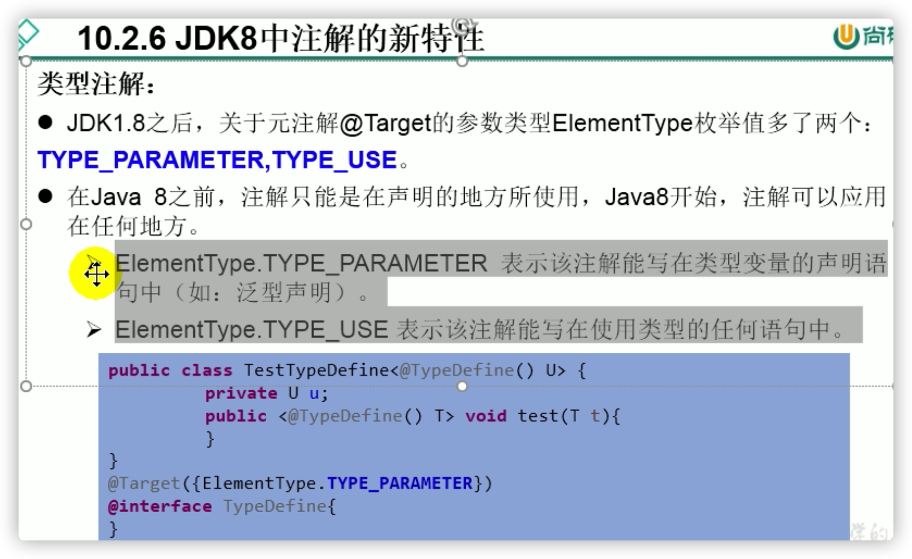
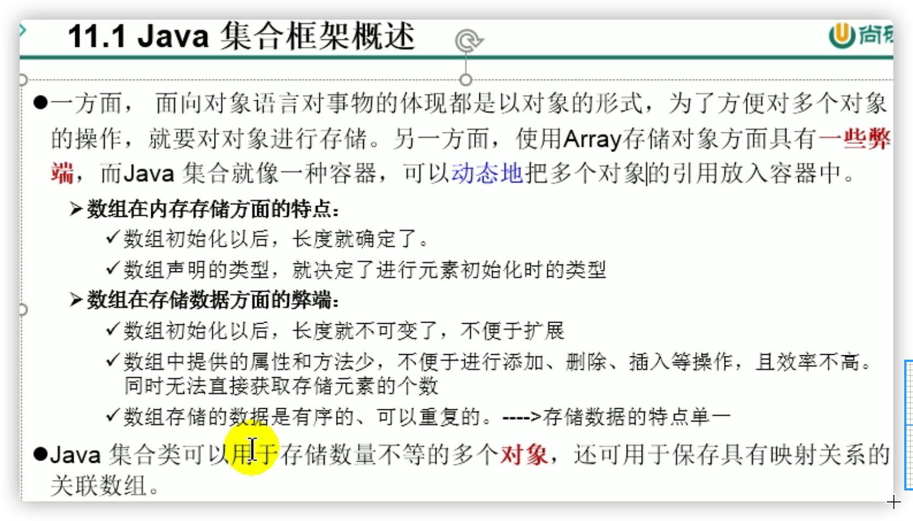

# 枚举类

```java
/**
 * 一、枚举类的使用
 * 1.枚举类的理解：类的对象只有有限个，确定的。我们称此类为枚举类
 * 2.当需要定义一组常量时，强烈建议使用枚举类
 * 3.如果枚举类中只有一个对象，则可以作为单例模式的实现方式。
 *
 * 二、如何定义枚举类
 * 方式一：jdk5.0之前，自定义枚举类
 * 方式二：jdk5.0，可以使用enum关键字定义枚举类
 *
 * 三、Enum类中的常用方法：
 *    values()方法：返回枚举类型的对象数组。该方法可以很方便地遍历所有的枚举值。
 *    valueOf(String str)：可以把一个字符串转为对应的枚举类对象。要求字符串必须是枚举类对象的“名字”。
 *    如不是，会有运行时异常：IllegalArgumentException。
 *    toString()：返回当前枚举类对象常量的名称(枚举类的父类会重写toString())
 *
 * 四、使用enum关键字定义的枚举类实现接口的情况
 *   情况一：实现接口，在enum类中实现抽象方法
 *   情况二：让枚举类的对象分别实现接口中的抽象方法
 */
```

## 自定义枚举类

```java
public class SeasonTest {
    public static void main(String[] args) {
        Season spring = Season.SPRING;
        System.out.println(spring);
    }
}
//自定义枚举类
class Season{
    //1.声明Season对象的属性:private final修饰
    private final String seasonName;
    private final String seasonDesc;

    //2.私有化类的构造器,并给对象属性赋值
    private Season(String seasonName,String seasonDesc){
        this.seasonName = seasonName;
        this.seasonDesc = seasonDesc;
    }

    //3.提供当前枚举类的多个对象：public static final的
    public static final Season SPRING = new Season("春天","春暖花开");
    public static final Season SUMMER = new Season("夏天","夏日炎炎");
    public static final Season AUTUMN = new Season("秋天","秋高气爽");
    public static final Season WINTER = new Season("冬天","冰天雪地");

    //4.其他诉求1：获取枚举类对象的属性
    public String getSeasonName() {
        return seasonName;
    }
    public String getSeasonDesc() {
        return seasonDesc;
    }
    
    //4.其他诉求1：提供toString()
    @Override
    public String toString() {
        return "Season{" +
                "seasonName='" + seasonName + '\'' +
                ", seasonDesc='" + seasonDesc + '\'' +
                '}';
    }
}
```

## enum

> enum定义枚举类
>
> enum主要方法
>
> 实现接口的枚举类（正常的实现方式；让每个枚举对象实现接口）

- 与switch case使用


- 枚举类

```java
//使用enum关键字枚举类
enum Season1 implements Info{
    //1.提供当前枚举类的对象，多个对象之间用","隔开，末尾对象";"结束
    SPRING("春天","春暖花开"){
        @Override
        public void show() {
            System.out.println("春天在哪里？");
        }
    },
    SUMMER("夏天","夏日炎炎"){
        @Override
        public void show() {
            System.out.println("宁夏");
        }
    },
    AUTUMN("秋天","秋高气爽"){
        @Override
        public void show() {
            System.out.println("秋天不回来");
        }
    },
    WINTER("冬天","冰天雪地"){
        @Override
        public void show() {
            System.out.println("大约在冬季");
        }
    };

    //2.声明Season对象的属性:private final修饰
    private final String seasonName;
    private final String seasonDesc;

    //2.私有化类的构造器,并给对象属性赋值
    private Season1(String seasonName,String seasonDesc){
        this.seasonName = seasonName;
        this.seasonDesc = seasonDesc;
    }
    //4.其他诉求1：获取枚举类对象的属性
    public String getSeasonName() {
        return seasonName;
    }

    public String getSeasonDesc() {
        return seasonDesc;
    }
//    //4.其他诉求1：提供toString()
//    @Override
//    public String toString() {
//        return "Season1{" +
//                "seasonName='" + seasonName + '\'' +
//                ", seasonDesc='" + seasonDesc + '\'' +
//                '}';
//    }

//    @Override
//    public void show() {
//        System.out.println("这是一个季节");
//    }
}
```

- main和接口

```java
/**
 * 使用enum关键字定义枚举类
 * 说明：定义的枚举类默认继承于java.lang.Enum类
 */
public class SeasonTest1 {
    public static void main(String[] args) {
        Season1 summer = Season1.SUMMER;
        //toString():返回枚举类对象的名称
        System.out.println(summer.toString());//SUMMER

        System.out.println(Season1.class.getSuperclass());
        //class java.lang.Enum

        System.out.println("****************");
        //values():返回所有的枚举类对象构成的数组
        Season1[] values = Season1.values();
        for(int i = 0;i < values.length;i++){
            System.out.println(values[i]);
            values[i].show();
        }

        System.out.println("****************");
        //valueOf(String objName):返回枚举类中对象名是objName的对象。
        Season1 winter = Season1.valueOf("WINTER");
        //如果没有objName的枚举类对象，则抛异常：IllegalArgumentException
        System.out.println(winter);
        winter.show();
    }
}

interface Info{
    void show();
}
```

# Annotation注解

框架理解 = +反射+设计模式


```JAVA
/**
 * 注解的使用
 * 1. 理解Annotation:
 * ① jdk 5.0 新增的功能
 *
 * ② Annotation 其实就是代码里的特殊标记, 这些标记可以在编译, 类加载, 运行时被读取, 并执行相应的处理。通过使用 Annotation,
 * 程序员可以在不改变原有逻辑的情况下, 在源文件中嵌入一些补充信息。
 *
 * ③在JavaSE中，注解的使用目的比较简单，例如标记过时的功能，忽略警告等。在JavaEE/Android
 * 中注解占据了更重要的角色，例如用来配置应用程序的任何切面，代替JavaEE旧版中所遗留的繁冗
 * 代码和XML配置等。
 /
```

## 常见的Annotation

```java
/**2. Annocation的使用示例
* 示例一：生成文档相关的注解
* 示例二：在编译时进行格式检查(JDK内置的三个基本注解)
    @Override: 限定重写父类方法/实现接口方法, 该注解只能用于方法
    @Deprecated: 用于表示所修饰的元素(类, 方法等)已过时。通常是因为所修饰的结构危险或存在更好的选择
    @SuppressWarnings: 抑制编译器警告

    @SuppressWarnings("unused")
    int num = 10;

 * 示例三：跟踪代码依赖性，实现替代配置文件功能
 /
```

## 自定义Annotation


```java
/* 3. 如何自定义注解：参照@SuppressWarnings定义
    * ① 注解声明为：@interface
    * ② 内部定义成员，通常使用value表示
    * ③ 可以指定成员的默认值，使用default定义（有默认值就可以不在使用注解的时候指明成员的值）
    * ④ 如果自定义注解没有成员，表明是一个标识作用。

   如果注解有成员，在使用注解时，需要指明成员的值。
   自定义注解必须配上注解的信息处理流程(使用反射)才有意义。
   自定义注解通过都会指明两个元注解：Retention、Target
   /
```

```java
@Inherited
@Repeatable(MyAnnotations.class)
@Retention(RetentionPolicy.RUNTIME)
@Target({TYPE, FIELD, METHOD, PARAMETER, CONSTRUCTOR, LOCAL_VARIABLE,TYPE_PARAMETER,TYPE_USE})
public @interface MyAnnotation {
    String value() default "hello";
}
```

```java
//@MyAnnotation(value="hi")
//@MyAnnotation("abc")//只有一个参数成员且名字是value可以省略value=
//@MyAnnotation//有默认值就可以不在使用注解的时候指明成员的值
class Person{
    private String name;
    private int age;

    public Person() {
    }
    @MyAnnotation
    public Person(String name, int age) {
        this.name = name;
        this.age = age;
    }
    @MyAnnotation(value="abc")
    public void walk(){
        System.out.println("人走路");
    }
    public void eat(){
        System.out.println("人吃饭");
    }
}
```

## 元注解


- 没有指定哪里都能用



```java
/*4. jdk 提供的4种元注解
  元注解：对现有的注解进行解释说明的注解
Retention：指定所修饰的 Annotation 的生命周期：SOURCE\CLASS（默认行为）\RUNTIME
       只有声明为RUNTIME生命周期的注解，才能通过反射获取。
Target:用于指定被修饰的 Annotation 能用于修饰哪些程序元素
*******出现的频率较低*******
Documented:表示所修饰的注解在被javadoc解析时，保留下来。
Inherited:被它修饰的 Annotation 将具有继承性。
/
```

```java
@Inherited
@Repeatable(MyAnnotations.class)
@Retention(RetentionPolicy.RUNTIME)
@Target({TYPE, FIELD, METHOD, PARAMETER, CONSTRUCTOR, LOCAL_VARIABLE,TYPE_PARAMETER,TYPE_USE})
public @interface MyAnnotation {
    String value() default "hello";
}
```

## 利用反射获取注解信息

```
5.通过反射获取注解信息 ---到反射内容时系统讲解
```

## JDK8新特性

### 可重复注解


### 类型注解




# 集合框架




- List Set是Collection接口的子接口

## Collection接口方法


## Iterator迭代器接口


## Collection子接口一：List


## Collection-子接口二：Set


## Map接口


## Collections工具类