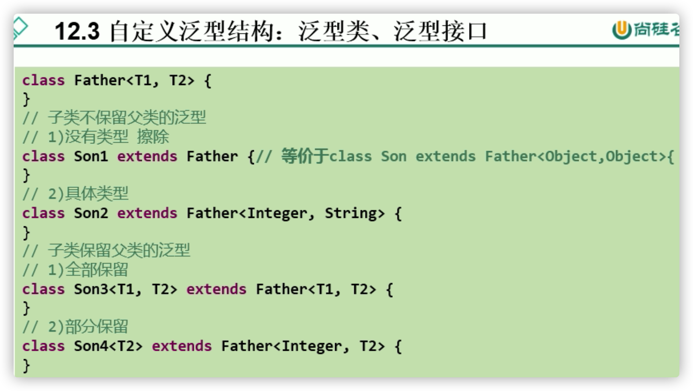
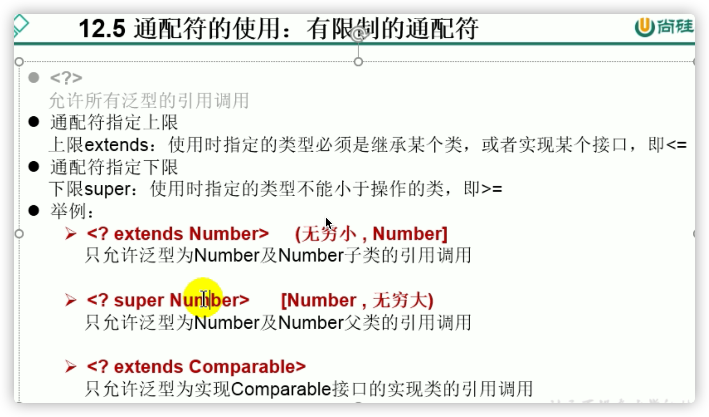
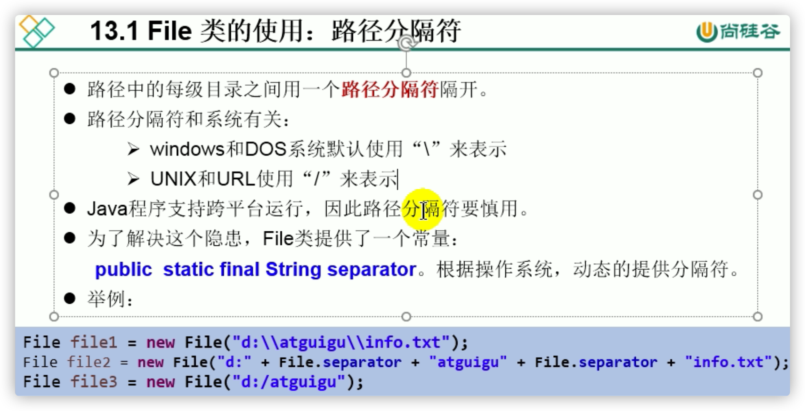
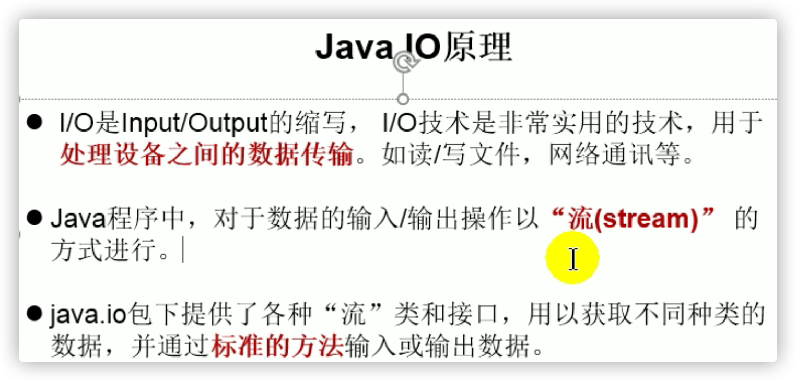
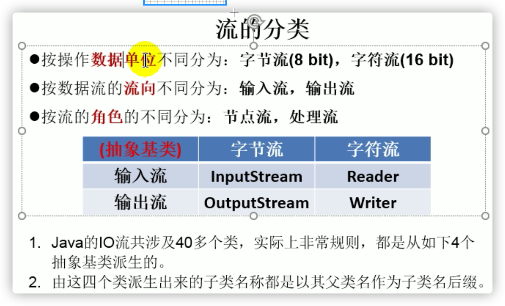

# 泛型

- 标签，限制类型


```java
/**
 * 泛型的使用
 * 1.jdk 5.0新增的特性
 *
 * 2.在集合中使用泛型：
 *  总结：
 *  ① 集合接口或集合类在jdk5.0时都修改为带泛型的结构。
 *  ② 在实例化集合类时，可以指明具体的泛型类型
 *  ③ 指明完以后，在集合类或接口中凡是定义类或接口时，内部结构（比如：方法、构造器、属性等）使用到类的泛型的位置，都指定为实例化的泛型类型。
 *    比如：add(E e)  --->实例化以后：add(Integer e)
 *  ④ 注意点：泛型的类型必须是类，不能是基本数据类型。需要用到基本数据类型的位置，拿包装类替换
 *  ⑤ 如果实例化时，没有指明泛型的类型。默认类型为java.lang.Object类型。
 *
 * 3.如何自定义泛型结构：泛型类、泛型接口；泛型方法。见 GenericTest1.java
 */
```

## 在集合中使用泛型

```java
//在集合中使用泛型的情况：以ArrayList为例
    @Test
    public void test2(){
       ArrayList<Integer> list =  new ArrayList<Integer>();

        list.add(78);
        list.add(87);
        list.add(99);
        list.add(65);
        //编译时，就会进行类型检查，保证数据的安全
//        list.add("Tom");

        //方式一：
//        for(Integer score : list){
//            //避免了强转操作
//            int stuScore = score;
//            System.out.println(stuScore);
//        }
        //方式二：
        Iterator<Integer> iterator = list.iterator();
        while(iterator.hasNext()){
            int stuScore = iterator.next();
            System.out.println(stuScore);
        }
    }
```

```java
//在集合中使用泛型的情况：以HashMap为例
    @Test
    public void test3(){
//        Map<String,Integer> map = new HashMap<String,Integer>();
        //jdk7新特性：类型推断
        Map<String,Integer> map = new HashMap<>();

        map.put("Tom",87);
        map.put("Jerry",87);
        map.put("Jack",67);

        //泛型的嵌套
        Set<Map.Entry<String,Integer>> entry = map.entrySet();
        Iterator<Map.Entry<String, Integer>> iterator = entry.iterator();

        while(iterator.hasNext()){
            Map.Entry<String, Integer> e = iterator.next();
            String key = e.getKey();
            Integer value = e.getValue();
            System.out.println(key + "----" + value);
        }
    }
```

## 自定义泛型结构





### 自定义泛型类,泛型方法

```java
public class Order<T> {
    String orderName;
    int orderId;

    //类的内部结构就可以使用类的泛型
    T orderT;

    public Order(){
        //编译不通过
//        T[] arr = new T[10];
        //编译通过
        T[] arr = (T[]) new Object[10];
    }

    public Order(String orderName,int orderId,T orderT){
        this.orderName = orderName;
        this.orderId = orderId;
        this.orderT = orderT;
    }

    //如下的三个方法都不是泛型方法
    public T getOrderT(){
        return orderT;
    }

    public void setOrderT(T orderT){
        this.orderT = orderT;
    }

    @Override
    public String toString() {
        return "Order{" +
                "orderName='" + orderName + '\'' +
                ", orderId=" + orderId +
                ", orderT=" + orderT +
                '}';
    }

    //静态方法中不能使用类的泛型。(静态方法中不能用对象，不能用类的属性)
//    public static void show(T orderT){
//        System.out.println(orderT);
//    }

    //泛型方法：在方法中出现了泛型的结构，泛型参数与类的泛型参数没有任何关系。
    //换句话说，泛型方法所属的类是不是泛型类都没有关系。
    //泛型方法，可以声明为静态的。原因：泛型参数是在调用方法时确定的。并非在实例化类时确定。
    public static <E>  List<E> copyFromArrayToList(E[] arr){
        ArrayList<E> list = new ArrayList<>();
        for(E e : arr){
            list.add(e);
        }
        return list;
    }
}
```

其子类：

```java
public class SubOrder extends Order<Integer> {//SubOrder:不是泛型类
    public static <E> List<E> copyFromArrayToList(E[] arr){
        ArrayList<E> list = new ArrayList<>();
        for(E e : arr){
            list.add(e);
        }
        return list;
    }
}

public class SubOrder1<T> extends Order<T> {//SubOrder1<T>:仍然是泛型类
}
```

使用:

```java
@Test
public void test1(){
    //如果定义了泛型类，实例化没有指明类的泛型，则认为此泛型类型为Object类型
    //要求：如果大家定义了类是带泛型的，建议在实例化时要指明类的泛型。
    Order order = new Order();
    order.setOrderT(123);
    order.setOrderT("ABC");

    //建议：实例化时指明类的泛型
    Order<String> order1 = new Order<String>("orderAA",1001,"order:AA");

    order1.setOrderT("AA:hello");
}
```

```java
@Test
public void test2(){
    SubOrder sub1 = new SubOrder();
    //由于子类在继承带泛型的父类时，指明了泛型类型。则实例化子类对象时，不再需要指明泛型。
    sub1.setOrderT(1122);

    SubOrder1<String> sub2 = new SubOrder1<>();
    sub2.setOrderT("order2...");
}
```

```java
@Test
    public void test3(){
        ArrayList<String> list1 = null;
        ArrayList<Integer> list2 = new ArrayList<Integer>();
        //泛型不同的引用不能相互赋值。
//        list1 = list2;
    }
```

```java
//测试泛型方法
@Test
public void test4(){
    Order<String> order = new Order<>();
    Integer[] arr = new Integer[]{1,2,3,4};
    //泛型方法在调用时，指明泛型参数的类型。
    List<Integer> list = order.copyFromArrayToList(arr);

    System.out.println(list);
}
```

## 泛型与异常

```java
//异常类不能声明为泛型类
//public class MyException<T> extends Exception{
//}
```

```java
 public void show(){
        //编译不通过
        //泛型不能与异常有关
//        try{
//        }catch(T t){
//        }
    }
```

## 泛型在继承上的表现

```java
/*
    1. 泛型在继承方面的体现
      虽然类A是类B的父类，但是G<A> 和G<B>二者不具备子父类关系，二者是并列关系。
       补充：类A是类B的父类，A<G> 是 B<G> 的父类
     */
    @Test
    public void test1(){
        Object[] arr1 = null;
        String[] arr2 = null;
        arr1 = arr2;
        
        List<Object> list1 = null;
        List<String> list2 = new ArrayList<String>();
        //此时的list1和list2的类型不具有子父类关系
        //编译不通过
//        list1 = list2;
    }

@Test
    public void test2(){
        AbstractList<String> list1 = null;
        List<String> list2 = null;
        ArrayList<String> list3 = null;

        list1 = list3;
        list2 = list3;
    }
```


## 通配符的使用

### 一般使用


```java
/*
    2. 通配符的使用
       通配符：?
       类A是类B的父类，G<A>和G<B>是没有关系的，二者共同的父类是：G<?>
     */
    @Test
    public void test3(){
        List<Object> list1 = null;
        List<String> list2 = null;

        List<?> list = null;

        list = list1;
        list = list2;

        List<String> list3 = new ArrayList<>();
        list3.add("AA");
        list3.add("BB");
        list = list3;
        //添加(写入)：对于List<?>就不能向其内部添加数据。
        //除了添加null之外。
//        list.add("DD");
//        list.add('?');

        list.add(null);

        //获取(读取)：允许读取数据，读取的数据类型为Object。
        Object o = list.get(0);
        System.out.println(o);
    }

public void print(List<?> list){
        Iterator<?> iterator = list.iterator();
        while(iterator.hasNext()){
            Object obj = iterator.next();
            System.out.println(obj);
        }
    }
```

### 有限制的通配符



```java
/*
    3.有限制条件的通配符的使用。
        ? extends A:
                G<? extends A> 可以作为G<A>和G<B>的父类，其中B是A的子类
        ? super A:
                G<? super A> 可以作为G<A>和G<B>的父类，其中B是A的父类
     */
    @Test
    public void test4(){
        List<? extends Person> list1 = null;
        List<? super Person> list2 = null;

        List<Student> list3 = new ArrayList<Student>();
        List<Person> list4 = new ArrayList<Person>();
        List<Object> list5 = new ArrayList<Object>();

        list1 = list3;
        list1 = list4;
//        list1 = list5;

//        list2 = list3;
        list2 = list4;
        list2 = list5;

        //读取数据：
        list1 = list3;
        Person p = list1.get(0);
        //编译不通过
        //Student s = list1.get(0);

        list2 = list4;
        Object obj = list2.get(0);
        ////编译不通过
//        Person obj = list2.get(0);

        //写入数据：
        //编译不通过
//        list1.add(new Student());

        //编译通过
        list2.add(new Person());
        //多态
        list2.add(new Student());
    }
```

## 泛型的应用

```java
public class DAO<T> {
    private Map<String,T> map = new HashMap<String,T>();
    
    //返回 map 中存放的所有 T 对象
    public List<T> list(){
        //错误的：
//        Collection<T> values = map.values();
//        return (List<T>) values;
        //正确的：
        ArrayList<T> list = new ArrayList<>();
        Collection<T> values = map.values();
        for(T t : values){
            list.add(t);
        }
        return list;
    }
}
```

### 比较

```java
public class Employee implements Comparable<Employee>{
  //省略代码
  ...............................
  //指明泛型时的写法
    @Override
    public int compareTo(Employee o) {
        return this.name.compareTo(o.name);
    }
}
```

```java
public class MyDate implements Comparable<MyDate>{
 @Override
    public int compareTo(MyDate m) {
        //比较年
        int minusYear = this.getYear() - m.getYear();
        if(minusYear != 0){
            return minusYear;
        }
        //比较月
        int minusMonth = this.getMonth() - m.getMonth();
        if(minusMonth != 0){
            return minusMonth;
        }
        //比较日
        return this.getDay() - m.getDay();
    } 
}
```

```java
TreeSet<Employee> set = new TreeSet<>(new Comparator<Employee>() {
    //使用泛型以后的写法
    @Override
    public int compare(Employee o1, Employee o2) {
        MyDate b1 = o1.getBirthday();
        MyDate b2 = o2.getBirthday();

        return b1.compareTo(b2);
    }
```

### 泛型嵌套


# IO流

## File类


```java
/**
 * File类的使用
 *
 * 1. File类的一个对象，代表一个文件或一个文件目录(俗称：文件夹)
 * 2. File类声明在java.io包下
 * 3. File类中涉及到关于文件或文件目录的创建、删除、重命名、修改时间、文件大小等方法，
 *    并未涉及到写入或读取文件内容的操作。如果需要读取或写入文件内容，必须使用IO流来完成。
 * 4. 后续File类的对象常会作为参数传递到流的构造器中，指明读取或写入的"终点".
 
DEA中：
如果大家开发使用几JUnit中的单元测试方法测试，相对路径即为当前module下。 如果大家使用main()测试，相对路径即为当前的Project下。
Eclipse中：
不管使用单元测试方法还是使用main()测试，相对路径都是当前的Project下。
 */
```

### 构造器

```java
/*
1.如何创建File类的实例
    File(String filePath)
    File(String parentPath,String childPath)
    File(File parentFile,String childPath)

2.
相对路径：相较于某个路径下，指明的路径。
绝对路径：包含盘符在内的文件或文件目录的路径

3.路径分隔符
 windows:\\
 unix:/
 */
```




```java
@Test
public void test1(){
    //构造器1
    File file1 = new File("hello.txt");//相对于当前module
    File file2 =  new File("D:\\workspace_idea1\\JavaSenior\\day08\\he.txt");

    System.out.println(file1);//用相对路径构造，输出相对路径
    System.out.println(file2);

    //构造器2：
    File file3 = new File("D:\\workspace_idea1","JavaSenior");
    System.out.println(file3);

    //构造器3：
    File file4 = new File(file3,"hi.txt");
    System.out.println(file4);
}
```

### 使用

```java
/*
public String getAbsolutePath()：获取绝对路径
public String getPath() ：获取路径
public String getName() ：获取名称
public String getParent()：获取上层文件目录路径。若无，返回null
public long length() ：获取文件长度（即：字节数）。不能获取目录的长度。
public long lastModified() ：获取最后一次的修改时间，毫秒值

如下的两个方法适用于文件目录：
public String[] list() ：获取指定目录下的所有文件或者文件目录的名称数组
public File[] listFiles() ：获取指定目录下的所有文件或者文件目录的File数组
     */
    @Test
    //还不涉及硬盘，仅在内存中
    public void test2(){
        File file1 = new File("hello.txt");
        File file2 = new File("d:\\io\\hi.txt");

        System.out.println(file1.getAbsolutePath());//用相对路径构造，输出相对路径
        System.out.println(file1.getPath());//用相对路径构造，输出相对路径
        System.out.println(file1.getName());
        System.out.println(file1.getParent());//null
        System.out.println(file1.length());
        System.out.println(new Date(file1.lastModified()));

        System.out.println();

        System.out.println(file2.getAbsolutePath());//用绝对路径构造，输出绝对路径
        System.out.println(file2.getPath());//用绝对路径构造，输出绝对路径
        System.out.println(file2.getName());
        System.out.println(file2.getParent());//null
        System.out.println(file2.length());
        System.out.println(file2.lastModified());
    }
```

```java
@Test
public void test3(){
    File file = new File("/Users/kaixin/Downloads/尚硅谷宋红康Java核心基础_好评如潮（30天入门）/新建文件夹/4_代码/第2部分：Java高级编程/JavaSenior");

    String[] list = file.list();
    for(String s : list){
        System.out.println(s);
    }

    System.out.println();

    File[] files = file.listFiles();
    for(File f : files){
        System.out.println(f);
    }
```

```java
/*
public boolean renameTo(File dest):把文件重命名为指定的文件路径
 比如：file1.renameTo(file2)为例：
    要想保证返回true,需要file1在硬盘中是存在的，且file2不能在硬盘中存在。
    成功之后file1消失，转移到file2
 */
@Test
public void test4(){
    File file1 = new File("hello.txt");
    File file2 = new File("D:\\io\\hi.txt");

    boolean renameTo = file2.renameTo(file1);
    System.out.println(renameTo);
}
```

```java
/*
public boolean isDirectory()：判断是否是文件目录
public boolean isFile() ：判断是否是文件
public boolean exists() ：判断是否存在
public boolean canRead() ：判断是否可读
public boolean canWrite() ：判断是否可写
public boolean isHidden() ：判断是否隐藏
     */
    @Test
    public void test5(){
        File file1 = new File("hello.txt");
        file1 = new File("hello1.txt");

        //先判断存在与否
        System.out.println(file1.isDirectory());
        System.out.println(file1.isFile());
        System.out.println(file1.exists());
        System.out.println(file1.canRead());
        System.out.println(file1.canWrite());
        System.out.println(file1.isHidden());

        System.out.println();

        File file2 = new File("d:\\io");
        file2 = new File("d:\\io1");
        System.out.println(file2.isDirectory());
        System.out.println(file2.isFile());
        System.out.println(file2.exists());
        System.out.println(file2.canRead());
        System.out.println(file2.canWrite());
        System.out.println(file2.isHidden());
    }
```

### 创建删除

- 在硬盘中创建文件/文件夹

```java
/*
    创建硬盘中对应的文件或文件目录
public boolean createNewFile() ：创建文件。若文件存在，则不创建，返回false
public boolean mkdir() ：创建文件目录。如果此文件目录存在，就不创建了。如果此文件目录的上层目录不存在，也不创建。
public boolean mkdirs() ：创建文件目录。如果此文件目录存在，就不创建了。如果上层文件目录不存在，一并创建

    删除磁盘中的文件或文件目录
public boolean delete()：删除文件或者文件夹
    删除注意事项：Java中的删除不走回收站。
     */
```

```java
@Test
public void test6() throws IOException {
    File file1 = new File("hi.txt");
    if(!file1.exists()){
        //文件的创建
        file1.createNewFile();
        System.out.println("创建成功");
    }else{//文件存在
        file1.delete();
        System.out.println("删除成功");
    }
}
```

```java
@Test
public void test7(){
    //文件目录的创建
    File file1 = new File("d:\\io\\io1\\io3");

    boolean mkdir = file1.mkdir();
    if(mkdir){
        System.out.println("创建成功1");
    }

    File file2 = new File("d:\\io\\io1\\io4");

    boolean mkdir1 = file2.mkdirs();
    if(mkdir1){
        System.out.println("创建成功2");
    }
    //要想删除成功，io4文件目录下不能有子目录或文件
    File file3 = new File("D:\\io\\io1\\io4");
    file3 = new File("D:\\io\\io1");
    System.out.println(file3.delete());
}
```

## IO流原理及流的分类



- 站在内存角度看输入输出



字符流的一个参数是字节流


蓝色是需要关注的流

## 节点流（文件流）


## 缓冲流


## 转换流


## 标准输入输出流