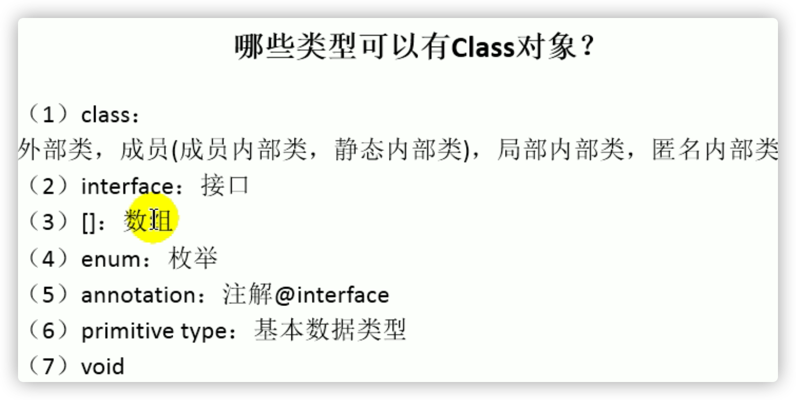
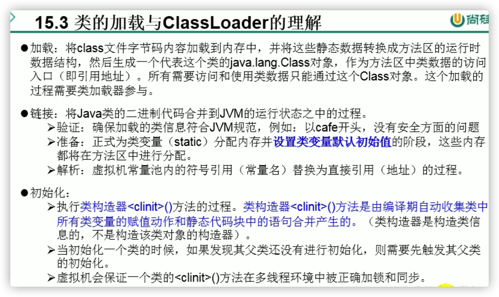
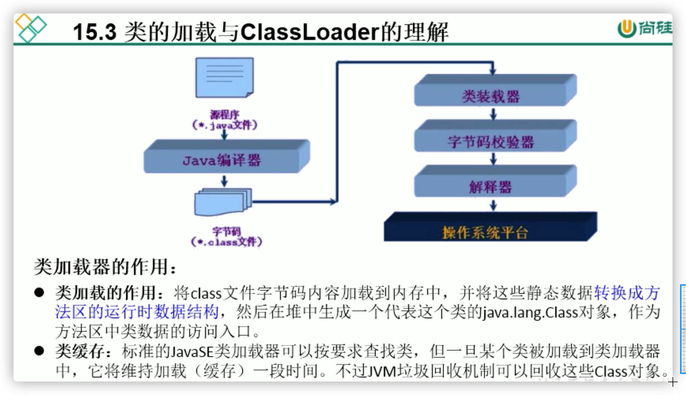
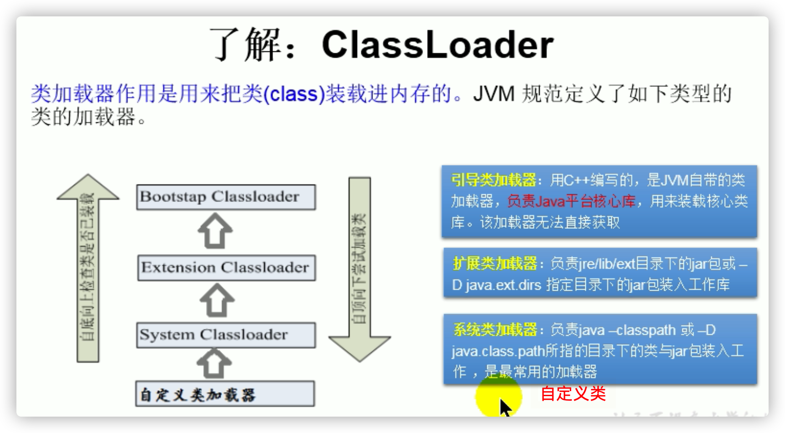

# 网络编程

## 网络通信要素概述


```java
/**
 * 一、网络编程中有两个主要的问题：
 * 1.如何准确地定位网络上一台或多台主机；定位主机上的特定的应用
 * 2.找到主机后如何可靠高效地进行数据传输
 *
 * 二、网络编程中的两个要素：
 * 1.对应问题一：IP和端口号
 * 2.对应问题二：提供网络通信协议：TCP/IP参考模型（应用层、传输层、网络层、物理+数据链路层）
 *
 * 三、通信要素一：IP和端口号
 * 1. IP:唯一的标识 Internet 上的计算机（通信实体）
 * 2. 在Java中使用InetAddress类代表IP
 * 3. IP分类：IPv4 和 IPv6 ; 万维网 和 局域网
 * 4. 域名 (来访问ip):   www.baidu.com   www.mi.com  www.sina.com  www.jd.com
 *            www.vip.com
 域名解析：域名容易记忆，当在连接网络时输入一个主机的域名后，域名服务器(DNS)负责将域名转化成IP地址，这样才能
主机建立连接。域名解析
 * 5. 本地回路地址：127.0.0.1 对应着：localhost
 * 6. 如何实例化InetAddress:两个方法：getByName(String host) 、 getLocalHost()
 *        两个常用方法：getHostName() / getHostAddress()
 *
 * 7. 端口号：正在计算机上运行的进程。
 * 要求：不同的进程有不同的端口号
 * 范围：被规定为一个 16 位的整数 0~65535。
 *
 * 8. 端口号与IP地址的组合得出一个网络套接字：Socket
 */
```

## 通信要素1：IP和端口号


```java
public static void main(String[] args) {
    try {
        InetAddress inet1 = InetAddress.getByName("192.168.10.14");
        System.out.println(inet1);

        InetAddress inet2 = InetAddress.getByName("www.atguigu.com");
        System.out.println(inet2);

        //获取本地ip
        InetAddress inet3 = InetAddress.getLocalHost();
        System.out.println(inet3);

        //getHostName()
        System.out.println(inet2.getHostName());//www.atguigu.com
        //getHostAddress()
        System.out.println(inet2.getHostAddress());//125.76.247.133

    } catch (UnknownHostException e) {
        e.printStackTrace();
    }
```

## 通信要素2：网络协议


- TCP:可靠的数据传输（三次握手）：进行大数据量的传输：效率低
  UDP:不可靠；以数据报形式发送， 数据报限定为64k:效率高

### TCP网络编程


- 客户端(浏览器等)或服务器均可主动发起挥手动作
- TCP,UDP都是接收端先跑着，再跑发送端

```java
/**
 * 实现TCP的网络编程
 * 例子1：客户端发送信息给服务端，服务端将数据显示在控制台上
 * IP 岛
 * port 港口
 */
public class TCPTest1 {
    //客户端
    @Test
    public void client()  {
        Socket socket = null;
        OutputStream os = null;
        try {
            //1.创建Socket对象，指明服务器端的ip和端口号
            InetAddress inet = InetAddress.getByName("127.0.0.1");
            socket = new Socket(inet,8899);
            //2.获取一个输出流，用于输出数据
            os = socket.getOutputStream();
            //3.写出数据的操作
            os.write("你好，我是客户端mm".getBytes());
          //关闭数据的输出，阻塞写出要手动关闭
        	//socket.shutdownOutput();
        } catch (IOException e) {
            e.printStackTrace();
        } finally {
            //4.资源的关闭
            if(os != null){
                try {
                    os.close();
                } catch (IOException e) {
                    e.printStackTrace();
                }
            }
            if(socket != null){
                try {
                    socket.close();
                } catch (IOException e) {
                    e.printStackTrace();
                }
            }
        }
    }
    //服务端
    @Test
    public void server()  {
        ServerSocket ss = null;
        Socket socket = null;
        InputStream is = null;
        ByteArrayOutputStream baos = null;
        try {
            //1.创建服务器端的ServerSocket，指明自己的端口号
            ss = new ServerSocket(8899);
            //2.调用accept()表示接收来自于客户端的socket
            socket = ss.accept();
            //3.获取输入流
            is = socket.getInputStream();
            //4.读取输入流中的数据
            baos = new ByteArrayOutputStream();
            byte[] buffer = new byte[5];
            int len;
            while((len = is.read(buffer)) != -1){
                //字节数组输出流在内存中创建一个字节数组缓冲区，所有发送到输出流的数据保存在该字节数组缓冲区中。
                baos.write(buffer,0,len);
            }
            System.out.println(baos.toString());
            System.out.println("收到了来自于：" + socket.getInetAddress().getHostAddress() + "的数据");
        } catch (IOException e) {
            e.printStackTrace();
        } finally {
            if(baos != null){
                //5.关闭资源
                try {
                    baos.close();
                } catch (IOException e) {
                    e.printStackTrace();
                }
            }
            if(is != null){
                try {
                    is.close();
                } catch (IOException e) {
                    e.printStackTrace();
                }
            }
            if(socket != null){
                try {
                    socket.close();
                } catch (IOException e) {
                    e.printStackTrace();
                }
            }
            if(ss != null){
                try {
                    ss.close();
                } catch (IOException e) {
                    e.printStackTrace();
                }
            }
        }
    }
}
```

### UDP网络编程


```java
/**
 * UDPd协议的网络编程
 */
public class UDPTest {
    //发送端
    @Test
    public void sender() throws IOException {
        DatagramSocket socket = new DatagramSocket();
        String str = "我是UDP方式发送的导弹";
        byte[] data = str.getBytes();
        InetAddress inet = InetAddress.getLocalHost();
        DatagramPacket packet = new DatagramPacket(data,0,data.length,inet,9090);
        socket.send(packet);
        socket.close();
    }
    //接收端
    @Test
    public void receiver() throws IOException {
        DatagramSocket socket = new DatagramSocket(9090);
        byte[] buffer = new byte[100];
        DatagramPacket packet = new DatagramPacket(buffer,0,buffer.length);
        socket.receive(packet);
        System.out.println(new String(packet.getData(),0,packet.getLength()));
        socket.close();
    }
}
```

## URL编程


```java
/**
 * URL网络编程
 * 1.URL:统一资源定位符，对应着互联网的某一资源地址
 * 2.格式：
 *  http://localhost:8080/examples/beauty.jpg?username=Tom
 *  协议   主机名    端口号  资源地址           参数列表
 */
public class URLTest {
    public static void main(String[] args) {
        try {
            URL url = new URL("http://localhost:8080/examples/beauty.jpg?username=Tom");
//            public String getProtocol(  )     获取该URL的协议名
            System.out.println(url.getProtocol());//http
//            public String getHost(  )           获取该URL的主机名
            System.out.println(url.getHost());//localhost
//            public String getPort(  )            获取该URL的端口号
            System.out.println(url.getPort());//8080
//            public String getPath(  )           获取该URL的文件路径
            System.out.println(url.getPath());///examples/beauty.jpg
//            public String getFile(  )             获取该URL的文件名
            System.out.println(url.getFile());///examples/beauty.jpg?username=Tom
//            public String getQuery(   )        获取该URL的查询名
            System.out.println(url.getQuery());///examples/beauty.jpg?username=Tom
        } catch (MalformedURLException e) {
            e.printStackTrace();
        }
    }
}
```

```java
public class URLTest1 {
    public static void main(String[] args) {
        HttpURLConnection urlConnection = null;
        InputStream is = null;
        FileOutputStream fos = null;
        try {
            URL url = new URL("http://localhost:8080/examples/beauty.jpg");
            urlConnection = (HttpURLConnection) url.openConnection();
            urlConnection.connect();
            is = urlConnection.getInputStream();
            fos = new FileOutputStream("day10\\beauty3.jpg");
            byte[] buffer = new byte[1024];
            int len;
            while((len = is.read(buffer)) != -1){
                fos.write(buffer,0,len);
            }
            System.out.println("下载完成");
        } catch (IOException e) {
            e.printStackTrace();
        } finally {
            //关闭资源
            if(is != null){
                try {
                    is.close();
                } catch (IOException e) {
                    e.printStackTrace();
                }
            }
            if(fos != null){
                try {
                    fos.close();
                } catch (IOException e) {
                    e.printStackTrace();
                }
            }
            if(urlConnection != null){
                urlConnection.disconnect();
            }
        }
    }
}
```

# 反射机制

- 主要是框架用

- 体验：可以使用反射机制调用私有构造器，属性，方法

```java
public class Person {
    private String name;
    public int age;

    @Override
    public String toString() {
        return "Person{" +
                "name='" + name + '\'' +
                ", age=" + age +
                '}';
    }

    public String getName() {
        return name;
    }

    public void setName(String name) {
        this.name = name;
    }

    public int getAge() {
        return age;
    }

    public void setAge(int age) {
        this.age = age;
    }

    public Person(String name, int age) {
        this.name = name;
        this.age = age;
    }

    private Person(String name) {
        this.name = name;
    }

    public Person() {
        System.out.println("Person()");
    }

    public void show(){
        System.out.println("你好，我是一个人");
    }

    private String showNation(String nation){
        System.out.println("我的国籍是：" + nation);
        return nation;
    }
}
```

```java
@Test
public void test2() throws Exception{
    Class clazz = Person.class;
    //1.通过反射，创建Person类的对象
    Constructor cons = clazz.getConstructor(String.class,int.class);
    Object obj = cons.newInstance("Tom", 12);
    Person p = (Person) obj;
    System.out.println(p.toString());//Person{name='Tom', age=12}
    //2.通过反射，调用对象指定的属性、方法
    //调用属性
    Field age = clazz.getDeclaredField("age");
    age.set(p,10);
    System.out.println(p.toString());//Person{name='Tom', age=10}
    //调用方法
    Method show = clazz.getDeclaredMethod("show");
    show.invoke(p);//你好，我是一个人

    System.out.println("*******************************");

    //通过反射，可以调用Person类的私有结构的。比如：私有的构造器、方法、属性
    //调用私有的构造器
    Constructor cons1 = clazz.getDeclaredConstructor(String.class);
    cons1.setAccessible(true);//访问私有
    Person p1 = (Person) cons1.newInstance("Jerry");
    System.out.println(p1);

    //调用私有的属性
    Field name = clazz.getDeclaredField("name");
    name.setAccessible(true);//访问私有
    name.set(p1,"HanMeimei");
    System.out.println(p1);

    //调用私有的方法
    Method showNation = clazz.getDeclaredMethod("showNation", String.class);
    showNation.setAccessible(true);//访问私有
    //相当于String nation = p1.showNation("中国")
    String nation = (String) showNation.invoke(p1,"中国");
    System.out.println(nation);
}
```

```java
疑问1：通过直接new的方式或反射的方式都可以调用公共的结构，开发中到底用那个？
建议：直接new的方式。
什么时候会使用：反射的方式。 反射的特征：动态性
疑问2：反射机制与面向对象中的封装性是不是矛盾的？如何看待两个技术？
不矛盾。反射机制偏向能否使用，面向对象中的封装性偏向建议使用不
```

## 理解Class类并获取Class实例




```java
//Class实例可以是哪些结构的说明：
    @Test
    public void test4(){
        Class c1 = Object.class;
        Class c2 = Comparable.class;
        Class c3 = String[].class;
        Class c4 = int[][].class;
        Class c5 = ElementType.class;
        Class c6 = Override.class;
        Class c7 = int.class;
        Class c8 = void.class;
        Class c9 = Class.class;

        int[] a = new int[10];
        int[] b = new int[100];
        Class c10 = a.getClass();
        Class c11 = b.getClass();
        // 只要数组的元素类型与维度一样，就是同一个Class
        System.out.println(c10 == c11);//true
    }
}
```

```java
/*
关于java.lang.Class类的理解
1.类的加载过程：
程序经过javac.exe命令以后，会生成一个或多个字节码文件(.class结尾)。
接着我们使用java.exe命令对某个字节码文件进行解释运行。相当于将某个字节码文件
加载到内存中。此过程就称为类的加载。加载到内存中的类，我们就称为运行时类，此
运行时类，就作为Class的一个实例。

2.换句话说，Class的实例就对应着一个运行时类。
3.加载到内存中的运行时类，会缓存一定的时间。在此时间之内，我们可以通过不同的方式
来获取此运行时类。
 */
```

```java
//获取Class的实例的方式（前三种方式需要掌握）
@Test
public void test3() throws ClassNotFoundException {
    //方式一：调用运行时类的属性：.class
    Class clazz1 = Person.class;
    System.out.println(clazz1);//class com.atguigu.java.Person
    //方式二：通过运行时类的对象,调用getClass()
    Person p1 = new Person();
    Class clazz2 = p1.getClass();
    System.out.println(clazz2);//class com.atguigu.java.Person
    //方式三：调用Class的静态方法：forName(String classPath)
    Class clazz3 = Class.forName("com.atguigu.java.Person");
    System.out.println(clazz3);//class com.atguigu.java.Person

    System.out.println(clazz1 == clazz2);//true 地址值相同，同一个实例类
    System.out.println(clazz1 == clazz3);//true

    //方式四：使用类的加载器：ClassLoader  (了解)
    ClassLoader classLoader = ReflectionTest.class.getClassLoader();
    Class clazz4 = classLoader.loadClass("com.atguigu.java.Person");
    System.out.println(clazz4);
    System.out.println(clazz1 == clazz4);//true
}
```

## 类的加载与ClassLoader的理解









```java
@Test
public void test1(){
    //对于自定义类，使用系统类加载器进行加载
    ClassLoader classLoader = ClassLoaderTest.class.getClassLoader();
    System.out.println(classLoader);
    //jdk.internal.loader.ClassLoaders$AppClassLoader@14899482
    //调用系统类加载器的getParent()：获取扩展类加载器
    ClassLoader classLoader1 = classLoader.getParent();
    System.out.println(classLoader1);
    //jdk.internal.loader.ClassLoaders$PlatformClassLoader@32eebfca
    //调用扩展类加载器的getParent()：无法获取引导类加载器
    //引导类加载器主要负责加载java的核心类库，无法加载自定义类的。
    ClassLoader classLoader2 = classLoader1.getParent();
    System.out.println(classLoader2);//null

    ClassLoader classLoader3 = String.class.getClassLoader();
    System.out.println(classLoader3);//null
}
```

### 读取配置文件

```
//jdbc.properties文件
user=吴飞
password=abc123
```

```java
public class ClassLoaderTest {
//    Properties：用来读取配置文件。
    @Test
    public void test2() throws Exception {
        Properties pros =  new Properties();
        //此时的文件默认在当前的module下。
        //读取配置文件的方式一：
//        FileInputStream fis = new FileInputStream("jdbc.properties");
        //不在module在src时
//        FileInputStream fis = new FileInputStream("src\\jdbc1.properties");
//        pros.load(fis);

        //读取配置文件的方式二：使用ClassLoader
        //配置文件默认识别为：当前module的src下(推荐放在src下)
        ClassLoader classLoader = ClassLoaderTest.class.getClassLoader();
        InputStream is = classLoader.getResourceAsStream("jdbc1.properties");
        pros.load(is);
        String user = pros.getProperty("user");
        String password = pros.getProperty("password");
        System.out.println("user = " + user + ",password = " + password);
    }
}
```

## 创建运行时类的对象

```java
@Test
public void test1() throws IllegalAccessException, InstantiationException {
    Class<Person> clazz = Person.class;
    /*
    newInstance():调用此方法，创建对应的运行时类的对象。内部调用了运行时类的空参的构造器。

    要想此方法正常的创建运行时类的对象，要求：
    1.运行时类必须提供空参的构造器
    2.空参的构造器的访问权限得够。通常，设置为public。

    在javabean中要求提供一个public的空参构造器。原因：
    1.便于通过反射，创建运行时类的对象
    2.便于子类继承此运行时类时，默认调用super()时，保证父类有此构造器
     */
    Person obj = clazz.newInstance();//指定泛型，返回值就是指定的泛型
    //反射造对象通常先造一个空参对象，之后按需再给参数赋值
    System.out.println(obj);
}
```

## 获取运行时类的完整结构


## 调用运行时类的指定结构

## 反射的应用:动态代理