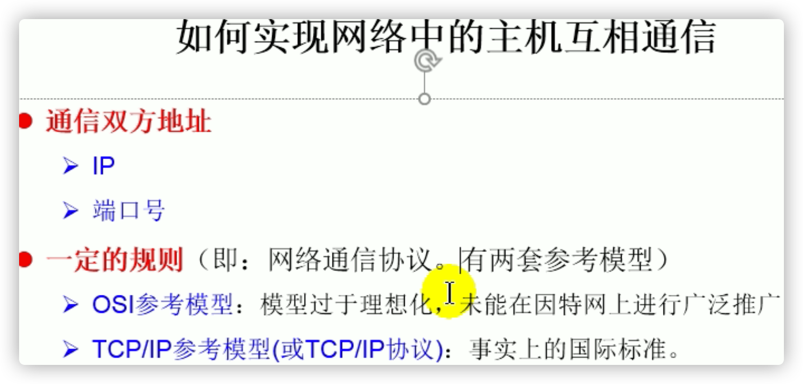
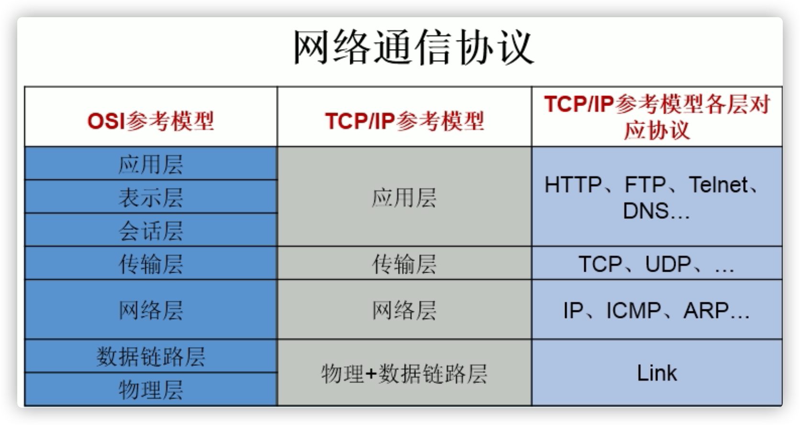
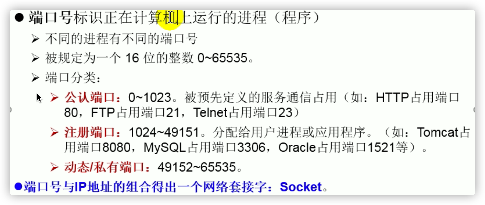
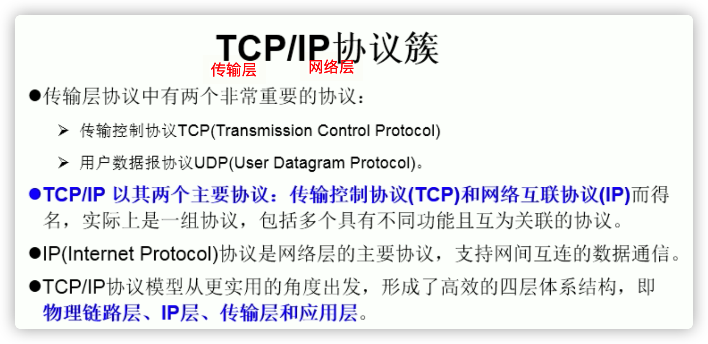
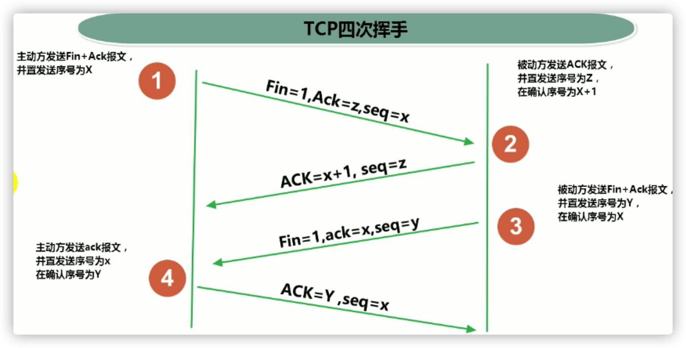

# 网络编程

## 网络通信要素概述





```java
/**
 * 一、网络编程中有两个主要的问题：
 * 1.如何准确地定位网络上一台或多台主机；定位主机上的特定的应用
 * 2.找到主机后如何可靠高效地进行数据传输
 *
 * 二、网络编程中的两个要素：
 * 1.对应问题一：IP和端口号
 * 2.对应问题二：提供网络通信协议：TCP/IP参考模型（应用层、传输层、网络层、物理+数据链路层）
 *
 * 三、通信要素一：IP和端口号
 * 1. IP:唯一的标识 Internet 上的计算机（通信实体）
 * 2. 在Java中使用InetAddress类代表IP
 * 3. IP分类：IPv4 和 IPv6 ; 万维网 和 局域网
 * 4. 域名 (来访问ip):   www.baidu.com   www.mi.com  www.sina.com  www.jd.com
 *            www.vip.com
 * 5. 本地回路地址：127.0.0.1 对应着：localhost
 * 6. 如何实例化InetAddress:两个方法：getByName(String host) 、 getLocalHost()
 *        两个常用方法：getHostName() / getHostAddress()
 *
 * 7. 端口号：正在计算机上运行的进程。
 * 要求：不同的进程有不同的端口号
 * 范围：被规定为一个 16 位的整数 0~65535。
 *
 * 8. 端口号与IP地址的组合得出一个网络套接字：Socket
 */
```

## 通信要素1：IP和端口号




```java
public static void main(String[] args) {
    try {
        InetAddress inet1 = InetAddress.getByName("192.168.10.14");
        System.out.println(inet1);

        InetAddress inet2 = InetAddress.getByName("www.atguigu.com");
        System.out.println(inet2);

        //获取本地ip
        InetAddress inet3 = InetAddress.getLocalHost();
        System.out.println(inet3);

        //getHostName()
        System.out.println(inet2.getHostName());//www.atguigu.com
        //getHostAddress()
        System.out.println(inet2.getHostAddress());//125.76.247.133

    } catch (UnknownHostException e) {
        e.printStackTrace();
    }
```

## 通信要素2：网络协议





## TCP网络编程




- 客户端(浏览器等)或服务器均可主动发起挥手动作
- TCP,UDP都是接收端先跑着，再开发送端


## UDP网络编程


## URL编程


 