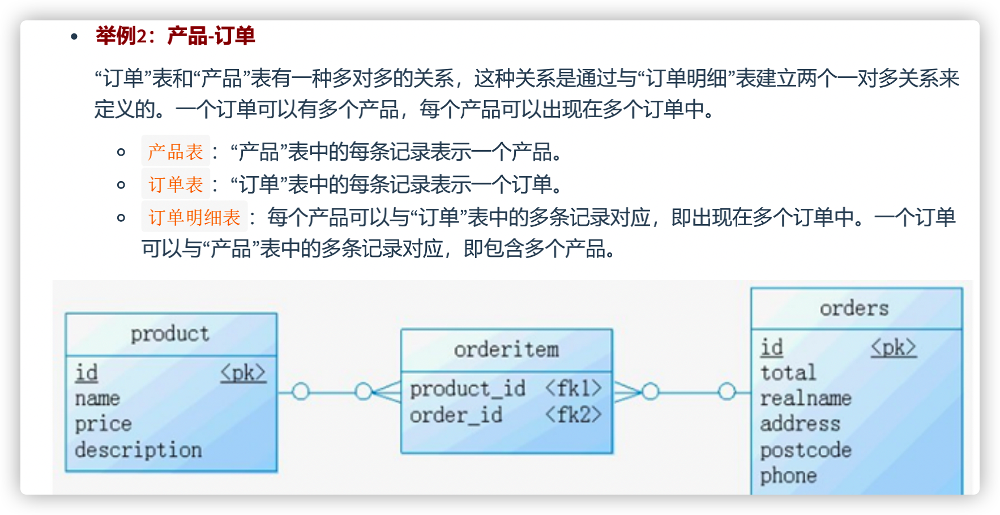

# 数据库概述

## 数据库概念


- SQLite
  嵌入式的小型数据库，应用在手机端。零配置，SQLite不用安装，不用配置，不用启动，关闭或者配置数据库实例。当系统崩溃后不用做任何恢复操作，再下次使用数据库的时候自动恢复。

## MySQL介绍

- MySQL是一个 开放源代码的 **关系型**数据库管理系统

- MySQL6.x 版本之后分为 社区版 和 商业版 。 

- MySQL是可以定制的，采用了 GPL（GNU General Public License） 协议，你可以修改源码来

  开发自己的MySQL系统。

- MySQL支持大型的数据库。可以处理拥有上千万条记录的大型数据库。

- MySQL支持大型数据库，支持5000万条记录的数据仓库，32位系统表文件最大可支持 4GB ，64位系统支持最大的表文件为 8TB 。

- 15年发布的MySQL5.7用的多


## RDBMS **与 非**RDBMS

- 关系型数据库绝对是 DBMS 的主流，其中使用最多的 DBMS 分别是 Oracle、 MySQL 和 SQL Server。这些都是关系型数据库（RDBMS）。

### 关系型数据库(RDBMS)

- 这种类型的数据库是 最古老 的数据库类型，关系型数据库模型是把复杂的数据结构归结为简单的二元关系 （即二维表格形式）。
- 关系型数据库以 行(row) 和 列(column) 的形式存储数据，以便于用户理解。这一系列的行和列被称为 表(table) ，一组表组成了一个库(database)。
- 表与表之间的数据记录有关系(relationship)。现实世界中的各种实体以及实体之间的各种联系均用关系模型 来表示。关系型数据库，就是建立在 关系模型 基础上的数据库。
-  **优势**
  - **复杂查询** 可以用SQL语句方便的在一个表以及多个表之间做非常复杂的数据查询。
  - **事务支持** 使得对于安全性能很高的数据访问要求得以实现。

### 非关系型数据库(非RDBMS) 

- **非关系型数据库**，可看成传统关系型数据库的功能 阉割版本 ，基于键值对存储数据，不需要经过SQL层的解析， 性能非常高 。同时，通过减少不常用的功能，进一步提高性能。目前基本上大部分主流的非关系型数据库都是免费的。
- NoSQL 泛指非关系型数据库

#### 键值型数据库

键值型数据库通过 Key-Value 键值的方式来存储数据。Key 作为唯一的标识符，优点是查找速度快，在这方面明显优于关系型数据库，缺点是无法像关系型数据库一样使用条件过滤（比如 WHERE），如果你不知道去哪里找数据，就要遍历所有的键，这就会消耗大量的计算。键值型数据库典型的使用场景是作为 内存缓存 。 **Redis** 是最流行的键值型数据库。

#### 文档型数据库

此类数据库可存放并获取文档，可以是XML、JSON等格式。在数据库中文档作为处理信息的基本单位，一个文档就相当于一条记录。文档数据库所存放的文档，就相当于键值数据库所存放的“值”。**MongoDB**是最流行的文档型数据库。此外，还有CouchDB等。

#### 搜索引擎数据库

虽然关系型数据库采用了索引提升检索效率，但是针对全文索引效率却较低。搜索引擎数据库是应用在搜索引擎领域的数据存储形式，由于搜索引擎会爬取大量的数据，并以特定的格式进行存储，这样在检索的时候才能保证性能最优。核心原理是“倒排索引”。典型产品：Solr（没人用了）、Elasticsearch（相比更重要）、Splunk 等。

#### 列式数据库

列式数据库是相对于行式存储的数据库，Oracle、MySQL、SQL Server 等数据库都是采用的行式存储（Row-based），而列式数据库是将数据按照列存储到数据库中，这样做的好处是可以大量降低系统的I/O，适合于分布式文件系统，不足在于功能相对有限。典型产品：**HBase**,**ClickHouse**（相比更重要）等。查询减少内存空间。

#### 图形数据库

图形数据库(趋势，但现在不咋用)，利用了图这种数据结构存储了实体（对象）之间的关系。图形数据库最典型的例子就是社交网络中人与人的关系，数据模型主要是以节点和边（关系）来实现，特点在于能高效地解决复杂的关系问题。图形数据库顾名思义，就是一种存储图形关系的数据库。它利用了图这种数据结构存储了实体（对象）之间的关系。关系型数据用于存储明确关系的数据，但对于复杂关系的数据存储却有些力不从心。如社交网络中人物之间的关系，如果用关系型数据库则非常复杂，用图形数据库将非常简单。典型产品：Neo4J、InfoGrid等。

## 关系型数据库设计规则

- 将数据放到表中，表再放到库中。
- 一个数据库中可以有多个表，每个表都有一个名字，用来标识自己。表名具有唯一性。

### 表、记录、字段

- E-R（entity-relationship，实体-联系）模型中有三个主要概念是： 实体集 、 属性 、 联系集 。
  - 一个实体集（class）对应于数据库中的一个表（table），一个实体（instance）则对应于数据库表中的一行（row），也称为一条记录（record）。一个属性（attribute）对应于数据库表中的一列（column），也称为一个字段（field）。
  - 联系集：一张表的一条条和另外一张表的一条条数据之间的联系

### 表的关联关系

- 四种：一对一关联、一对多关联、多对多关联、自我引用

####  一对一关联（one-to-one)

- 在实际的开发中应用不多，因为一对一可以创建成一张表。

- 举例：设计 学生表 ：学号、姓名、手机号码、班级、系别、身份证号码、家庭住址、籍贯、紧急联系人、...拆为两个表：两个表的记录是一一对应关系。
  - 基础信息表 （常用信息）：学号、姓名、手机号码、班级、系别
  - 档案信息表 （不常用信息）：学号、身份证号码、家庭住址、籍贯、紧急联系人、...
- 两种建表原则：
  - 外键唯一：主表的主键和从表的外键（唯一），形成主外键关系，外键唯一。
  - 外键是主键：主表的主键和从表的主键，形成主外键关系。
  - 一份表常用字段，一份少用

#### 一对多关系（one-to-many)

- 常见实例场景： 客户表和订单表 ， 分类表和商品表 ， 部门表和员工表 。
  - 举例：
    - 员工表：编号、姓名、...、所属部门
    - 部门表：编号、名称、简介
- 一对多建表原则：在从表(多方)创建一个字段，字段作为外键指向主表(一方)的主键

#### 多对多（many-to-many）

- 要表示多对多关系，必须创建第三个表，该表通常称为 联接表 ，它将多对多关系划分为两个一对多关系。将这两个表的主键都插入到第三个表中。



####  自我引用(Self reference)


# 我的尝试

## docker安装mysql

- MySQL8.0.26

  MySQL5.7企业用得多

- 听说把数据库安装到docker比较好，参考下面的装了mysql5.7和8+的版本，结果5.7可以链接navicat,8+不能链接navicat。5.7还牵扯文件改编码格式UTF-8，咱不会改，找不到文件夹，就删了docker

https://juejin.cn/post/7039024521159901197

https://blog.csdn.net/a1023266384/article/details/119455841

https://prinsss.github.io/build-x86-docker-images-on-an-m1-macs/

## 直接安装mysql

- 还是老老实实安装mysql到本地好了，于是参考下面的文件

https://blog.csdn.net/weixin_58089927/article/details/122061041

我是直接复制路径在bash文件修改配置的 ~/.bash_profile

```bash
export PATH=$PATH:/usr/local/mysql/bin
export PATH=$PATH:/usr/local/mysql/support-files
```

## mysql初步几个终端指令

### 自带客户端的登录与退出

当MySQL服务启动完成后，便可以通过客户端来登录MySQL数据库。注意：确认服务是开启的。（下载设置mysql自动勾选默认服务开启）

- 登陆

   mysql -u root -p 

- 退出登录 

  - exit 

    或

  - quit 

### mac下启动/停止/重启mysql服务

- ⚠️遇到问题的话

  - sudo su 的条件下搞上面的 启动/停止/重启mysql服务

  - **杀死线程**

    https://www.jianshu.com/p/8095bdbf20bb 

    - 执行`ps -ef|grep mysqld`查看mysql的进程
    - 使用`sudo kill -9 进程id`杀死进程

  - ⚠️要不然全删了再安装mysql

    - sudo su 的条件下搞下面的（可以删除干净）

    - ```bash
      sudo rm /usr/local/mysql
      sudo rm -rf /usr/local/mysql*
      sudo rm -rf /Library/StartupItems/MySQLCOM
      sudo rm -rf /Library/PreferencePanes/My*
      rm -rf ~/Library/PreferencePanes/My*
      sudo rm -rf /Library/Receipts/mysql*
      sudo rm -rf /Library/Receipts/MySQL*
      sudo rm -rf /var/db/receipts/com.mysql.*
      ```

    - 完成会发现user/local 路径没有mysql之类的文件

    - System Preferences里面也没有mysql🐬图标

- 遇到的问题:
  -  Access denied for user 'root'@'localhost' (using password: YES)
    - 我这里应该是密码错误，停止mysql -> mysql.server stop，删除多余进程 -> sudo kill -9
    - 在System Preferences里面的mysql🐬图标，Initialize Database，里面重新设置密码
  - Can't connect to local MySQL server through socket '/tmp/mysql.sock' (2)
    - 没有启动mysql, mysql.server start 

- 开始mysql

  mysql.server start 

  或者

   sudo /usr/local/mysql/support-files/mysql.server start

- 停止mysql

  mysql.server stop

  或者

  sudo /usr/local/mysql/support-files/mysql.server stop

- 重启mysql

  mysql.server restart

  或者

  sudo /usr/local/mysql/support-files/mysql.server restart

  - mac重启mysql提示ERROR! MySQL server PID file could not be found!的解决办法 **杀死线程**

    https://www.jianshu.com/p/8095bdbf20bb 

    - 执行`ps -ef|grep mysqld`查看mysql的进程
    - 使用`sudo kill -9 进程id`杀死进程
    - 执行`sudo /usr/local/mysql/support-files/mysql.server restart`重启mysql。我这里执行了两次(推荐两次)

### 创建/查看/增删

- 创建自己的数据库

```bash
create database 数据库名;
```

- 使用自己的数据库

```bash
use 数据库名;
```

- 查看某个库的所有表格

```bash
show tables; #要求前面有use语句
```

- 查看数据库的创建信息

```bash
show create database 数据库名\G
```

- 删除表格

```bash
drop table 表名称;
```

- 删除数据库

```bash
drop database 数据库名;
```

# 基本的SELECT语句

##  SQL **分类** 

