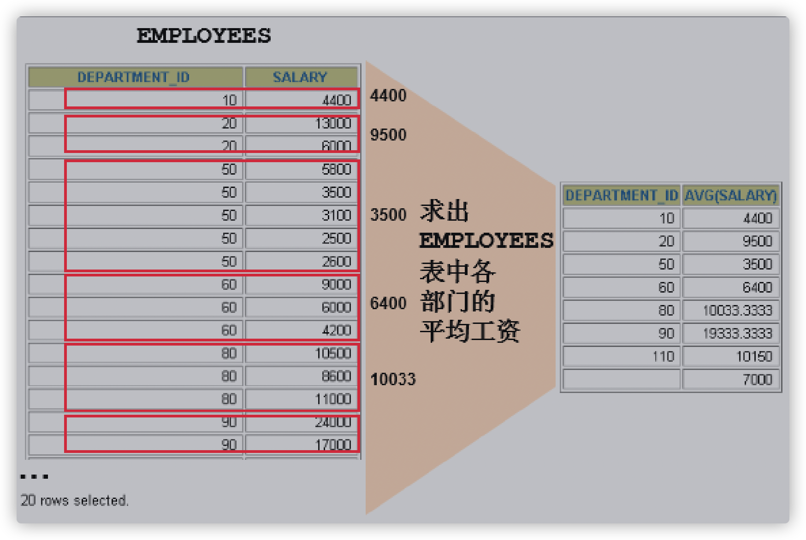

#  函数理解

- 从函数定义的角度出发，我们可以将函数分成 内置函数 和 自定义函数 。在 SQL 语言中，同样也包括了内置函数和自定义函数。内置函数是系统内置的通用函数，而自定义函数是我们根据自己的需要编写的，本章及下一章讲解的是 SQL 的内置函数。
- 我们在使用 SQL 语言的时候，不是直接和这门语言打交道，而是通过它使用不同的数据库软件，即DBMS。DBMS **之间的差异性很大，远大于同一个语言不同版本之间的差异。**实际上，只有很少的函数是被 DBMS 同时支持的。比如，大多数 DBMS 使用（||）或者（+）来做拼接符，而在 MySQL 中的字符串拼接函数为concat()。大部分 DBMS 会有自己特定的函数，这就意味着**采用** SQL **函数的代码可移植性是很差的**，因此在使用函数的时候需要特别注意。
- 的内置函数分为两类： 单行函数 、 聚合函数（或分组函数） 。


- 单行函数：
  - **每行返回一个结果**
  - 可以嵌套

# 单行函数

**见 第07章_单行函数.pdf**

## 数值函数

## 字符串函数

- MySQL里面，字段名下数据的查询不分大小写，即使查询条件是字段名下数据的小写，大写的数据也会查询出来
- MySQL里面，角标从1开始

## 日期和时间函数

## 流程控制函数

SQL查询自带循环

## 加密与解密函数

## MySQL信息函数

## 其他函数

# 聚合函数

- 聚合（或聚集、分组）函数，它是对一组数据进行汇总的函数，输入的是一组数据的集合，输出的是单个值。
- 聚合函数不能嵌套调用。

## 聚合函数介绍

### AVG和SUM函数

```sql
#1.1 AVG / SUM ：只适用于数值类型的字段（或变量）
-- 不能用于日期，字符串
SELECT AVG(salary),SUM(salary),AVG(salary) * 107
FROM employees;
```

### MIN和MAX函数

可以对**任意数据类型**的数据使用 MIN 和 MAX 函数。

```sql
#1.2 MAX / MIN :适用于任意数据类型
SELECT MAX(salary),MIN(salary)
FROM employees;

SELECT MAX(last_name),MIN(last_name),MAX(hire_date),MIN(hire_date)
FROM employees;
```

### COUNT函数

```sql
#1.3 COUNT：
# ① 作用：计算指定字段在查询结构中出现的个数（不包含NULL值的）
SELECT COUNT(employee_id),COUNT(salary),COUNT(2 * salary),COUNT(1),COUNT(2),COUNT(*)
FROM employees;

#如果计算表中有多少条记录，如何实现？
#方式1：COUNT(*) 返回表中记录总数，适用于**任意数据类型**。 
#方式2：COUNT(1)
#方式3：COUNT(具体字段) : 不一定对！
-- COUNT(expr) 返回expr**不为空**的记录总数。

# 如何需要统计表中的记录数，使用COUNT(*)、COUNT(1)、COUNT(具体字段) 哪个效率更高呢？
# 如果使用的是MyISAM 存储引擎，则三者效率相同，都是O(1)
# 如果使用的是InnoDB 存储引擎，则三者效率：COUNT(*) = COUNT(1)> COUNT(字段)

#② 注意：计算指定字段出现的个数时，是不计算NULL值的。
-- count(*)会统计值为 NULL 的行，而 count(列名)不会统计此列为 NULL 值的行。
SELECT COUNT(commission_pct)
FROM employees;
-- 上下两者等价
SELECT commission_pct
FROM employees
WHERE commission_pct IS NOT NULL;
```

```sql
#③ 公式：AVG = SUM / COUNT
SELECT AVG(salary),SUM(salary)/COUNT(salary),
AVG(commission_pct),SUM(commission_pct)/COUNT(commission_pct),
SUM(commission_pct) / 107
FROM employees;

#需求：查询公司中平均奖金率
#错误的！
SELECT AVG(commission_pct)
FROM employees;

#正确的：
SELECT SUM(commission_pct) / COUNT(IFNULL(commission_pct,0)),
AVG(IFNULL(commission_pct,0))
FROM employees;
```

## GROUP BY



```sql
#2. GROUP BY 的使用
#需求：查询各个部门的平均工资，最高工资
SELECT department_id,AVG(salary),SUM(salary)
FROM employees
GROUP BY department_id

#需求：查询各个department_id,job_id的平均工资
#方式1：
SELECT department_id,job_id,AVG(salary)
FROM employees
GROUP BY  department_id,job_id;
-- GROUP BY job_id,department_id;
-- GROUP BY 两者交换对结果没有影响

#错误的！job_id 无法显示结果
SELECT department_id,job_id,AVG(salary)
FROM employees
GROUP BY department_id;
#结论1：SELECT中出现的非组函数的字段必须声明在GROUP BY 中。
#      反之，GROUP BY中声明的字段可以不出现在SELECT中。
```

### WITH ROLLUP

```sql
#结论3：MySQL中GROUP BY中使用WITH ROLLUP
-- 使用 WITH ROLLUP 关键字之后，在所有查询出的分组记录之后增加一条记录，该记录计算查询出的所有记录的总和，即统计记录数量。
SELECT department_id,AVG(salary)
FROM employees
GROUP BY department_id WITH ROLLUP;
```

```sql
#需求：查询各个部门的平均工资，按照平均工资升序排列
SELECT department_id,AVG(salary) avg_sal
FROM employees
GROUP BY department_id
ORDER BY avg_sal ASC;

#说明：当使用ROLLUP时，不能同时使用ORDER BY子句进行结果排序，即ROLLUP和ORDER BY是互相排斥的。
-- 自定义平均不能排序（矛盾）
#错误的：
SELECT department_id,AVG(salary) avg_sal
FROM employees
GROUP BY department_id WITH ROLLUP
ORDER BY avg_sal ASC;
```

## HAVING

```sql
#3. HAVING的使用 (作用：用来过滤数据的)
#练习：查询各个部门中最高工资比10000高的部门信息

#要求1：如果过滤条件中使用了聚合函数，则必须使用HAVING来替换WHERE。否则，报错。
#要求2：HAVING 必须声明在 GROUP BY 的后面。
SELECT department_id,MAX(salary)
FROM employees
GROUP BY department_id
HAVING MAX(salary) > 10000;

#要求3：开发中，我们使用HAVING的前提是SQL中使用了GROUP BY。
```

```sql
#练习：查询部门id为10,20,30,40这4个部门中最高工资比10000高的部门信息
SELECT department_id,MAX(salary)
FROM employees
WHERE department_id IN (10,20,30,40)
GROUP BY department_id
HAVING MAX(salary) > 10000;
#结论：当过滤条件中有聚合函数时，则此过滤条件必须声明在HAVING中。
#      当过滤条件中没有聚合函数时，则此过滤条件声明在WHERE中或HAVING中都可以。但是，建议大家声明在WHERE中。

/*
  WHERE 与 HAVING 的对比
1. 从适用范围上来讲，HAVING的适用范围更广。 
2. 如果过滤条件中没有聚合函数：这种情况下，WHERE的执行效率要高于HAVING
*/
```

## SQL底层执行原理

### SELECT 语句的完整结构

```sql
/*
#sql92语法：
SELECT ....,....,....(存在聚合函数)
FROM ...,....,....
WHERE 多表的连接条件 AND 不包含聚合函数的过滤条件
GROUP BY ...,....
HAVING 包含聚合函数的过滤条件
ORDER BY ....,...(ASC / DESC )
LIMIT ...,....


#sql99语法：
SELECT ....,....,....(存在聚合函数)
FROM ... (LEFT / RIGHT)JOIN ....ON 多表的连接条件 
(LEFT / RIGHT)JOIN ... ON .... （习惯上把数据多的放在左边，一般就是左外）
WHERE 不包含聚合函数的过滤条件
GROUP BY ...,....
HAVING 包含聚合函数的过滤条件
ORDER BY ....,...(ASC / DESC )
LIMIT ...,....
*/
```

### SQL语句的执行过程

```sql
#4.2 SQL语句的执行过程：
#FROM ...,...-> ON -> (LEFT/RIGNT  JOIN) -> WHERE -> GROUP BY -> HAVING -> SELECT -> DISTINCT -> 
# ORDER BY -> LIMIT
```

