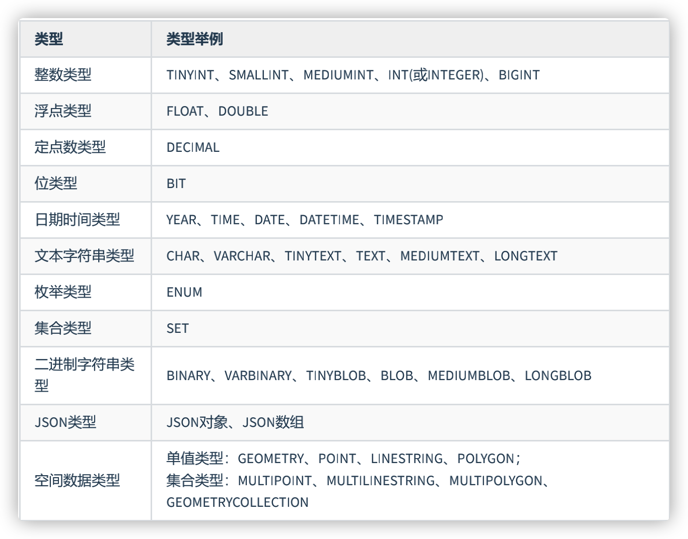
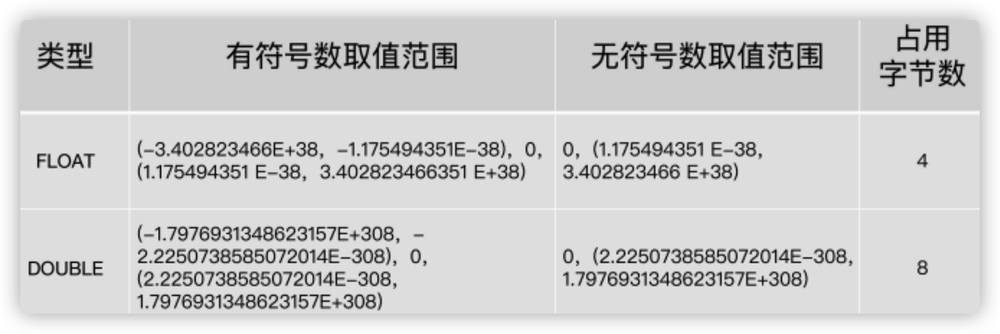
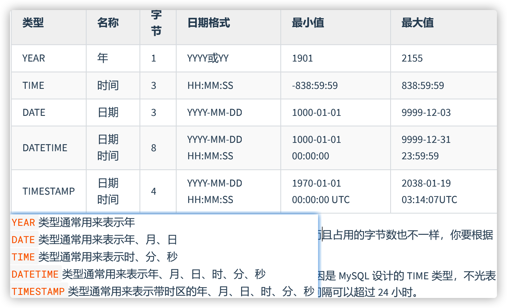
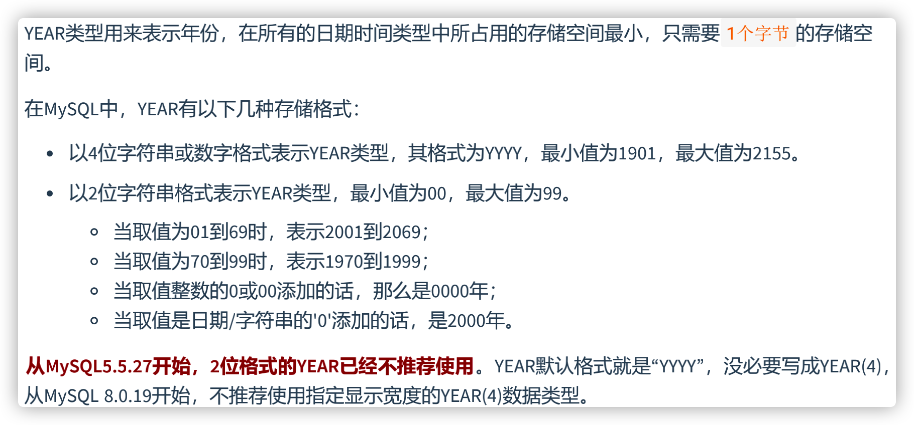
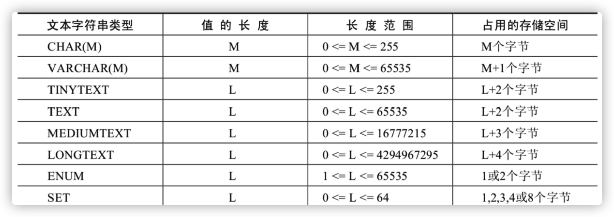
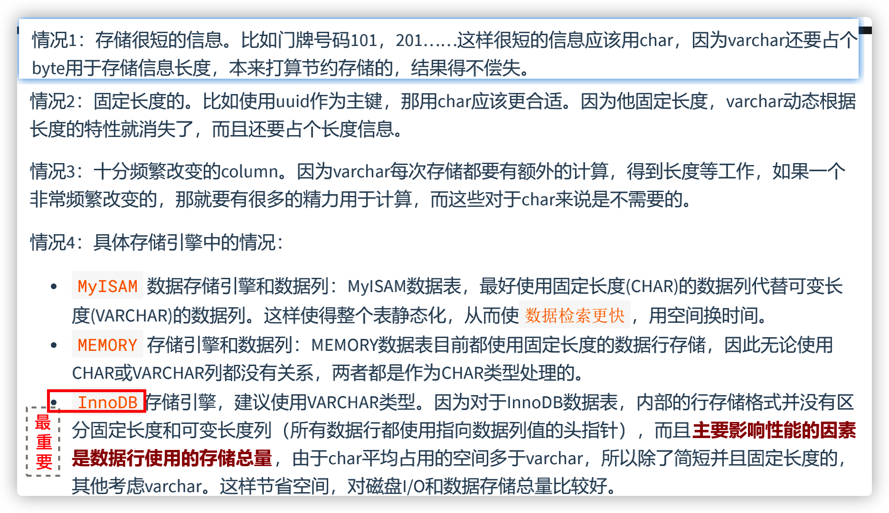
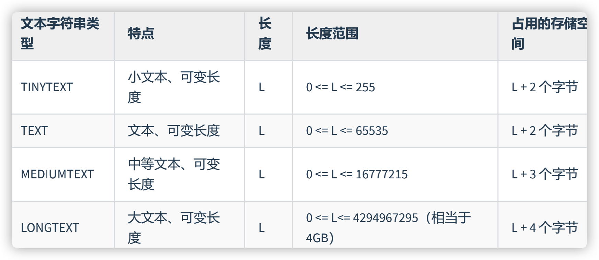
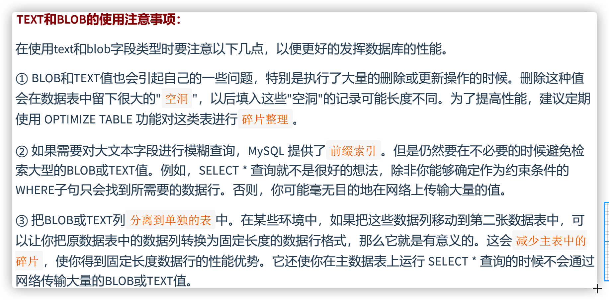
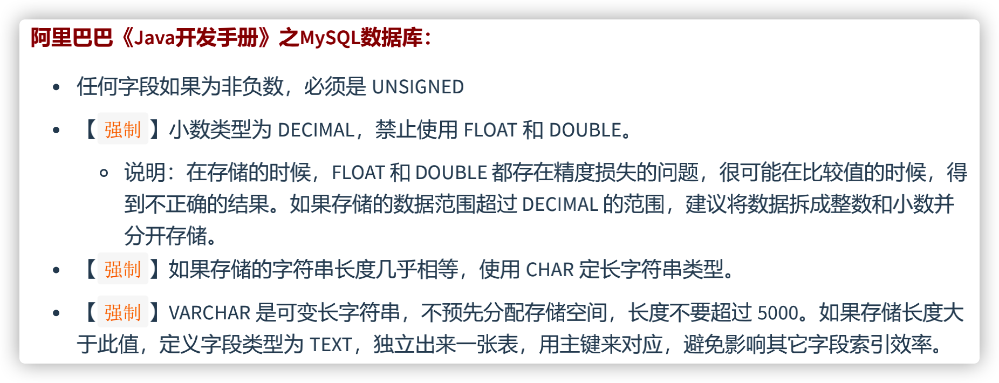

# MySQL数据类型




## character set

```sql
#1.关于属性：character set name
SHOW VARIABLES LIKE 'character_%';

#创建数据库时指名字符集
-- 一般就光写这个，之后表、字段就不用制定字符集
-- 创建数据库时没有指名字符集的话，根据系统默认的字符集走
CREATE DATABASE IF NOT EXISTS dbtest12 CHARACTER SET 'utf8';

SHOW CREATE DATABASE dbtest12;

#创建表的时候，指名表的字符集
CREATE TABLE temp(
id INT
) CHARACTER SET 'utf8';

SHOW CREATE TABLE temp;

#创建表，指名表中的字段时，可以指定字段的字符集
CREATE TABLE temp1(
id INT,
NAME VARCHAR(15) CHARACTER SET 'gbk'

);
SHOW CREATE TABLE temp1;
```


## 整数类型


```sql
#2.整型数据类型
USE dbtest12;

CREATE TABLE test_int1(
f1 TINYINT,
f2 SMALLINT,
f3 MEDIUMINT,
f4 INTEGER,
f5 BIGINT
);

DESC test_int1;

INSERT INTO test_int1(f1)
VALUES(12),(-12),(-128),(127);

SELECT * FROM test_int1;

#Out of range value for column 'f1' at row 1
INSERT INTO test_int1(f1)
VALUES(128);
```

### 可选属性

####  M & ZEROFILL

- M : 表示显示宽度，M的取值范围是(0, 255)。例如，int(5)：当数据宽度小于5位的时候在数字前面需要用字符填满宽度。**该项功能需要配合“ ZEROFILL ”**使用，表示用“0”填满宽度，否则指定显示宽度无效。

- 如果设置了显示宽度，那么插入的数据宽度超过显示宽度限制，会不会截断或插入失败？

  答案：不会对插入的数据有任何影响，还是按照类型的实际宽度进行保存，即 显示宽度与类型可以存储的 值范围无关 。

- **从MySQL 8.0.17开始，整数数据类型不推荐使用显示宽度属性。**

```sql
CREATE TABLE test_int2(
f1 INT,
f2 INT(5),
f3 INT(5) ZEROFILL  
#① 显示宽度为5。当insert的值不足5位时，使用0填充。 
#②当使用ZEROFILL时，自动会添加UNSIGNED
);

INSERT INTO test_int2(f1,f2)
VALUES(123,123),(123456,123456);

SELECT * FROM test_int2;

INSERT INTO test_int2(f3)
VALUES(123),(123456);
```

- 整型数据类型可以在定义表结构时指定所需要的显示宽度，如果不指定，则系统为每一种类型指定默认的宽度值。


#### UNSIGNED

- UNSIGNED : 无符号类型（非负），所有的整数类型都有一个可选的属性UNSIGNED（无符号属性），无符号整数类型的最小取值为0。所以，如果需要在MySQL数据库中保存非负整数值时，可以将整数类型设置为无符号类型。
- int类型默认显示宽度为int(11)，无符号int类型默认显示宽度为int(10)。

```sql
CREATE TABLE test_int3(
f1 INT UNSIGNED
);

DESC test_int3;

INSERT INTO test_int3
VALUES(2412321);

#Out of range value for column 'f1' at row 1
INSERT INTO test_int3
VALUES(4294967296);
```

### 选择

- **一般情况用int**
- 

- 用空间换取可靠性 

## 浮点类型

>由于 DECIMAL 数据类型的精准性，在我们的项目中，除了极少数（比如商品编号）用到整数类型外，其他的数值都用的是 DECIMAL，原因就是这个项目所处的零售行业，要求精准，一分钱也不能差。 ” ——来自某项目经理



- MySQL支持的浮点数类型，分别是 FLOAT、DOUBLE、REAL（一般不用）。
- REAL默认就是 DOUBLE。如果你把 SQL 模式设定为启用“ REAL_AS_FLOAT ”，那 么，MySQL 就认为REAL 是 FLOAT。如果要启用“REAL_AS_FLOAT”，可以通过以下 SQL 语句实现：

```sql
SET sql_mode = “REAL_AS_FLOAT”;
```

- **问题**：为什么浮点数类型的无符号数取值范围，只相当于有符号数取值范围的一半，也就是只相当于有符号数取值范围大于等于零的部分呢？

  MySQL 存储浮点数的格式为： 符号(S) 、 尾数(M) 和 阶码(E) 。因此，无论有没有符号，MySQL 的浮点数都会存储表示符号的部分。因此， 所谓的无符号数取值范围，其实就是有符号数取值范围大于等于零的部分。

### 数据精度

- MySQL允许使用 非标准语法 （其他数据库未必支持，因此如果涉及到数据迁移，则最好不要这么用）： FLOAT(M,D) 或 DOUBLE(M,D) 。这里，M称为 精度 ，D称为 标度 。(M,D)中 M=整数位+小数位，D=小数位。 D<=M<=255，0<=D<=30。
- FLOAT和DOUBLE类型在不指定(M,D)时，默认会按照实际的精度（由实际的硬件和操作系统决定）来显示。
- 说明：浮点类型，也可以加 UNSIGNED ，但是不会改变数据范围，例如：FLOAT(3,2) UNSIGNED仍然只能表示0-9.99的范围。

```sql
#测试FLOAT和DOUBLE的精度问题
CREATE TABLE test_double2(
f1 DOUBLE
);

INSERT INTO test_double2
VALUES(0.47),(0.44),(0.19);

SELECT SUM(f1)
FROM test_double2;

SELECT SUM(f1) = 1.1,1.1 = 1.1
FROM test_double2;
```

- **MySQL 8.0.17开始，FLOAT(M,D) 和DOUBLE(M,D)用法在官方文档中已经明确不推荐使用**，将来可能被移除。另外，关于浮点型FLOAT和DOUBLE的UNSIGNED也不推荐使用了，将来也可能被移除。

```sql
#3.浮点类型
CREATE TABLE test_double1(
f1 FLOAT,
f2 FLOAT(5,2),
f3 DOUBLE,
f4 DOUBLE(5,2)
);

DESC test_double1;

INSERT INTO test_double1(f1,f2)
VALUES(123.45,123.45);

SELECT * FROM test_double1;

INSERT INTO test_double1(f3,f4)
VALUES(123.45,123.456); #存在四舍五入

#Out of range value for column 'f4' at row 1
INSERT INTO test_double1(f3,f4)
VALUES(123.45,1234.456);

#Out of range value for column 'f4' at row 1
-- 四舍五入后越界 也报错
INSERT INTO test_double1(f3,f4)
VALUES(123.45,999.995);
```

- 误差: FLOAT和DOUBLE都有误差

  MySQL 用 4 个字节存储 FLOAT 类型数据，用 8 个字节来存储 DOUBLE 类型数据。无论哪个，都是采用二进制的方式来进行存储的。无法用一个二进制数来精确表达。进而，就只好在取值允许的范围内进行四舍五入。

- **因为浮点数是不准确的，所以我们要避免使用“=”来**判断两个数是否相等。同时，在一些对精确度要求较高的项目中，千万不要使用浮点数，不然会导致结果错误，甚至是造成不可挽回的损失。那么，MySQL 有没有精准的数据类型呢？当然有，这就是定点数类型： DECIMAL 。 

```sql
#测试FLOAT和DOUBLE的精度问题
CREATE TABLE test_double2(
f1 DOUBLE
);

INSERT INTO test_double2
VALUES(0.47),(0.44),(0.19);

SELECT SUM(f1)
FROM test_double2;

SELECT SUM(f1) = 1.1,1.1 = 1.1
FROM test_double2;
-- 0,1
```

## 定点数类型


- 使用 DECIMAL(M,D) 的方式表示高精度小数。其中，M被称为精度，D被称为标度。0<=M<=65， 0<=D<=30，D<M。例如，定义DECIMAL（5,2）的类型，表示该列取值范围是-999.99~999.99。
- DECIMAL(M,D)**的最大取值范围与DOUBLE**类型一样**，但是有效的数据范围是由M和D决定的。
- 定点数在MySQL内部是以 字符串 的形式进行存储，这就决定了它一定是精准的。
- 当DECIMAL类型不指定精度和标度时，其默认为DECIMAL(10,0)。当数据的精度超出了定点数类型的精度范围时，则MySQL同样会进行四舍五入处理。

```sql
#4. 定点数类型
CREATE TABLE test_decimal1(
f1 DECIMAL,
f2 DECIMAL(5,2)
);

DESC test_decimal1;
-- decimal(10,0)
-- decimal(5,2)

INSERT INTO test_decimal1(f1)
VALUES(123),(123.45);

SELECT * FROM test_decimal1;

INSERT INTO test_decimal1(f2)
VALUES(999.99);

INSERT INTO test_decimal1(f2)
VALUES(67.567);#存在四色五入

#Out of range value for column 'f2' at row 1
INSERT INTO test_decimal1(f2)
VALUES(1267.567);

#Out of range value for column 'f2' at row 1
INSERT INTO test_decimal1(f2)
VALUES(999.995);
```

```sql
#演示DECIMAL替换DOUBLE，体现精度
ALTER TABLE test_double2
MODIFY f1 DECIMAL(5,2);

DESC test_double2;

SELECT SUM(f1)
FROM test_double2;

SELECT SUM(f1) = 1.1,1.1 = 1.1
FROM test_double2;
-- 1		1
```

### 浮点数 vs 定点数

- 浮点数相对于定点数的优点是在长度一定的情况下，浮点类型取值范围大，但是不精准，适用于需要取值范围大，又可以容忍微小误差的科学计算场景（比如计算化学、分子建模、流体动力学等）
- 定点数类型取值范围相对小，但是精准，没有误差，适合于对精度要求极高的场景 （比如涉及金额计算的场景）

##  **位类型：**BIT

- BIT类型中存储的是二进制值，类似010110。 
- 
- BIT类型，如果没有指定(M)，默认是1位。这个1位，表示只能存1位的二进制值。这里(M)是表示二进制的位数，位数最小值为1，最大值为64。
- 

```sql
#5. 位类型：BIT
CREATE TABLE test_bit1(
f1 BIT, -- 详情显示 bit(1)
f2 BIT(5),
f3 BIT(64)
);

DESC test_bit1;

INSERT INTO test_bit1(f1)
VALUES(0),(1);

SELECT *
FROM test_bit1;

#Data too long for column 'f1' at row 1
INSERT INTO test_bit1(f1)
VALUES(2);

INSERT INTO test_bit1(f2)
VALUES(31);

#Data too long for column 'f2' at row 1
INSERT INTO test_bit1(f2)
VALUES(32);
```

### 进制转换

```sql
SELECT BIN(f1),BIN(f2),HEX(f1),HEX(f2)
FROM test_bit1;
-- BIN 二位数 HEX 16位数

#此时+0以后，可以以十进制的方式显示数据
SELECT f1 + 0, f2 + 0
FROM test_bit1;
```

# 日期与时间类型

- **日期加上单引号**
- MySQL有多种表示日期和时间的数据类型，不同的版本可能有所差异，MySQL8.0版本支持的日期和时间类型主要有：YEAR类型、TIME类型、DATE类型、DATETIME类型和TIMESTAMP类型。
- 
- 为什么时间类型 TIME 的取值范围不是 -23:59:59～23:59:59 呢？原因是 MySQL 设计的 TIME 类型，不光表示一天之内的时间，而且可以用来表示一个时间间隔，这个时间间隔可以超过 24 小时。

### YEAR类型



```sql
#6.1 YEAR类型
CREATE TABLE test_year(
f1 YEAR,
f2 YEAR(4)
);

DESC test_year;

INSERT INTO test_year(f1)
VALUES('2021'),(2022);

SELECT * FROM test_year;

INSERT INTO test_year(f1)
VALUES ('2155');

#Out of range value for column 'f1' at row 1
INSERT INTO test_year(f1)
VALUES ('2156');

INSERT INTO test_year(f1)
VALUES ('69'),('70');

INSERT INTO test_year(f1)
VALUES (0),('00');
```

### DATE类型

- DATE类型表示日期，没有时间部分，格式为 YYYY-MM-DD ，其中，YYYY表示年份，MM表示月份，DD表示日期。需要 3个字节 的存储空间。


```sql
#6.2 DATE类型
CREATE TABLE test_date1(
f1 DATE
);

DESC test_date1;

INSERT INTO test_date1
VALUES ('2020-10-01'), ('20201001'),(20201001);

INSERT INTO test_date1
VALUES ('00-01-01'), ('000101'), ('69-10-01'), ('691001'), ('70-01-01'), ('700101'), ('99-01-01'), ('990101');

INSERT INTO test_date1
VALUES (000301), (690301), (700301), (990301); #存在隐式转换

INSERT INTO test_date1
VALUES (CURDATE()),(CURRENT_DATE()),(NOW());

SELECT *
FROM test_date1;
```

### TIME类型

- TIME类型用来表示时间，不包含日期部分。
- 在MySQL中，需要 3个字节 的存储空间来存储TIME类型的数据，可以使用“HH:MM:SS”格式来表示TIME类型，其中，HH表示小时，MM表示分钟，SS表示秒。


```sql
#6.3 TIME类型
CREATE TABLE test_time1(
f1 TIME
);

DESC test_time1;

INSERT INTO test_time1
VALUES('2 12:30:29'), ('12:35:29'), ('12:40'), ('2 12:40'),('1 05'), ('45');

INSERT INTO test_time1
VALUES ('123520'), (124011),(1210);

INSERT INTO test_time1
VALUES (NOW()), (CURRENT_TIME()),(CURTIME());

SELECT *
FROM test_time1;
```

### DATETIME类型

- DATETIME类型在所有的日期时间类型中占用的存储空间最大，总共需要 8 个字节的存储空间。在格式上为DATE类型和TIME类型的组合，可以表示为 YYYY-MM-DD HH:MM:SS ，其中YYYY表示年份，MM表示月份，DD表示日期，HH表示小时，MM表示分钟，SS表示秒。


```sql
#6.4 DATETIME类型
CREATE TABLE test_datetime1(
dt DATETIME
);

INSERT INTO test_datetime1
VALUES ('2021-01-01 06:50:30'), ('20210101065030');

INSERT INTO test_datetime1
VALUES ('99-01-01 00:00:00'), ('990101000000'), ('20-01-01 00:00:00'), ('200101000000');

INSERT INTO test_datetime1
VALUES (20200101000000), (200101000000), (19990101000000), (990101000000);
 
INSERT INTO test_datetime1
VALUES (CURRENT_TIMESTAMP()), (NOW()),(SYSDATE());

SELECT *
FROM test_datetime1;
```

### TIMESTAMP类型

- TIMESTAMP类型也可以表示日期时间，其显示格式与DATETIME类型相同，都是 YYYY-MM-DD HH:MM:SS ，需要4个字节的存储空间。但是TIMESTAMP存储的时间范围比DATETIME要小很多，只能存储“1970-01-01 00:00:01 UTC”到“2038-01-19 03:14:07 UTC”之间的时间。其中，UTC表示世界统一时间，也叫作世界标准时间。
- **使用TIMESTAMP存储的同一个时间值，在不同的时区查询时会显示不同的时间。**

```sql
#6.5 TIMESTAMP类型
CREATE TABLE test_timestamp1(
ts TIMESTAMP
);

INSERT INTO test_timestamp1
VALUES ('1999-01-01 03:04:50'), ('19990101030405'), ('99-01-01 03:04:05'), ('990101030405');

INSERT INTO test_timestamp1
VALUES ('2020@01@01@00@00@00'), ('20@01@01@00@00@00');

INSERT INTO test_timestamp1
VALUES (CURRENT_TIMESTAMP()), (NOW());

#Incorrect datetime value
INSERT INTO test_timestamp1
VALUES ('2038-01-20 03:14:07');

SELECT *
FROM test_timestamp1;
```

### TIMESTAMP**和**DATETIME的区别

- TIMESTAMP存储空间比较小，表示的日期时间范围也比较小
- 底层存储方式不同，TIMESTAMP底层存储的是毫秒值，距离1970-1-1 0:0:0 0毫秒的毫秒值。
- 两个日期比较大小或日期计算时，TIMESTAMP更方便、更快。
- TIMESTAMP和时区有关。TIMESTAMP会根据用户的时区不同，显示不同的结果。而DATETIME则只能反映出插入时当地的时区，其他时区的人查看数据必然会有误差的。

```sql
#对比DATETIME 和 TIMESTAMP
CREATE TABLE temp_time(
d1 DATETIME,
d2 TIMESTAMP
);

INSERT INTO temp_time VALUES('2021-9-2 14:45:52','2021-9-2 14:45:52');

INSERT INTO temp_time VALUES(NOW(),NOW());

SELECT * FROM temp_time;

#修改当前的时区
SET time_zone = '+9:00';

SELECT * FROM temp_time;
```

### 选择

- 用得最多的日期时间类型，就是 DATETIME 。
- 因为这个数据类型包括了完整的日期和时间信息，取值范围也最大，使用起来比较方便。
- 此外，一般存注册时间、商品发布时间等，不建议使用DATETIME存储，而是使用 时间戳(UNIX_TIMESTAMP(); ) ，因为DATETIME虽然直观，但不便于计算。

## 文本字符串类型

- MySQL中，文本字符串总体上分为 CHAR 、 VARCHAR 、 TINYTEXT 、 TEXT 、 MEDIUMTEXT 、 LONGTEXT 、 ENUM 、 SET 等类型。



### CHAR**与**VARCHAR类型

- CHAR和VARCHAR类型都可以存储比较短的字符串。


#### CHAR类型

- CHAR(M) 类型一般需要预先定义字符串长度。如果不指定(M)，则表示长度默认是1个字符。
- 如果保存时，数据的实际长度比CHAR类型声明的长度小，则会在 右侧填充 空格以达到指定的长度。当MySQL检索CHAR类型的数据时，CHAR类型的字段会去除尾部的空格。
- 定义CHAR类型字段时，声明的字段长度即为CHAR类型字段所占的存储空间的字节数。

```sql
#7.1 CHAR类型
CREATE TABLE test_char1(
c1 CHAR, -- char(1)
c2 CHAR(5)
);

DESC test_char1;

INSERT INTO test_char1(c1)
VALUES('a');

#Data too long for column 'c1' at row 1
INSERT INTO test_char1(c1)
VALUES('ab');

INSERT INTO test_char1(c2)
VALUES('ab');

INSERT INTO test_char1(c2)
VALUES('hello');

INSERT INTO test_char1(c2)
VALUES('尚');

INSERT INTO test_char1(c2)
VALUES('硅谷');

INSERT INTO test_char1(c2)
VALUES('尚硅谷教育');

#Data too long for column 'c2' at row 1
INSERT INTO test_char1(c2)
VALUES('尚硅谷IT教育');

SELECT * FROM test_char1;

SELECT CONCAT(c2,'***')
FROM test_char1;

INSERT INTO test_char1(c2)
VALUES('ab  ');
-- ab***
-- 空格被无视
-- 2个char长度

SELECT CHAR_LENGTH(c2)
FROM test_char1;
```

#### VARCHAR类型

- VARCHAR(M) 定义时， 必须指定 长度M，否则报错。
- 检索VARCHAR类型的字段数据时，会保留数据尾部的空格。VARCHAR类型的字段所占用的存储空间为字符串实际长度加1个字节。

```sql
#7.2 VARCHAR类型
-- 可变字符，要指定长度(CHAR长度)
CREATE TABLE test_varchar1(
NAME VARCHAR  #错误
);

#Column length too big for column 'name' (max = 21845); use BLOB or TEXT instead
-- 21845 * 3 = 65535，在此编码集里面，是3个字节一个汉字
CREATE TABLE test_varchar2(
NAME VARCHAR(65535)
);

CREATE TABLE test_varchar3(
NAME VARCHAR(5)
);

INSERT INTO test_varchar3
VALUES('尚硅谷'),('尚硅谷教育');

#Data too long for column 'NAME' at row 1
INSERT INTO test_varchar3
VALUES('尚硅谷IT教育');
```

#### 选择




### TEXT类型

- 在MySQL中，TEXT用来保存文本类型的字符串，总共包含4种类型，分别为TINYTEXT、TEXT、 MEDIUMTEXT 和 LONGTEXT 类型。
- **由于实际存储的长度不确定，**MySQL **不允许** TEXT **类型的字段做主键**。遇到这种情况，你只能采用CHAR(M)，或者 VARCHAR(M)。



- TEXT文本类型，可以存比较大的文本段，搜索速度稍慢，因此如果不是特别大的内容，建议使用CHAR， VARCHAR来代替。还有TEXT类型不用加默认值，加了也没用。而且text和blob类型的数据删除后容易导致“空洞”，使得文件碎片比较多，所以频繁使用的表不建议包含TEXT类型字段，建议单独分出去，单独用一个表。

```sql
#7.3 TEXT类型
CREATE TABLE test_text(
tx TEXT
);

INSERT INTO test_text
VALUES('atguigu   ');
-- 存储数据包括了空格

SELECT CHAR_LENGTH(tx)
FROM test_text; #10
```

###  ENUM类型

- ENUM类型也叫作枚举类型，ENUM类型的取值范围需要在定义字段时进行指定。设置字段值时，ENUM类型只允许从成员中选取单个值，不能一次选取多个值。
- 其所需要的存储空间由定义ENUM类型时指定的成员个数决定。

```sql
#8. ENUM类型
CREATE TABLE test_enum(
season ENUM('春','夏','秋','冬','unknow')
);

INSERT INTO test_enum
VALUES('春'),('秋');

SELECT * FROM test_enum;

#Data truncated for column 'season' at row 1
INSERT INTO test_enum
VALUES('春,秋');
#Data truncated for column 'season' at row 1
INSERT INTO test_enum
VALUES('人');

INSERT INTO test_enum
VALUES('unknow');

#忽略大小写的
INSERT INTO test_enum
VALUES('UNKNOW');
-- 存储的是枚举指定的小写

#可以使用索引进行枚举元素的调用
INSERT INTO test_enum
VALUES(1),('3');

# 没有限制非空的情况下，可以添加null值
INSERT INTO test_enum
VALUES (NULL);
```

### SET类型

- SET表示一个字符串对象，可以包含0个或多个成员，但成员个数的上限为 64 。设置字段值时，可以取取值范围内的 0 个或多个值。
- SET类型在选取成员时，可以一次选择多个成员，这一点与ENUM类型不同。

```sql
#9. SET类型
CREATE TABLE test_set(
s SET ('A', 'B', 'C')
);

INSERT INTO test_set (s) VALUES ('A'), ('A,B');

#插入重复的SET类型成员时，MySQL会自动删除重复的成员
INSERT INTO test_set (s) VALUES ('A,B,C,A');

#向SET类型的字段插入SET成员中不存在的值时，MySQL会抛出错误。
INSERT INTO test_set (s) VALUES ('A,B,C,D');

SELECT *
FROM test_set;
```

## 二进制字符串类型

- MySQL中的二进制字符串类型主要存储一些二进制数据，比如可以存储图片、音频和视频等二进制数据。
- MySQL中支持的二进制字符串类型主要包括BINARY、VARBINARY、TINYBLOB、BLOB、MEDIUMBLOB 和 LONGBLOB类型。

### BINARY**与**VARBINARY类型

- BINARY (M)为固定长度的二进制字符串，M表示最多能存储的字节数，取值范围是0~255个字符。如果未指定(M)，表示只能存储 1个字节 。例如BINARY (8)，表示最多能存储8个字节，如果字段值不足(M)个字节，将在右边填充'\0'以补齐指定长度。
- VARBINARY (M)为可变长度的二进制字符串，M表示最多能存储的字节数，总字节数不能超过行的字节长度限制65535，另外还要考虑额外字节开销，VARBINARY类型的数据除了存储数据本身外，还需要1或2个字节来存储数据的字节数。VARBINARY类型 必须指定(M) ，否则报错。

```sql
#10.1 BINARY 与 VARBINARY类型
CREATE TABLE test_binary1(
f1 BINARY,-- binary(1)
f2 BINARY(3),
#f3 VARBINARY,
f4 VARBINARY(10)
);

DESC test_binary1;

INSERT INTO test_binary1(f1,f2)
VALUES('a','abc');

SELECT * FROM test_binary1;

#Data too long for column 'f1' at row 1
INSERT INTO test_binary1(f1)
VALUES('ab');

INSERT INTO test_binary1(f2,f4)
VALUES('ab','ab');-- 长度 3 2

SELECT LENGTH(f2),LENGTH(f4)
FROM test_binary1;
```

### BLOB**类型** 

- BLOB是一个 二进制大对象 ，可以容纳可变数量的数据。
- 需要注意的是，在实际工作中，往往不会在MySQL数据库中使用BLOB类型存储大对象数据，通常会将图片、音频和视频文件存储到 服务器的磁盘上 ，并将图片、音频和视频的访问路径存储到MySQL中。


```sql
#10.2 Blob类型
CREATE TABLE test_blob1(
id INT,
img MEDIUMBLOB
);

INSERT INTO test_blob1(id)
VALUES (1001);

SELECT *
FROM test_blob1;
```



## JSON类型

- JSON（JavaScript Object Notation）是一种轻量级的 数据交换格式 。
- JSON **可以将** JavaScript **对象中表示的一组数据转换为字符串，然后就可以在网络或者程序之间轻**松地传递这个字符串，并在需要的时候将它还原为各编程语言所支持的数据格式。

```sql
#11. JSON类型
CREATE TABLE test_json(
js json
);

INSERT INTO test_json (js) 
VALUES ('{"name":"songhk", "age":18, "address":{"province":"beijing", "city":"beijing"}}');


SELECT * FROM test_json;

SELECT js -> '$.name' AS NAME,js -> '$.age' AS age ,js -> '$.address.province' AS province, js -> '$.address.city' AS city
FROM test_json;
```

## 小结及选择建议



# 约束

```sql
/*
1. 基础知识
1.1 为什么需要约束？ 为了保证数据的完整性！

1.2 什么叫约束？对表中字段的限制。

1.3 约束的分类：

角度1：约束的字段的个数
单列约束:每个约束只约束一列
vs 
多列约束:每个约束可约束多列数据

角度2：约束的作用范围

列级约束：将此约束声明在对应字段的后面
只能作用在一个列上，

表级约束：在表中所有字段都声明完，在所有字段的后面声明的约束
可以作用在多个列上

角度3：约束的作用（或功能）

① not null (非空约束)
② unique  (唯一性约束)
③ primary key (主键约束)
④ foreign key (外键约束) (非空且唯一)
⑤ check (检查约束) 
注意： MySQL不支持check约束，但可以使用check约束，而没有任何效果
⑥ default (默认值约束)

1.4 如何添加/删除约束？

CREATE TABLE时添加约束

ALTER TABLE 时增加约束、删除约束
*/
```


## 查看某个表已有的约束

```sql
#information_schema数据库名（系统库）
#table_constraints表名称（专门存储各个表的约束）
SELECT * FROM information_schema.table_constraints 
WHERE table_name = '表名称';
```

## 非空约束

- 限定某个字段/某列的值不允许为空
- 特点:
  - 默认，所有的类型的值都可以是NULL，包括INT、FLOAT等数据类型
  - 非空约束只能出现在表对象的列上，只能某个列单独限定非空，不能组合非空
  - 一个表可以有很多列都分别限定了非空
  - 空字符串''不等于NULL，0也不等于NULL 

```sql
-- 添加非空约束
-- 建表时
CREATE TABLE 表名称(
  字段名 数据类型, 
  字段名 数据类型 NOT NULL,
  字段名 数据类型 NOT NULL 
);

-- 建表后
-- 添加not null约束时，要保证该字段的数据没有null
alter table 表名称 modify 字段名 数据类型 not null;

CREATE TABLE test1(
id INT NOT NULL,
last_name VARCHAR(15) NOT NULL,
email VARCHAR(25),
salary DECIMAL(10,2)
);

ALTER TABLE test1
MODIFY email VARCHAR(25) NOT NULL;
```

```sql
 -- 删除非空约束
 alter table 表名称 modify 字段名 数据类型 NULL;
 #去掉not null，相当于修改某个非注解字段，该字段允 许为空 
 -- 或
 alter table 表名称 modify 字段名 数据类型;
 #去掉not null，相当于修改某个非注解字段，该字段允许为空
 
#3.3 在ALTER TABLE时删除约束
ALTER TABLE test1
MODIFY email VARCHAR(25) NULL;
```

## 唯一性约束

- 用来限制某个字段/某列的值不能重复。
- 唯一约束，允许出现多个空值：null。
- 特点：
  - 同一个表可以有多个唯一约束。
  - 唯一约束可以是某一个列的值唯一，也可以多个列组合的值唯一。
  - 在创建唯一约束的时候，如果不给唯一约束命名，就默认和列名相同。
  - MySQL**会给唯一约束的列上默认创建一个唯一索引。**

```sql
-- 建表时
create table 表名称(
  字段名 数据类型 unique,
  字段名 数据类型 unique key,
  字段名 数据类型 
);

create table 表名称( 
  字段名 数据类型, 
  字段名 数据类型,
  [constraint 约束名] unique key(字段名)
);

-- 建表后指定唯一键约束
#字段列表中如果是一个字段，表示该列的值唯一。如果是两个或更多个字段，那么复合唯一，即多个字段的组合是唯 一的
#方式1： 
alter table 表名称 add unique key(字段列表);

#方式2： 
alter table 表名称 modify 字段名 字段类型 unique;

CREATE TABLE test2(
id INT UNIQUE, #列级约束
last_name VARCHAR(15) ,
email VARCHAR(25),
salary DECIMAL(10,2),
#表级约束
-- UNIQUE(email) 没有起名字，也可以
CONSTRAINT uk_test2_email UNIQUE(email)
);

```


一个字段添加多个约束？

同时删除多个约束？