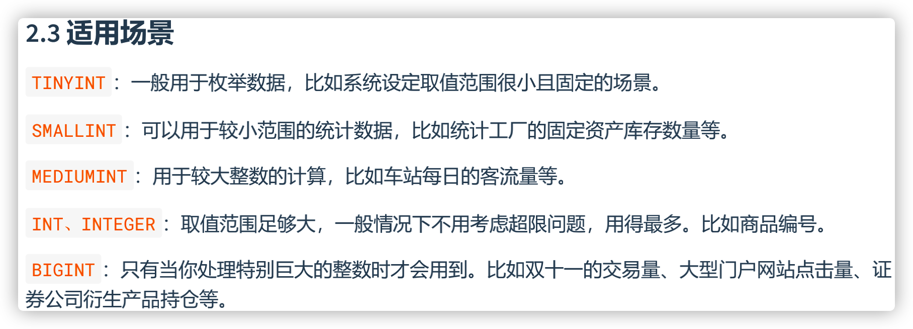

# MySQL数据类型


## character set

```sql
#1.关于属性：character set name
SHOW VARIABLES LIKE 'character_%';

#创建数据库时指名字符集
-- 一般就光写这个，之后表、字段就不用制定字符集
-- 创建数据库时没有指名字符集的话，根据系统默认的字符集走
CREATE DATABASE IF NOT EXISTS dbtest12 CHARACTER SET 'utf8';

SHOW CREATE DATABASE dbtest12;

#创建表的时候，指名表的字符集
CREATE TABLE temp(
id INT
) CHARACTER SET 'utf8';

SHOW CREATE TABLE temp;

#创建表，指名表中的字段时，可以指定字段的字符集
CREATE TABLE temp1(
id INT,
NAME VARCHAR(15) CHARACTER SET 'gbk'

);
SHOW CREATE TABLE temp1;
```


## 整数类型


```sql
#2.整型数据类型
USE dbtest12;

CREATE TABLE test_int1(
f1 TINYINT,
f2 SMALLINT,
f3 MEDIUMINT,
f4 INTEGER,
f5 BIGINT
);

DESC test_int1;

INSERT INTO test_int1(f1)
VALUES(12),(-12),(-128),(127);

SELECT * FROM test_int1;

#Out of range value for column 'f1' at row 1
INSERT INTO test_int1(f1)
VALUES(128);
```

### 可选属性

####  M & ZEROFILL

- M : 表示显示宽度，M的取值范围是(0, 255)。例如，int(5)：当数据宽度小于5位的时候在数字前面需要用字符填满宽度。**该项功能需要配合“ ZEROFILL ”**使用，表示用“0”填满宽度，否则指定显示宽度无效。

- 如果设置了显示宽度，那么插入的数据宽度超过显示宽度限制，会不会截断或插入失败？

  答案：不会对插入的数据有任何影响，还是按照类型的实际宽度进行保存，即 显示宽度与类型可以存储的 值范围无关 。

- **从MySQL 8.0.17开始，整数数据类型不推荐使用显示宽度属性。**

```sql
CREATE TABLE test_int2(
f1 INT,
f2 INT(5),
f3 INT(5) ZEROFILL  
#① 显示宽度为5。当insert的值不足5位时，使用0填充。 
#②当使用ZEROFILL时，自动会添加UNSIGNED
);

INSERT INTO test_int2(f1,f2)
VALUES(123,123),(123456,123456);

SELECT * FROM test_int2;

INSERT INTO test_int2(f3)
VALUES(123),(123456);
```

- 整型数据类型可以在定义表结构时指定所需要的显示宽度，如果不指定，则系统为每一种类型指定默认的宽度值。


#### UNSIGNED

- UNSIGNED : 无符号类型（非负），所有的整数类型都有一个可选的属性UNSIGNED（无符号属性），无符号整数类型的最小取值为0。所以，如果需要在MySQL数据库中保存非负整数值时，可以将整数类型设置为无符号类型。
- int类型默认显示宽度为int(11)，无符号int类型默认显示宽度为int(10)。

```sql
CREATE TABLE test_int3(
f1 INT UNSIGNED
);

DESC test_int3;

INSERT INTO test_int3
VALUES(2412321);

#Out of range value for column 'f1' at row 1
INSERT INTO test_int3
VALUES(4294967296);
```

### 选择

- **一般情况用int**
- 

- 用空间换取可靠性 

## 浮点类型


日期加上单引号


年份写四位的


一个字段添加多个约束？

同时删除多个约束？