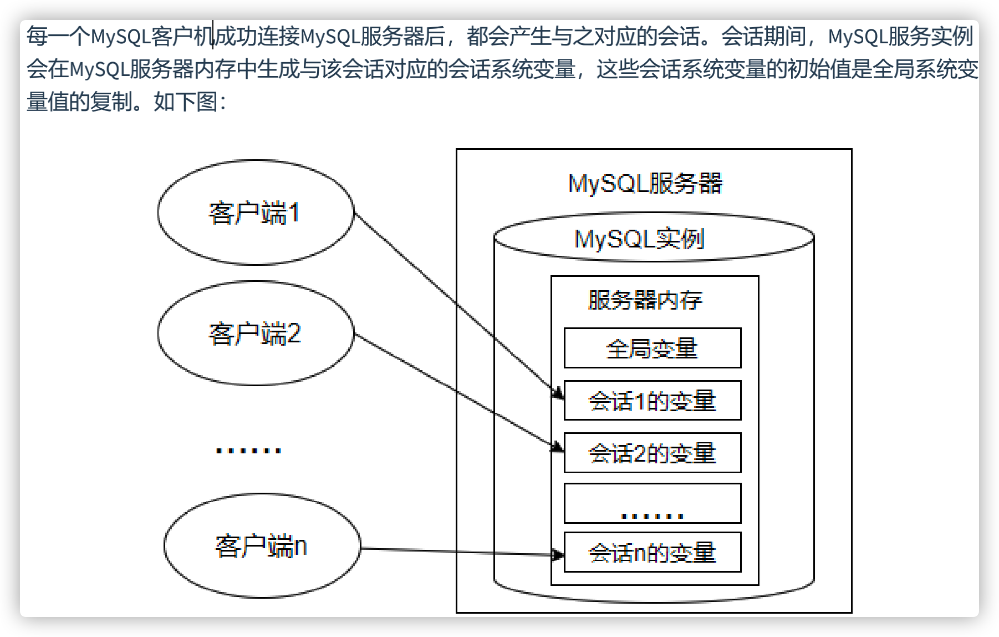
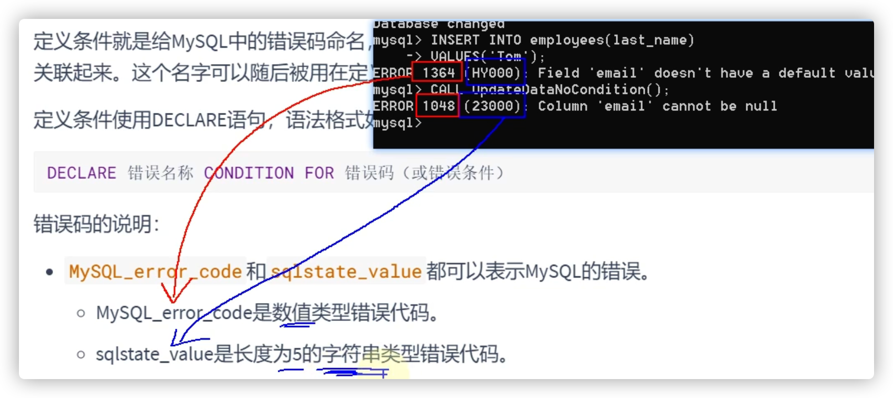
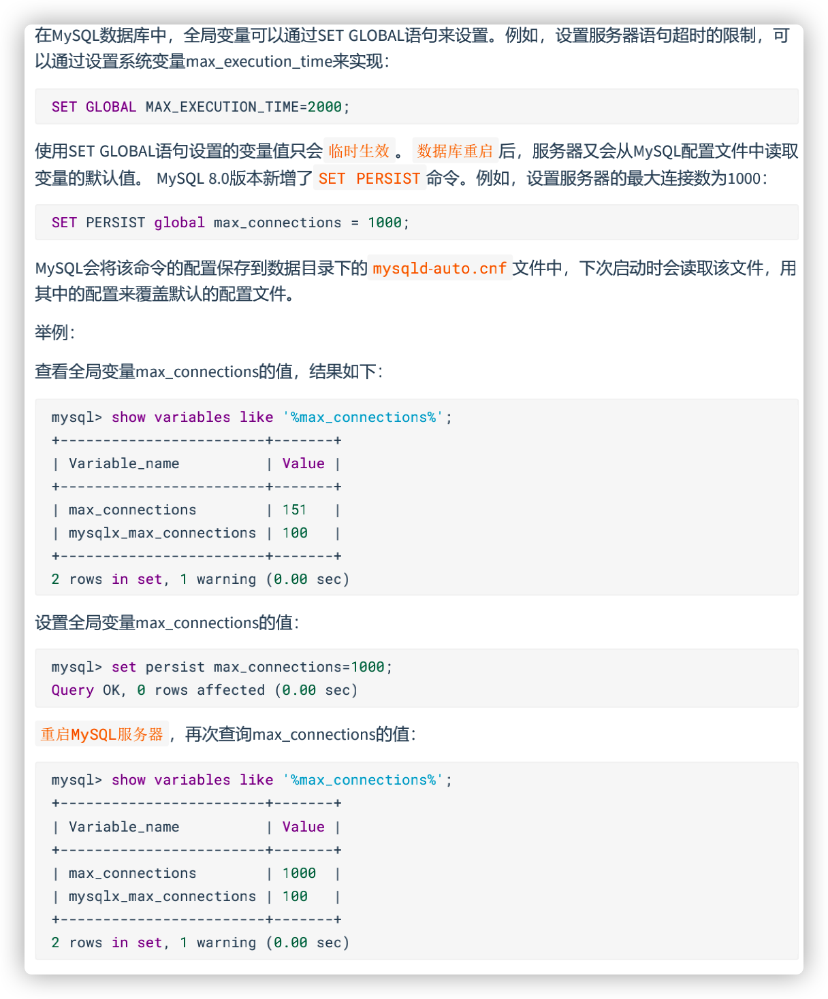
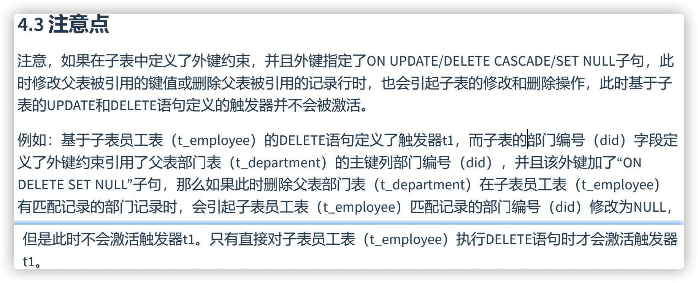

# 变量、流程控制与游标

## 变量

- 在MySQL数据库的存储过程和函数中，可以使用变量来存储查询或计算的中间结果数据，或者输出最终的结果数据。
- 在 MySQL 数据库中，变量分为 **系统变量** 以及 **用户自定义变量** 。 

### 系统变量

- 变量由系统定义，不是用户定义，属于 服务器 层面。启动MySQL服务，生成MySQL服务实例期间，MySQL将为MySQL服务器内存中的系统变量赋值，这些系统变量定义了当前MySQL服务实例的属性、特征。
- 系统变量分为全局系统变量（需要添加 global 关键字）以及会话系统变量（需要添加 session 关键字），有时也把全局系统变量简称为全局变量，有时也把会话系统变量称为local变量。**如果不写，默认****会话级别。**静态变量（在 MySQL 服务实例运行期间它们的值不能使用 set 动态修改）属于特殊的全局系统变量。



- 全局系统变量针对于所有会话（连接）有效，但 不能跨重启
- 会话系统变量仅针对于当前会话（连接）有效。会话期间，当前会话对某个会话系统变量值的修改，不会影响其他会话同一个会话系统变量的值。会话1对某个全局系统变量值的修改会导致会话2中同一个全局系统变量值的修改。
- 在MySQL中有些系统变量只能是全局的，例如 max_connections 用于限制服务器的最大连接数；有些系统变量作用域既可以是全局又可以是会话，例如 character_set_client 用于设置客户端的字符集；有些系统变量的作用域只能是当前会话，例如 pseudo_thread_id 用于标记当前会话的 MySQL 连接 ID。 

#### 查看修改系统变量

```sql
-- 查看所有或部分系统变量
#查看所有全局变量 
SHOW GLOBAL VARIABLES;
#查看所有会话变量 
SHOW SESSION VARIABLES;
或
SHOW VARIABLES;

#查看满足条件的部分系统变量。
SHOW GLOBAL VARIABLES LIKE '%标识符%';
#查看满足条件的部分会话变量 
SHOW SESSION VARIABLES LIKE '%标识符%';

-- 查看指定系统变量
-- 作为 MySQL 编码规范，MySQL 中的系统变量以 两个“@” 开头，其中“@@global”仅用于标记全局系统变量，“@@session”仅用于标记会话系统变量。“@@”首先标记会话系统变量，如果会话系统变量不存在，则标记全局系统变量。
#查看指定的系统变量的值
SELECT @@global.变量名;
#查看指定的会话变量的值 
SELECT @@session.变量名;
#或者
SELECT @@变量名;
```

```sql
-- 修改系统变量的值
方式1：修改MySQL 配置文件 ，继而修改MySQL系统变量的值（该方法需要重启MySQL服务）--> 一劳永逸
方式2：在MySQL服务运行期间，使用“set”命令重新设置系统变量的值

-- #针对于当前的数据库实例是有效的，一旦重启mysql服务，就失效了。
#为某个系统变量赋值 
#方式1：
SET @@global.变量名=变量值;
#方式2：
SET GLOBAL 变量名=变量值;

#为某个会话变量赋值 
#针对于当前会话是有效的，一旦结束会话，重新建立起新的会话，就失效了。
#方式1：
SET @@session.变量名=变量值;
#方式2：
SET SESSION 变量名=变量值;
```

### 用户变量

- 用户变量是用户自己定义的，作为 MySQL 编码规范，MySQL 中的用户变量以 一个“@” 开头。根据作用范围不同，又分为 **会话用户变量** 和 **局部变量** 。

  - 会话用户变量：作用域和会话变量一样，只对 当前 **连接** 会话有效。

  - 局部变量：只在 BEGIN 和 END 语句块中有效。局部变量只能在 存储过程和函数 中使用。

#### 初始化问题

```sql
SELECT @big; 
#会话用户变量不用声明数据类型
#查看某个未声明的会话用户变量时，将得到NULL值
```

```sql
-- 局部变量如果没有DEFAULT子句，初始值为NULL
-- 需要指定数据类型
```

#### 会话用户变量

```sql
-- 变量的定义
#方式1：“=”或“:=” 
SET @用户变量 = 值;
SET @用户变量 := 值;
#方式2：“:=” 或 INTO关键字
SELECT @用户变量 := 表达式 
[FROM 等子句];

SELECT 表达式 INTO @用户变量 
[FROM 等子句];

#方式1：
SET @m1 = 1;
SET @m2 := 2;
SET @sum := @m1 + @m2;
-- 下面两个都可以
SELECT @sum;
-- SELECT @m1 + @m2;

#方式2：
SELECT @count := COUNT(*) FROM employees;
SELECT @count;

#方式3：
SELECT AVG(salary) INTO @avg_sal FROM employees;
SELECT @avg_sal;
```

```sql
-- 查看用户变量的值
SELECT @用户变量
```

```sql
-- 会话用户变量可以当函数返回值
#2. 创建函数ename_salary(),根据员工姓名，返回它的工资
DELIMITER $

CREATE FUNCTION ename_salary(emp_name VARCHAR(15))
RETURNS DOUBLE

BEGIN
	#声明变量
	SET @sal = 0; #定义了一个会话用户变量
	
	#赋值
	SELECT salary INTO @sal FROM employees WHERE last_name = emp_name;	
	
	RETURN @sal;
END $

DELIMITER ;

#调用
SELECT ename_salary('Abel');
SELECT @sal;
```

#### 局部变量

- 定义：可以使用 DECLARE 语句定义一个局部变量
- 作用域：仅仅在定义它的 BEGIN ... END 中有效
- 位置：只能放在 BEGIN ... END 中，而且只能放在第一句

```sql
BEGIN

#声明局部变量 
# 如果没有DEFAULT子句，初始值为NULL
DECLARE 变量名1 变量数据类型 [DEFAULT 变量默认值];
DECLARE 变量名2,变量名3,... 变量数据类型 [DEFAULT 变量默认值];
#为局部变量赋值 
SET 变量名1 = 值;
SELECT 值 INTO 变量名2 [FROM 子句];
#查看局部变量的值
SELECT 变量1,变量2,变量3; 

END
```

```sql
-- 变量赋值
-- 方式1：一般用于赋简单的值
SET 变量名=值; 
SET 变量名:=值;

-- 方式2：一般用于赋表中的字段值
SELECT 字段名或表达式 INTO 变量名 FROM 表
```

```sql
-- 使用变量
SELECT 局部变量名;
```

```sql
#举例：
DELIMITER //
CREATE PROCEDURE test_var()

BEGIN
	#1、声明局部变量
	DECLARE a INT DEFAULT 0;
	DECLARE b INT ;
	#DECLARE a,b INT DEFAULT 0;
	DECLARE emp_name VARCHAR(25);
	#2、赋值
	SET a = 1;
	SET b := 2;
	SELECT last_name INTO emp_name FROM employees WHERE employee_id = 101;
	#3、使用
	SELECT a,b,emp_name;	
END //

DELIMITER ;
#调用存储过程
CALL test_var();
```

```sql
#举例1：声明局部变量，并分别赋值为employees表中employee_id为102的last_name和salary
DELIMITER //

CREATE PROCEDURE test_pro()
BEGIN
	#声明
	DECLARE emp_name VARCHAR(25);
	DECLARE sal DOUBLE(10,2) DEFAULT 0.0;
	#赋值
	SELECT last_name,salary INTO emp_name,sal
	FROM employees
	WHERE employee_id = 102;
	#使用
	SELECT emp_name,sal;
	
END //

DELIMITER ;
#调用存储过程
CALL test_pro();
```


## 定义条件与处理程序

- 定义条件 是事先定义程序执行过程中可能遇到的问题， 处理程序 定义了在遇到问题时应当采取的处理方式，并且保证存储过程或函数在遇到警告或错误时能继续执行。这样可以增强存储程序处理问题的能力，避免程序异常停止运行。
- 说明：定义条件和处理程序在存储过程、存储函数中都是支持的。
- **在存储过程中未定义条件和处理程序，且当存储过程中执行的SQL语句报错时，MySQL数据库会抛出错误，并退出当前SQL逻辑，不再向下继续执行。**

```sql
#错误演示：
DELIMITER //
CREATE PROCEDURE UpdateDataNoCondition()
	BEGIN
		SET @x = 1;
		UPDATE employees SET email = NULL WHERE last_name = 'Abel';
		SET @x = 2;
		UPDATE employees SET email = 'aabbel' WHERE last_name = 'Abel';
		SET @x = 3;
	END //
DELIMITER ;

#调用存储过程
#错误代码： 1048
#Column 'email' cannot be null
CALL UpdateDataNoCondition();
SELECT @x;
-- 1
```

### 定义条件

- 定义条件就是给MySQL中的错误码命名，这有助于存储的程序代码更清晰。它将一个 错误名字 和 指定的 错误条件 关联起来。这个名字可以随后被用在定义处理程序的 DECLARE HANDLER 语句中。
- 定义条件使用DECLARE语句，语法格式如下：

```sql
DECLARE 错误名称 CONDITION FOR 错误码（或错误条件）
```



```sql
#2.2 定义条件
#格式：DECLARE 错误名称 CONDITION FOR 错误码（或错误条件）
#举例1：定义“Field_Not_Be_NULL”错误名与MySQL中违反非空约束的错误类型是“ERROR 1048 (23000)”对应。
#方式1：使用MySQL_error_code
DECLARE Field_Not_Be_NULL CONDITION FOR 1048;

#方式2：使用sqlstate_value
DECLARE Field_Not_Be_NULL CONDITION FOR SQLSTATE '23000';
/*
不知道为啥给我说:
1064 - You have an error in your SQL syntax; check the manual that corresponds to your MySQL server version for the right syntax to use near 'DECLARE Field_Not_Be_NULL CONDITION FOR 1048' at line 5, Time: 0.000000s
*/
```

### 定义处理程序

- 可以为SQL执行过程中发生的某种类型的错误定义特殊的处理程序。定义处理程序时，使用DECLARE语句的语法如下：

```sql
DECLARE 处理方式 HANDLER FOR 错误类型 处理语句
```

- **处理方式**：处理方式有3个取值：CONTINUE、EXIT、UNDO。 
  - CONTINUE ：表示遇到错误不处理，继续执行。
  - EXIT ：表示遇到错误马上退出。
  - UNDO ：表示遇到错误后撤回之前的操作。MySQL中暂时不支持这样的操作。
- **错误类型**（即条件）可以有如下取值：
  - SQLSTATE '字符串错误码' ：表示长度为5的sqlstate_value类型的错误代码； 
  - MySQL_error_code ：匹配数值类型错误代码；
  - 错误名称 ：表示DECLARE ... CONDITION定义的错误条件名称。
  - SQLWARNING ：匹配所有以01开头的SQLSTATE错误代码；
  - NOT FOUND ：匹配所有以02开头的SQLSTATE错误代码；
  - SQLEXCEPTION ：匹配所有没有被SQLWARNING或NOT FOUND捕获的SQLSTATE错误代码；
- **处理语句**：如果出现上述条件之一，则采用对应的处理方式，并执行指定的处理语句。语句可以是像“ SET 变量 = 值 ”这样的简单语句，也可以是使用 BEGIN ... END 编写的复合语句。

```sql
-- 定义处理程序的几种方式
#方法1：捕获sqlstate_value
DECLARE CONTINUE HANDLER FOR SQLSTATE '42S02' SET @info = 'NO_SUCH_TABLE';

#方法2：捕获mysql_error_value
DECLARE CONTINUE HANDLER FOR 1146 SET @info = 'NO_SUCH_TABLE';

#方法3：先定义条件，再调用
DECLARE no_such_table CONDITION FOR 1146;
DECLARE CONTINUE HANDLER FOR no_such_table SET @info = 'NO_SUCH_TABLE';

#方法4：使用SQLWARNING
DECLARE EXIT HANDLER FOR SQLWARNING SET @info = 'ERROR';

#方法5：使用NOT FOUND
DECLARE EXIT HANDLER FOR NOT FOUND SET @info = 'NO_SUCH_TABLE';

#方法6：使用SQLEXCEPTION
DECLARE EXIT HANDLER FOR SQLEXCEPTION SET @info = 'ERROR';
```

### 案例解决

```sql
#2.4 案例的处理
#重新定义存储过程，体现错误的处理程序
DELIMITER //

CREATE PROCEDURE UpdateDataNoCondition()
	BEGIN
		#声明处理程序
		#处理方式1：
		DECLARE CONTINUE HANDLER FOR 1048 SET @prc_value = -1;
		#处理方式2：
		#DECLARE CONTINUE HANDLER FOR sqlstate '23000' SET @prc_value = -1;
		
		SET @x = 1;
		UPDATE employees SET email = NULL WHERE last_name = 'Abel';
		SET @x = 2;
		UPDATE employees SET email = 'aabbel' WHERE last_name = 'Abel';
		SET @x = 3;
	END //

DELIMITER ;
#调用存储过程：
CALL UpdateDataNoCondition();
#查看变量：
SELECT @x,@prc_value;
-- 3 -1
```

## 流程控制

- 针对于MySQL 的流程控制语句主要有 3 类。注意：只能用于存储程序。
  - 条件判断语句 ：IF 语句和 CASE 语句
  - 循环语句 ：LOOP、WHILE 和 REPEAT 语句
  - 跳转语句 ：ITERATE 和 LEAVE 语句

### **分支结构之** IF

- 使用在begin end中

```sql
IF 表达式1 THEN 操作1 
[ELSEIF 表达式2 THEN 操作2]
……
[ELSE 操作N]
END IF
```

```sql
DELIMITER //
CREATE PROCEDURE test_if()
BEGIN	
	#情况1：
	#声明局部变量
	#declare stu_name varchar(15);
	
	#if stu_name is null 
	#	then select 'stu_name is null';
	#end if;
	
	#情况2：二选一
	#declare email varchar(25) default 'aaa';
	
	#if email is null
	#	then select 'email is null';
	#else
	#	select 'email is not null';
	#end if;
	
	#情况3：多选一
	DECLARE age INT DEFAULT 20;
	
	IF age > 40
		THEN SELECT '中老年';
	ELSEIF age > 18
		THEN SELECT '青壮年';
	ELSEIF age > 8
		THEN SELECT '青少年';
	ELSE
		SELECT '婴幼儿';
	END IF;

END //

DELIMITER ;
#调用
CALL test_if();
```

```sql
SELECT DATEDIFF(CURDATE(),hire_date)/365 INTO hire_year FROM employees WHERE employee_id = emp_id;
-- 可以这样查询 hire_date
```

### 分支结构之 CASE

```sql
-- CASE 语句的语法结构1：
#情况一：类似于switch 
CASE 表达式 
WHEN 值1 THEN 结果1或语句1(如果是语句，需要加分号)
WHEN 值2 THEN 结果2或语句2(如果是语句，需要加分号)
... 
ELSE 结果n或语句n(如果是语句，需要加分号) 
END [case]（如果是放在begin end中需要加上case，如果放在select后面不需要）

-- CASE 语句的语法结构2：
#情况二：类似于多重if 
CASE 
WHEN 条件1 THEN 结果1或语句1(如果是语句，需要加分号) 
WHEN 条件2 THEN 结果2或语句2(如果是语句，需要加分号) 
... 
ELSE 结果n或语句n(如果是语句，需要加分号) 
END [case]（如果是放在begin end中需要加上case，如果放在select后面不需要）
```

```sql
#举例1:基本使用
DELIMITER //
CREATE PROCEDURE test_case()
BEGIN
	#演示1：case ... when ...then ...
	/*
	declare var int default 2;
	
	case var
		when 1 then select 'var = 1';
		when 2 then select 'var = 2';
		when 3 then select 'var = 3';
		else select 'other value';
	end case;
	*/
	#演示2：case when ... then ....
	DECLARE var1 INT DEFAULT 10;
	CASE 
	WHEN var1 >= 100 THEN SELECT '三位数';
	WHEN var1 >= 10 THEN SELECT '两位数';
	ELSE SELECT '个数位';
	END CASE;
END //
DELIMITER ;
#调用
CALL test_case();
```

### 循环结构之LOOP

```sql
/*
凡是循环结构，一定具备4个要素：
1. 初始化条件
2. 循环条件
3. 循环体
4. 迭代条件
*/
```

- LOOP循环语句用来重复执行某些语句。LOOP内的语句一直重复执行直到循环被退出（使用LEAVE子句），跳出循环过程。

```sql
[loop_label:] LOOP 
循环执行的语句 
END LOOP [loop_label]
-- loop_label表示LOOP语句的标注名称，该参数可以省略。
```

```sql
DELIMITER //
CREATE PROCEDURE test_loop()

BEGIN
	#声明局部变量
	DECLARE num INT DEFAULT 1;
	loop_label:LOOP
		#重新赋值
		SET num = num + 1;
		#可以考虑某个代码程序反复执行。（略）
		IF num >= 10 THEN LEAVE loop_label;
		END IF;
	END LOOP loop_label;
	#查看num
	SELECT num;
END //

DELIMITER ;
#调用
CALL test_loop();
```

```sql
#举例2：当市场环境变好时，公司为了奖励大家，决定给大家涨工资。
#声明存储过程“update_salary_loop()”，声明OUT参数num，输出循环次数。
#存储过程中实现循环给大家涨薪，薪资涨为原来的1.1倍。直到全公司的平
#均薪资达到12000结束。并统计循环次数。
DELIMITER //

CREATE PROCEDURE update_salary_loop(OUT num INT)
BEGIN
	#声明变量
	DECLARE avg_sal DOUBLE ; #记录员工的平均工资
	
	DECLARE loop_count INT DEFAULT 0;
	#记录循环的次数，避免传进来的OUT变量有值
	
	#① 初始化条件
	#获取员工的平均工资
	SELECT AVG(salary) INTO avg_sal FROM employees;
	
	loop_lab:LOOP
		#② 循环条件
		#结束循环的条件
		IF avg_sal >= 12000
			THEN LEAVE loop_lab;
		END IF;
		
		#③ 循环体
		#如果低于12000，更新员工的工资
		UPDATE employees SET salary = salary * 1.1;
		
		#④ 迭代条件
		#更新avg_sal变量的值
		SELECT AVG(salary) INTO avg_sal FROM employees;
		
		#记录循环次数
		SET loop_count = loop_count + 1;
		
	END LOOP loop_lab;
			
	#给num赋值
	SET num = loop_count;	

END //

DELIMITER ;

CALL update_salary_loop(@num);
SELECT @num;
```

### WHILE

- WHILE语句创建一个带条件判断的循环过程。WHILE在执行语句执行时，先对指定的表达式进行判断，如果为真，就执行循环内的语句，否则退出循环。WHILE语句的基本格式如下：

```sql
[while_label:] WHILE 循环条件 
DO 循环体 
END WHILE [while_label];
-- while_label为WHILE语句的标注名称,该参数可以省略；如果循环条件结果为真，WHILE语句内的语句或语句群被执行，直至循环条件为假，退出循环。
```

```sql
DELIMITER //
CREATE PROCEDURE test_while()

BEGIN	
	#初始化条件
	DECLARE num INT DEFAULT 1;
	#循环条件
	WHILE num <= 10 DO
		#循环体（略）
		#迭代条件
		SET num = num + 1;
	END WHILE;
	#查询
	SELECT num;
END //

DELIMITER ;

#调用
CALL test_while();
```

### 循环结构之REPEAT

- REPEAT语句创建一个带条件判断的循环过程。与WHILE循环不同的是，REPEAT 循环首先会执行一次循环，然后在 UNTIL 中进行表达式的判断，如果满足条件就退出，即 END REPEAT；如果条件不满足，则会就继续执行循环，直到满足退出条件为止。

```sql
[repeat_label:] REPEAT 循环体的语句
UNTIL 结束循环的条件表达式
END REPEAT [repeat_label]
-- repeat_label为REPEAT语句的标注名称，该参数可以省略；REPEAT语句内的语句或语句群被重复，直至expr_condition为真。
```

```sql
DELIMITER //

CREATE PROCEDURE test_repeat()
BEGIN
	#声明变量
	DECLARE num INT DEFAULT 1;
	
	REPEAT
		SET num = num + 1;
		UNTIL num >= 10
	END REPEAT;
	
	#查看
	SELECT num;

END //

DELIMITER ;

#调用
CALL test_repeat();
```

### 对比三种循环结构

1、这三种循环都可以省略名称，但如果循环中添加了循环控制语句（LEAVE或ITERATE）则必须添加名称。

 2、 LOOP：一般用于实现简单的"死"循环 

​		WHILE：先判断后执行 

​		REPEAT：先执行后判断，无条件至少执行一次

### 跳转语句之LEAVE语句

- LEAVE语句：可以用在循环语句内，或者以 BEGIN 和 END 包裹起来的程序体内，表示跳出循环或者跳出程序体的操作。如果你有面向过程的编程语言的使用经验，你可以把 LEAVE 理解为 break。

```sql
LEAVE 标记名
```

```sql
#5.1 LEAVE的使用
/*
**举例1：**创建存储过程 “leave_begin()”，声明INT类型的IN参数num。给BEGIN...END加标记名，
并在BEGIN...END中使用IF语句判断num参数的值。

- 如果num<=0，则使用LEAVE语句退出BEGIN...END；
- 如果num=1，则查询“employees”表的平均薪资；
- 如果num=2，则查询“employees”表的最低薪资；
- 如果num>2，则查询“employees”表的最高薪资。

IF语句结束后查询“employees”表的总人数。
*/
DELIMITER //
CREATE PROCEDURE leave_begin(IN num INT)

begin_label:BEGIN
	IF num <= 0
		THEN LEAVE begin_label;
	ELSEIF num = 1
		THEN SELECT AVG(salary) FROM employees;
	ELSEIF num = 2
		THEN SELECT MIN(salary) FROM employees;
	ELSE 
		SELECT MAX(salary) FROM employees;
	END IF;
	
	#查询总人数
	SELECT COUNT(*) FROM employees;
END //

DELIMITER ;
#调用
CALL leave_begin(0);
```

```sql
#举例2：当市场环境不好时，公司为了渡过难关，决定暂时降低大家的薪资。
#声明存储过程“leave_while()”，声明OUT参数num，输出循环次数，存储过程中使用WHILE
#循环给大家降低薪资为原来薪资的90%，直到全公司的平均薪资小于等于10000，并统计循环次数。
DELIMITER //
CREATE PROCEDURE leave_while(OUT num INT)

BEGIN 
	#
	DECLARE avg_sal DOUBLE;#记录平均工资
	DECLARE while_count INT DEFAULT 0; #记录循环次数
	
	SELECT AVG(salary) INTO avg_sal FROM employees; #① 初始化条件
	
	while_label:WHILE TRUE DO  #② 循环条件
		
		#③ 循环体
		IF avg_sal <= 10000 THEN
			LEAVE while_label;
		END IF;
		
		UPDATE employees SET salary  = salary * 0.9;
		SET while_count = while_count + 1;
		
		#④ 迭代条件
		SELECT AVG(salary) INTO avg_sal FROM employees;
	
	END WHILE while_label;
	
	#赋值
	SET num = while_count;

END //

DELIMITER ;

#调用
CALL leave_while(@num);
SELECT @num;

SELECT AVG(salary) FROM employees;
```

### 跳转语句之ITERATE语句

- ITERATE语句：只能用在循环语句（LOOP、REPEAT和WHILE语句）内，表示重新开始循环，将执行顺序转到语句段开头处。如果你有面向过程的编程语言的使用经验，你可以把 ITERATE 理解为 continue，意思为“再次循环”。

```sql
ITERATE label
```

```sql
/*
举例： 定义局部变量num，初始值为0。循环结构中执行num + 1操作。
- 如果num < 10，则继续执行循环；
- 如果num > 15，则退出循环结构；
*/
DROP PROCEDURE IF EXISTS test_iterate;

DELIMITER //

CREATE PROCEDURE test_iterate()

BEGIN
	DECLARE num INT DEFAULT 0;
	
	loop_label:LOOP
		#赋值
		SET num = num + 1;
		
		IF num  < 10
			THEN ITERATE loop_label;
		ELSEIF num > 15
			THEN LEAVE loop_label;
		END IF;
		
		SELECT '尚硅谷：让天下没有难学的技术',num;
		-- num --> 10
	
	END LOOP;

END //

DELIMITER ;

CALL test_iterate();
```

## 游标

### 什么是游标（或光标）

- 在结果集中像指针一样，向前定位一条记录、向后定位一条记录，或者是 **随意定位到某一条记录** ，并对记录的数据进行处理。
- 让我们能够对结果集中的每一条记录进行定位，并对指向的记录中的数据进行操作的数据结构。**游标让** SQL **这种面向集合的语言有了面向过程开发的能力。**

### 使用游标步骤

- 游标必须在**声明处理程序之前被声明**，并且**变量和条件**还必须在声明游标或处理程序之前被声明。
- 如果我们想要使用游标，一般需要经历四个步骤。不同的 DBMS 中，使用游标的语法可能略有不同。

```sql
-- 第一步，声明游标
-- 这个语法适用于 MySQL，SQL Server，DB2 和 MariaDB
DECLARE cursor_name CURSOR FOR select_statement;
-- 如果是用 Oracle 或者 PostgreSQL，需要写成：
DECLARE cursor_name CURSOR IS select_statement;

-- 要使用 SELECT 语句来获取数据结果集，而此时还没有开始遍历数据，这里 select_statement 代表的是SELECT 语句，返回一个用于创建游标的结果集。
DECLARE cur_emp CURSOR FOR 
SELECT employee_id,salary FROM employees;
```

```sql
-- 第二步，打开游标
OPEN cursor_name
-- 打开游标的时候 SELECT 语句的查询结果集就会送到游标工作区，为后面游标的 逐条读取 结果集中的记录做准备。
OPEN cur_emp;
```

```sql
-- 第三步，使用游标（从游标中取得数据）
FETCH cursor_name INTO var_name [, var_name] ...
/*
这句的作用是使用 cursor_name 这个游标来读取当前行，并且将数据保存到 var_name 这个变量中，游
标指针指到下一行。如果游标读取的数据行有多个列名，则在 INTO 关键字后面赋值给多个变量名即可。
注意：var_name必须在声明游标之前就定义好。
*/
```


```sql
-- 第四步，关闭游标
CLOSE cursor_name
/*
因为游标会占用系统资源 ，如果不及时关闭，游标会一直保持到存储过程结束，影响系统运行的效率。而关闭游标的操作，会释放游标占用的系统资源。
*/
```

```sql
#举例：创建存储过程“get_count_by_limit_total_salary()”，声明IN参数 limit_total_salary，
#DOUBLE类型；声明OUT参数total_count，INT类型。函数的功能可以实现累加薪资最高的几个员工的薪资值，
#直到薪资总和达到limit_total_salary参数的值，返回累加的人数给total_count。
DELIMITER //

CREATE PROCEDURE get_count_by_limit_total_salary(IN limit_total_salary DOUBLE,OUT total_count INT)
BEGIN

	#声明局部变量
	DECLARE sum_sal DOUBLE DEFAULT 0.0; #记录累加的工资总额
	DECLARE emp_sal DOUBLE; #记录每一个员工的工资
	DECLARE emp_count INT DEFAULT 0;#记录累加的人数
	
	#1.声明游标
	DECLARE emp_cursor CURSOR FOR SELECT salary FROM employees ORDER BY salary DESC;
	
	#2.打开游标
	OPEN emp_cursor;
	
	REPEAT
		#3.使用游标
		FETCH emp_cursor INTO emp_sal;
		
		SET sum_sal = sum_sal + emp_sal;
		SET emp_count = emp_count + 1;
		UNTIL sum_sal >= limit_total_salary
	END REPEAT;
	
	SET total_count = emp_count;
	
	#4.关闭游标
	CLOSE emp_cursor;
	
END //

DELIMITER ;

#调用
CALL get_count_by_limit_total_salary(200000,@total_count);
SELECT @total_count;
```

```sql
#3. 游标的使用
#创建存储过程update_salary()，参数1为 IN 的INT型变量dept_id，表示部门id；
#参数2为 IN的INT型变量change_sal_count，表示要调整薪资的员工个数。查询指定id部门的员工信息，
#按照salary升序排列，根据hire_date的情况，调整前change_sal_count个员工的薪资，详情如下。
DELIMITER $

CREATE PROCEDURE update_salary(IN dept_id INT,IN change_sal_count INT)
BEGIN
	#声明变量
	DECLARE emp_id INT ;#记录员工id
	DECLARE emp_hire_date DATE; #记录员工入职时间
	
	DECLARE init_count INT DEFAULT 1; #用于表示循环结构的初始化条件
	DECLARE add_sal_rate DOUBLE ; #记录涨薪的比例
	
	#声明游标
	DECLARE emp_cursor CURSOR FOR SELECT employee_id,hire_date FROM employees 
	WHERE department_id = dept_id ORDER BY salary ASC;
	
	#打开游标
	OPEN emp_cursor;
	
	WHILE init_count <= change_sal_count DO

		#使用游标
		FETCH emp_cursor INTO emp_id,emp_hire_date;
		
		#获取涨薪的比例
		IF (YEAR(emp_hire_date) < 1995)
			THEN SET add_sal_rate = 1.2;
		ELSEIF(YEAR(emp_hire_date) <= 1998)
			THEN SET add_sal_rate = 1.15;
		ELSEIF(YEAR(emp_hire_date) <= 2001)
			THEN SET add_sal_rate = 1.10;
		ELSE
			SET add_sal_rate = 1.05;
		END IF;
		
		#涨薪操作
		UPDATE employees SET salary = salary * add_sal_rate
		WHERE employee_id = emp_id;
		
		#迭代条件的更新
		SET init_count = init_count + 1;
	
	END WHILE;
	
	#关闭游标
	CLOSE emp_cursor;

END $

DELIMITER ;

#调用
CALL update_salary(50,3);
```

### 小结

- 游标是 MySQL 的一个重要的功能，为 逐条读取 结果集中的数据，提供了完美的解决方案。跟在应用层面实现相同的功能相比，游标可以在存储程序中使用，效率高，程序也更加简洁。
- 但同时也会带来一些性能问题，比如在使用游标的过程中，会对数据行进行 加锁 ，这样在业务并发量大的时候，不仅会影响业务之间的效率，还会 消耗系统资源 ，造成内存不足，这是因为游标是在内存中进行的处理。
- 建议：养成用完之后就关闭的习惯，这样才能提高系统的整体效率。

## MySQL 8.0的新特性—全局变量的持久化



# 触发器

- 在实际开发中，我们经常会遇到这样的情况：有 2 个或者多个相互关联的表，如 商品信息 和 库存信息 分别存放在 2 个不同的数据表中，我们在添加一条新商品记录的时候，为了保证数据的完整性，必须同时在库存表中添加一条库存记录。

  这样一来，我们就必须把这两个关联的操作步骤写到程序里面，而且要用 事务 包裹起来，确保这两个操作成为一个 原子操作 ，要么全部执行，要么全部不执行。要是遇到特殊情况，可能还需要对数据进行手动维护，这样就很 容易忘记其中的一步 ，导致数据缺失。

  这个时候，咱们可以使用触发器。**你可以创建一个触发器，让商品信息数据的插入操作自动触发库存数****据的插入操作。**这样一来，就不用担心因为忘记添加库存数据而导致的数据缺失了。

- 当对数据表中的数据执行插入、更新和删除操作，需要自动执行一些数据库逻辑时，可以使用触发器来实现。

## 触发器的创建

- 表名 ：表示触发器监控的对象。
- BEFORE|AFTER ：表示触发的时间。BEFORE 表示在事件之前触发；AFTER 表示在事件之后触发。
- INSERT|UPDATE|DELETE ：表示触发的事件。
  - INSERT 表示插入记录时触发；
  - UPDATE 表示更新记录时触发；
  - DELETE 表示删除记录时触发。触发器执行的语句块 ：可以是单条SQL语句，也可以是由BEGIN…END结构组成的复合语句块。

```sql
CREATE TRIGGER 触发器名称 
{BEFORE|AFTER} {INSERT|UPDATE|DELETE} ON 表名 
FOR EACH ROW 
触发器执行的语句块;
```

## 查看、删除触发器

```sql
-- 方式1：查看当前数据库的所有触发器的定义
SHOW TRIGGERS\G

-- 方式2：查看当前数据库中某个触发器的定义
SHOW CREATE TRIGGER 触发器名

-- 方式3：从系统库information_schema的TRIGGERS表中查询“salary_check_trigger”触发器的信息。
-- 各个数据库
SELECT * FROM information_schema.TRIGGERS;
```

```sql
-- 触发器也是数据库对象，删除触发器也用DROP语句，语法格式如下：
DROP TRIGGER IF EXISTS 触发器名称;
```

## 触发器的优缺点

### 优点

- 触发器可以确保数据的完整性。
- 触发器可以帮助我们记录操作日志。利用触发器，可以具体记录什么时间发生了什么。
- 触发器还可以用在操作数据前，对数据进行合法性检查。

### 缺点

- 触发器最大的一个问题就是可读性差。
- 因为触发器存储在数据库中，并且由事件驱动，这就意味着触发器有可能 不受应用层的控制 。这对系统维护是非常有挑战的。
- 相关数据的变更，可能会导致触发器出错。
- 特别是数据表结构的变更，都可能会导致触发器出错，进而影响数据操作的正常运行。这些都会由于触发器本身的隐蔽性，影响到应用中错误原因排查的效率。

### 注意点

注意，如果在子表中定义了外键约束，并且外键指定了ON UPDATE/DELETE CASCADE/SET NULL子句，此时修改父表被引用的键值或删除父表被引用的记录行时，也会引起子表的修改和删除操作，此时基于子表的UPDATE和DELETE语句定义的触发器并不会被激活。

